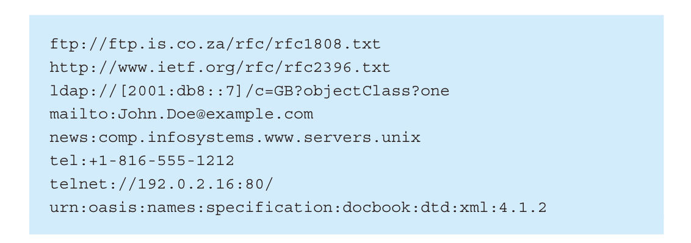

# 基本概念

URI：由某个协议方案表示的资源的定位标识符，用字符串标识某一互联网资源。

URL：统一资源定位符，表示资源的地点。

URI示例：



完整的URI：


HTTP 使用 URL（ **U** niform **R**esource **L**ocator，统一资源定位符）来定位资源，它是  URI（**U**niform **R**esource **I**dentifier，统一资源标识符）的子集，URL 在 URI 的基础上增加了定位能力。URI 除了包含 URL，还包含 URN（Uniform Resource Name，统一资源名称），它只是用来定义一个资源的名称，并不具备定位该资源的能力。例如 urn:isbn:0451450523 用来定义一个书籍名称，但是却没有表示怎么找到这本书。

<div align="center">  </div><br>

# HTTP报文中的HTTP信息

HTTP报文本身是由多行（用 CR+LF 作换行符）数据构成的字符串文本。

HTTP 报文大致可分为报文首部和报文主体两块。两者由最初出现的空行（CR+LF）来划分。通常，并不一定要有报文主体。


请求报文：


响应报文：


demo：

请求

```http
GET /s?tn=02003390_42_hao_pg&ie=utf-8&wd=innocent HTTP/1.1
Host: www.baidu.com
Connection: keep-alive
Cache-Control: max-age=0
sec-ch-ua: " Not;A Brand";v="99", "Microsoft Edge";v="91", "Chromium";v="91"
sec-ch-ua-mobile: ?0
DNT: 1
Upgrade-Insecure-Requests: 1
User-Agent: Mozilla/5.0 (Windows NT 10.0; Win64; x64) AppleWebKit/537.36 (KHTML, like Gecko) Chrome/91.0.4472.114 Safari/537.36 Edg/91.0.864.59
Accept: text/html,application/xhtml+xml,application/xml;q=0.9,image/webp,image/apng,*/*;q=0.8,application/signed-exchange;v=b3;q=0.9
Sec-Fetch-Site: cross-site
Sec-Fetch-Mode: navigate
Sec-Fetch-User: ?1
Sec-Fetch-Dest: document
Accept-Encoding: gzip, deflate, br
Accept-Language: zh-CN,zh;q=0.9,en;q=0.8,en-GB;q=0.7,en-US;q=0.6
Cookie: BAIDUID=A17CE864870430DED165E496DC708B33:FG=1; BIDUPSID=A17CE864870430DEC91277D3C02E85D7; PSTM=1606239629; BD_UPN=12314753; __yjs_duid=1_78ae6ff59e304aa3cd12164a740512e21618493893529; BDUSS=ZzME1rcVQxb0V4OVZSZDdUWFRESkFuWjBvTnRVSld3R3pzazd6ZVBsMmV4dkpnRVFBQUFBJCQAAAAAAAAAAAEAAACbFnEnd2luZHlzc3NkYQAAAAAAAAAAAAAAAAAAAAAAAAAAAAAAAAAAAAAAAAAAAAAAAAAAAAAAAAAAAAAAAAAAAAAAAJ45y2CeOctgb0; BDUSS_BFESS=ZzME1rcVQxb0V4OVZSZDdUWFRESkFuWjBvTnRVSld3R3pzazd6ZVBsMmV4dkpnRVFBQUFBJCQAAAAAAAAAAAEAAACbFnEnd2luZHlzc3NkYQAAAAAAAAAAAAAAAAAAAAAAAAAAAAAAAAAAAAAAAAAAAAAAAAAAAAAAAAAAAAAAAAAAAAAAAJ45y2CeOctgb0; H_PS_PSSID=31254_26350; BDORZ=FFFB88E999055A3F8A630C64834BD6D0; ab_sr=1.0.1_Y2MyNGZiMzMwMjNmMzQyOWUzOWIyMjhmYjM4ODRkMDczMzc5YWI3ODU5ZmVmYWYwN2Q1MjdhMzU0MDAwYzI1MTcyZTFhYzJjNzdkZGU3YTYxZGRhMTBlN2IyOTc2NGVmODc5YTcyMzJkNTY3ODg1NTYxNzlhMWM4YWYyY2Y0MzVjYzM4OGE3YmFjNTBkZTA3M2FhNzlhZjdiZGQyMWU3ZDc5YTFkYjQ4NDU3ODRhODhhY2I1ZWI0YzQxNGVlZTJl; BDRCVFR[VXHUG3ZuJnT]=mk3SLVN4HKm; delPer=0; BD_CK_SAM=1; PSINO=6; sugstore=0; H_PS_645EC=44aa%2FV6bnlCeedUGxQ8yNuzEgmBWDDBAo7b1VcQQ9sJCnLQWxJBTn77JPTq5CS5Y7HXjve7CfXV5; BA_HECTOR=0h01ag84048h21agft1gdo5us0q
```

响应

```http
HTTP/1.1 200 OK
Bdpagetype: 3
Bdqid: 0xbddedb6100045afa
Cache-Control: private
Ckpacknum: 2
Ckrndstr: 100045afa
Connection: keep-alive
Content-Encoding: gzip
Content-Type: text/html;charset=utf-8
Date: Wed, 30 Jun 2021 07:08:42 GMT
P3p: CP=" OTI DSP COR IVA OUR IND COM "
Server: BWS/1.1
Set-Cookie: BDRCVFR[VXHUG3ZuJnT]=mk3SLVN4HKm; path=/; domain=.baidu.com
Set-Cookie: delPer=0; path=/; domain=.baidu.com
Set-Cookie: BD_CK_SAM=1;path=/
Set-Cookie: PSINO=6; domain=.baidu.com; path=/
Set-Cookie: BDSVRTM=26; path=/
Set-Cookie: H_PS_PSSID=31254_26350; path=/; domain=.baidu.com
Strict-Transport-Security: max-age=172800
Traceid: 1625036922033845709813681613927656741626
Vary: Accept-Encoding
X-Ua-Compatible: IE=Edge,chrome=1
Transfer-Encoding: chunked
```

报文和实体：


一般情况下报文等于实体，只有发生编码时二者才会有差异。

# 简单的HTTP协议

客户端发送一个请求报文给服务器，服务器根据请求报文中的信息进行处理，并将处理结果放入响应报文中返回给客户端。

请求报文结构：

- 第一行是包含了请求方法、URL、协议版本
- 接下来的多行都是请求首部 Header，每个首部都有一个首部名称，以及对应的值
- 一个空行用来分隔首部和内容主体 Body
- 最后是请求的内容主体

```http
GET http://www.example.com/ HTTP/1.1
Accept: text/html,application/xhtml+xml,application/xml;q=0.9,image/webp,image/apng,*/*;q=0.8,application/signed-exchange;v=b3;q=0.9
Accept-Encoding: gzip, deflate
Accept-Language: zh-CN,zh;q=0.9,en;q=0.8
Cache-Control: max-age=0
Host: www.example.com
If-Modified-Since: Thu, 17 Oct 2019 07:18:26 GMT
If-None-Match: "3147526947+gzip"
Proxy-Connection: keep-alive
Upgrade-Insecure-Requests: 1
User-Agent: Mozilla/5.0 xxx

param1=1&param2=2
```

响应报文结构：

- 第一行包含协议版本、状态码以及描述，最常见的是 200 OK 表示请求成功了
- 接下来多行也是首部内容
- 一个空行分隔首部和内容主体
- 最后是响应的内容主体

```http
HTTP/1.1 200 OK
Age: 529651
Cache-Control: max-age=604800
Connection: keep-alive
Content-Encoding: gzip
Content-Length: 648
Content-Type: text/html; charset=UTF-8
Date: Mon, 02 Nov 2020 17:53:39 GMT
Etag: "3147526947+ident+gzip"
Expires: Mon, 09 Nov 2020 17:53:39 GMT
Keep-Alive: timeout=4
Last-Modified: Thu, 17 Oct 2019 07:18:26 GMT
Proxy-Connection: keep-alive
Server: ECS (sjc/16DF)
Vary: Accept-Encoding
X-Cache: HIT

<!doctype html>
<html>
<head>
    <title>Example Domain</title>
	// 省略... 
</body>
</html>

```

## POST请求


服务器响应：


HTTP/1.1是无状态协议，可以更快地处理大量事务，确保协议的可伸缩性。但是随着Web技术的发展，HTTP的无状态导致了一些问题，例如购物网站切换页面后需要重新登陆，为此，HTTP1.1引入了cookie技术。

## HTTP方法


### GET

GET 方法用来请求访问已被 URL 识别的资源。指定的资源经服务器端解析后返回响应内容。


### POST

POST 方法用来传输实体的主体。


### PUT

PUT 方法用来传输文件。就像 FTP 协议的文件上传一样，要求在请求报文的主体中包含文件内容，然后保存到请求 URI 指定的位置。

PUT 方法没有验证机制，一般只有配合 Web 应用程序的验证机制，或遵守 REST 标准时才会开放使用。


响应的意思是请求执行成功，无数据返回。

### HEAD

HEAD 方法和 GET 方法一样，只是不返回报文主体部分。用于确认URL 的有效性及资源更新的日期时间等。


### DELETE

DELETE 方法用来删除文件，是与 PUT 相反的方法。DELETE 方法按请求 URL 删除指定的资源。

DELETE 方法同样没有验证机制，一般只有配合 Web 应用程序的验证机制，或遵守 REST 标准时才会开放使用。


### OPTIONS

OPTIONS 方法用来查询针对请求 URL 指定的资源支持的方法。


### TRACE

TRACE 方法是让 Web 服务器端将之前的请求通信环回给客户端的方法。

发送请求时，在 Max-Forwards 首部字段中填入数值，每经过一个服务器就会减 1，当数值为 0 时就停止传输。

通常不会使用 TRACE，并且它容易受到 XST 攻击（Cross-Site Tracing，跨站追踪）。

### CONNECT

CONNECT 方法要求在与代理服务器通信时建立隧道，实现用隧道协议进行 TCP 通信。主要使用 SSL（Secure Sockets Layer，安全套接层）和 TLS（Transport Layer Security，传输层安全）协议把通信内容加密后经网络隧道传输。

格式：


### 持久连接

HTTP的最初版本中，每进行一次HTTP通信就会建立和断开一次TCP连接。


TCP连接的重复建立于断开导致了严重的性能开销。

为此，HTTP1.1和一部分HTTP1.0想出了持久连接的方法，其特点是只要一端没有明确提出断开连接，则保持TCP连接状态。


HTTP1.1版本中所有的连接默认都是持久连接，但在 HTTP/1.0 内并未标准化。虽然有一部分服务器通过非标准的手段实现了持久连接，但服务器端不一定都能够支持持久连接。

持久化连接的出现还使得流水线技术可以应用于HTTP通信中。

# Cookie

HTTP 协议是无状态的，主要是为了让 HTTP 协议尽可能简单，使得它能够处理大量事务。HTTP/1.1 引入 Cookie 来保存状态信息。

Cookie 技术通过在请求和响应报文中写入 Cookie 信息来控制客户端的状态。

Cookie 会根据从服务器端发送的响应报文内的一个叫做 Set-Cookie的首部字段信息，通知客户端保存 Cookie。当下次客户端再往该服务器发送请求时，客户端会自动在请求报文中加入 Cookie 值后发送出去。

服务器端发现客户端发送过来的 Cookie 后，会去检查究竟是从哪一个客户端发来的连接请求，然后对比服务器上的记录，最后得到之前的状态信息。

场景示例：


## 分类

- 会话期 Cookie：浏览器关闭之后它会被自动删除，也就是说它仅在会话期内有效。
- 持久性 Cookie：指定过期时间（Expires）或有效期（max-age）之后就成为了持久性的 Cookie。

```html
Set-Cookie: id=a3fWa; Expires=Wed, 21 Oct 2015 07:28:00 GMT;
```

#### 

# HTTP状态码

状态码的职责是当客户端向服务器端发送请求时，描述返回的请求结果。借助状态码，用户可以知道服务器端是正常处理了请求，还是出
现了错误。

| 状态码 |               类别               |            含义            |
| :----: | :------------------------------: | :------------------------: |
|  1XX   |  Informational（信息性状态码）   |     接收的请求正在处理     |
|  2XX   |      Success（成功状态码）       |      请求正常处理完毕      |
|  3XX   |   Redirection（重定向状态码）    | 需要进行附加操作以完成请求 |
|  4XX   | Client Error（客户端错误状态码） |     服务器无法处理请求     |
|  5XX   | Server Error（服务器错误状态码） |     服务器处理请求出错     |

## 1XX 信息

-   **100 Continue**  ：表明到目前为止都很正常，客户端可以继续发送请求或者忽略这个响应。

## 2XX

2XX的状态码代表响应被正常处理。

| 状态码 | 原因           | 描述                                                         |
| ------ | -------------- | ------------------------------------------------------------ |
| 200    | OK             | 请求被成功处理。                                             |
| 204    | No Content     | 服务器接收的请求已成功处理，但在返回的响应报文中不含实体的主体部分。 |
| 206    | Patial Content | 客户端指定了资源的范围，服务器只执行了这部分范围的GET请求。  |

## 3XX

3XX 响应结果表明浏览器需要执行某些特殊的处理以正确处理请求。

| 状态码 | 原因               | 描述                                                         |
| ------ | ------------------ | ------------------------------------------------------------ |
| 301    | Moved Permanently  | 请求的资源已被分配了新的URL，当URL被保存为书签时，应更新书签。 |
| 302    | Found              | 请求的资源被临时分配了新的URL，希望用户本次使用新的URL来访问资源。 |
| 303    | See Other          | 303和302功能类似，但明确希望用户通过GET方法使用URI来访问资源。 |
| 304    | Not Modified       | 客户端发送带有条件的请求时，服务器允许请求访问资源，但由于不满足条件，不返回任何主体部分。 |
| 307    | Temporary Redirect | 和302相同。                                                  |

在实际使用中，当接收到301、302、303状态码时，几乎所有浏览器都会将POST请求改为GET，删除请求报文中的主体并自动再次发送请求（尽管301、302禁止浏览器将POST改为GET）。

## 4XX

4XX 的响应结果表明客户端出现错误。

| 状态码 | 原因         | 描述                                                         |
| ------ | ------------ | ------------------------------------------------------------ |
| 400    | Bad Request  | 请求报文中存在语法错误                                       |
| 401    | Unauthorized | 该状态码表示发送的请求需要有通过 HTTP 认证（BASIC 认证、DIGEST 认证）的认证信息。如果之前已认证过一次，则标识认证失败（如密码错误等）。返回401时需要返回一个输入认证信息的WWW-Authenticate，且浏览器会弹出一个认证窗口。 |
| 403    | Forbidden    | 该状态码表明对请求资源的访问被服务器拒绝了。                 |
| 404    | Not Found    | 该状态码表明服务器上无法找到请求的资源，也可以在服务器端拒绝请求且不想说明理由时使用。 |

## 5XX

5XX的响应结果表明服务器本身发生错误。

| 状态码 | 原因                  | 描述                                                         |
| ------ | --------------------- | ------------------------------------------------------------ |
| 500    | Internal Server Error | 表明服务器端在执行请求时发生了错误。也有可能是 Web应用存在的 bug 或某些临时的故障。 |
| 503    | Service Unavailable   | 该状态码表明服务器暂时处于超负载或正在进行停机维护，现在无法处理请求。如果事先得知解除以上状况需要的时间，最好写入 Retry-After 首部字段再返回给客户端。 |

# Web服务器

## 代理

代理：代理是一种有转发功能的应用程序，它扮演了位于服务器和客户端“中间人”的角色，接收由客户端发送的请求并转发给服务器，同时也接收服务器返回的响应并转发给客户端。


代理服务器的基本行为就是接收客户端发送的请求后转发给其他服务器。代理不改变请求URL，会直接发送给前方持有资源的目标服务器。
持有资源实体的服务器被称为源服务器。从源服务器返回的响应经过代理服务器后再传给客户端。


代理可以分为两类：

- 缓存代理

代理转发响应时，缓存代理（Caching Proxy）会预先将资源的副本（缓存）保存在代理服务器上。

当代理再次接收到对相同资源的请求时，就可以不从源服务器那里获取资源，而是将之前缓存的资源作为响应返回。

- 透明代理

转发请求或响应时，不对报文做任何加工的代理类型被称为透明代理（Transparent Proxy）。反之，对报文内容进行加工的代理被称为非透明代理。

## 网关

网关：网关是转发其他服务器通信数据的服务器，接收从客户端发送来的请求时，它就像自己拥有资源的源服务器一样对请求进行处理。有时客户端可能都不会察觉，自己的通信目标是一个网关。


## 隧道

隧道：隧道是在相隔甚远的客户端和服务器两者之间进行中转，并保持双方通信连接的应用程序。

隧道可按要求建立起一条与其他服务器的通信线路，届时使用 SSL等加密手段进行通信。隧道的目的是确保客户端能与服务器进行安全的通信。

# HTTP首部

HTTP 首部字段是构成 HTTP 报文的要素之一。使用首部字段是为了给浏览器和服务器提供报文主体大小、所使用的语言、认证信息等内容。

四种HTTP首部字段类型：

- 通用首部字段(General Header Fields)：请求报文和响应报文双方都会使用的首部。
- 请求首部字段(Request Header Fields)：从客户端向服务器端发送请求报文时使用的首部。补充了请求的附加内容、客户端信息、响应内容相关优先级等信息。
- 响应首部字段(Response Header Fields)：从服务器端向客户端返回响应报文时使用的首部。补充了响应的附加内容，也会要求客户端附加额外的内容信息。
- 实体首部字段(Entity Header Fields)：针对请求报文和响应报文的实体部分使用的首部。补充了资源内容更新时间等与实体有关的信息。

HTTP 首部字段将定义成缓存代理和非缓存代理的行为，分成 2 种类型：

1.  端到端首部：需要转发给最终的发送者和接收者，且必须保存在由缓存生成的响应中，并且必须被转发。
2. 逐跳首部：只对单次转发有效，会因通过缓存或代理而不再转发。

HTTP/1.1的逐跳首部：


## HTTP/1.1通用首部字段

### Cache-Control

Cache-Control字段用于控制缓存的工作机制。

例如：`Cache-Control: private, max-age=0, no-cache`

缓存请求指令：

```
Cache-Control: max-age=<seconds>
Cache-Control: max-stale[=<seconds>]
Cache-Control: min-fresh=<seconds>
Cache-Control: no-cache
Cache-Control: no-store
Cache-Control: no-transform
Cache-Control: only-if-cached
```

缓存响应指令：

```
Cache-Control: must-revalidate
Cache-Control: max-age=<seconds>
Cache-Control: s-maxage=<seconds>
Cache-Control: no-cache
Cache-Control: no-store
Cache-Control: no-transform
Cache-Control: public
Cache-Control: private
Cache-Control: proxy-revalidate
```

#### public

表明响应可以被任何对象（包括发送请求的客户端，缓存服务器等）缓存，即使是通常不可缓存的内容（例如1. 该响应没有max-age指令或者Expires消息头；2. 该响应对应的请求方法为POST）。

public一般是多余的，因为max-age等字段已经隐含了它。

#### private

表明响应只能被响应的接收者（客户端/浏览器）缓存，而缓存服务器不能缓存。

#### no-cache

no-cache不等于不缓存，而是客户端发出一个请求后，当缓存服务器接收到请求时，必须先转发请求到服务器对缓存进行验证。当缓存有效时，返回一个消息头（状态码通常为304，Not Modified），然后缓存服务器将缓存中的资源添加到响应中发送给客户端；当缓存无效时，服务器发送完整的新版本的资源给客户端。

#### no-store

不使用任何缓存。带有这条指令的资源，无论在什么情况下都会发起请求。

#### max-age

请求中：当某个被缓存的资源的寿命小于max-age时，浏览器可以直接使用缓存中的该资源，而超过这个时间后，浏览器会向服务器验证该资源。

响应中：在max-age时间内，缓存服务器不向源服务器验证资源。

#### s-maxage

s-maxage会覆盖max-age和Expires头，但仅对共享缓存生效（浏览器缓存不生效），可以通过s-maxage对私有和共享缓存设置不同的maxage。

#### max-stale

表示客户端愿意接受一个过时了max-stale时间内的缓存资源。

#### only-if-cached

只接收已缓存的响应，如果缓存服务器中没有该资源的缓存，则直接返回504 Gateway Timeout。

#### must-revalidate

`Cache-Control: must-revalidate, max-age=600`

要求缓存服务器每隔十分钟向源服务器验证资源有效性。无法再次获取资源时，返回504 Gateway Timeout。

#### proxy-revalidate

只对缓存服务器生效的must-revalidate。

#### immutable

`Cache-Control: max-age=31536000, immutable`

31536000秒时间内，该资源不会发生变化，不需要重新验证。

#### no-transform

无论请求还是响应中，缓存都不能改变主体的媒体类型。防止缓存或代理服务器压缩文件等。

### Connection

作用：

1. 控制不再转发给代理的首部字段
2. 管理持久连接

当浏览器访问一个包含多张图片的 HTML 页面时，除了请求访问的 HTML 页面资源，还会请求图片资源。如果每进行一次 HTTP 通信就要新建一个 TCP 连接，那么开销会很大。

长连接只需要建立一次 TCP 连接就能进行多次 HTTP 通信。

- 从 HTTP/1.1 开始默认是长连接的，如果要断开连接，需要由客户端或者服务器端提出断开，使用 `Connection : close`；
- 在 HTTP/1.1 之前默认是短连接的，如果需要使用长连接，则使用 `Connection : Keep-Alive`。


服务器端想明确断开连接时，将Connection字段设置为close。

### Date

创建HTTP报文的日期和时间。

格式：`Date: Tue, 03 Jul 2012 04:40:59 GMT`

### Pragma

HTTP/1.0历史遗留字段。


### Transfer-Encoding

规定了传输报文主体时采用的编码方式。


### Via

追踪传输路径。

## 请求首部字段

|     首部字段名      |                      说明                       |
| :-----------------: | :---------------------------------------------: |
|       Accept        |            用户代理可处理的媒体类型             |
|   Accept-Charset    |                  优先的字符集                   |
|   Accept-Encoding   |                 优先的内容编码                  |
|   Accept-Language   |             优先的语言（自然语言）              |
|    Authorization    |                  Web 认证信息                   |
|       Expect        |              期待服务器的特定行为               |
|        From         |               用户的电子邮箱地址                |
|        Host         |               请求资源所在服务器                |
|      If-Match       |              比较实体标记（ETag）               |
|  If-Modified-Since  |               比较资源的更新时间                |
|    If-None-Match    |        比较实体标记（与 If-Match 相反）         |
|      If-Range       |      资源未更新时发送实体 Byte 的范围请求       |
| If-Unmodified-Since | 比较资源的更新时间（与 If-Modified-Since 相反） |
|    Max-Forwards     |                 最大传输逐跳数                  |
| Proxy-Authorization |         代理服务器要求客户端的认证信息          |
|        Range        |               实体的字节范围请求                |
|       Referer       |            对请求中 URI 的原始获取方            |
|         TE          |                传输编码的优先级                 |
|     User-Agent      |              HTTP 客户端程序的信息              |

## 响应首部字段

|     首部字段名     |             说明             |
| :----------------: | :--------------------------: |
|   Accept-Ranges    |     是否接受字节范围请求     |
|        Age         |     推算资源创建经过时间     |
|        ETag        |        资源的匹配信息        |
|      Location      |   令客户端重定向至指定 URI   |
| Proxy-Authenticate | 代理服务器对客户端的认证信息 |
|    Retry-After     |   对再次发起请求的时机要求   |
|       Server       |    HTTP 服务器的安装信息     |
|        Vary        |   代理服务器缓存的管理信息   |
|  WWW-Authenticate  |   服务器对客户端的认证信息   |

## 实体首部字段

|    首部字段名    |          说明          |
| :--------------: | :--------------------: |
|      Allow       | 资源可支持的 HTTP 方法 |
| Content-Encoding | 实体主体适用的编码方式 |
| Content-Language |   实体主体的自然语言   |
|  Content-Length  |     实体主体的大小     |
| Content-Location |   替代对应资源的 URI   |
|   Content-MD5    |   实体主体的报文摘要   |
|  Content-Range   |   实体主体的位置范围   |
|   Content-Type   |   实体主体的媒体类型   |
|     Expires      | 实体主体过期的日期时间 |
|  Last-Modified   | 资源的最后修改日期时间 |

# HTTPS

HTTP的缺点：

- 通信使用明文，内容可能被窃听；
- 不验证通信方的身份，因此可能遭遇伪装；
- 无法验证报文的完整性，报文可能遭遇篡改。

在收集到互联网上流动的数据帧之后，就可以使用抓包工具对包进行解析，HTTP采用明文传输，很容易被窃听。

HTTP可以通过和SSL(Secure Socket layer，安全套接层)，或TLS(Transport Layer Security，安全层传输协议)的组合使用，加密HTTP的通信内容。首先通过SSL建立安全通信线路，再通过HTTP协议通信。

HTTP与SSL的组合被称为HTTPS，即HTTP Secure或HTTP over SSL。

HTTP无法判断请求的发送方是否是真正的发送方，也无法判断请求的接收方是否是真正的接收方，可能会遇到伪装发送者或服务器的情况出现。而SSL提供了证书来验证发送方和接收方。由可靠的第三方为服务器和客户端颁发证书，客户端和服务器通过第三方验证通信方的证书来完成身份确认。

HTTP协议无法验证报文的完整性，容易遭到中间人攻击（攻击者篡改报文内容后发送给另一方）。

**HTTPS = HTTP + 加密 + 认证 + 完整性保护** 


## 共享密钥加密

共享密钥加密指的是发送方和接收方用同一个密钥进行加密和解密，也叫对称密钥加密。

存在的问题：

- 在传输密钥的过程中，密钥可能被攻击者获取。
- 如果密钥能安全到达，那数据也能安全到达。

## 公开密钥加密

公开密钥加密指的是发送方使用公开密钥加密信息，而接收者使用私有密钥解密的加密方式。

服务器需要先在自己的机器上生成公钥和私钥，然后把自己的公钥发送给客户端。然后，客户端会用服务器的公钥把信息加密得到密文，发送给服务器，密文传输过程中如果被截获是不用担心的，因为只有服务器才能解密密文。


## HTTPS加密

HTTPS采用混合加密机制。


## 证明公开密钥正确性的证书

公开密钥加密同样存在问题，那就是无法验证公开密钥的真实性。攻击者可能会将服务器的公开密钥篡改为自己的密钥，然后用自己的密钥解密客户端的数据。

为了解决这个问题，可以使用由数字证书认证机构和其相关机构颁发的公开密钥证书。

首先，浏览器会预存一些常见的证书颁发机构的公开密钥。

数字证书认证机构的业务流程：

1. 服务器运营人员向数字证书认证机构提出申请，并提供自己的公开密钥；
2. 数字证书认证机构用自己的私钥对该公开密钥做数字签名并颁发公钥证书（公开密钥+认证机构的数字签名）
3. 服务器将签名后的公钥证书发送给客户端
4. 客户端使用认证机构的公开密钥验证服务器的公钥证书上的数字签名


数字证书的格式普遍采用的是X.509V3国际标准，一个标准的X.509数字证书包含以下一些内容：

1、证书的版本信息；

2、证书的序列号，每个证书都有一个唯一的证书序列号；

3、证书所使用的签名算法；

4、证书的发行机构名称，命名规则一般采用X.500格式；

5、证书的有效期，通用的证书一般采用UTC时间格式；

6、证书所有人的名称，命名规则一般采用X.500格式；

7、证书所有人的公开密钥；

8、证书发行者对证书的签名。


## HTTPS的安全通信机制

首先使用公开密钥加密和客户端确定一个共享密钥，然后使用共享密钥进行通信。


# 用户身份认证

HTTP/1.1使用的认证方式包括：

- BASIC认证
- DIGEST认证
- SSL客户端认证
- FormBase认证

## BASIC认证

认证步骤：


当明文传输BASE64编码时，攻击者只要对BASE64编码进行解码即可获取到用户名和密码，因此HTTP等非加密线路上使用该方式完成用户身份认证很危险。

另外，一般的浏览器无法实现注销操作，无法切换其他用户。

## DIGEST认证

DIGEST认证采用质询响应方式进行认证。


DIGEST根据服务器返回的随机数nouce，给服务器回送：

`response = MD5(HA1:nouce:HA2)`

其中，`HA1 = MD5(username:realm:password), HA2 = MD5(method:degestURI)`

这样做会生成一个混乱的字符串，随后服务器也以相同的方式处理nouce，比较双方产生的字符串，确定客户端密码是否正确。

## SSL客户端认证


该方式能够确认用户是否在经过授权的计算机上访问服务器。

缺点是客户端申请证书费用昂贵。

## 表单认证

客户端向服务器发送用户名和密码，由服务器进行认证。

目前的认证基本都属于表单认证，由Web应用实现用户认证功能。

Session管理与cookie应用：


步骤一

客户端使用POST方法将用户名和密码通过HTTPS协议发送给服务器。

步骤二

服务器发放用来标识用户的SessionID，通过客户端的数据进行身份认证，然后把认证状态和session

记录在服务器上。向客户端返回响应时，服务器会将SessionID填入Set-Cookie字段。

步骤三

客户端接收到sessionID后将其作为cookie保存在本地，下次向服务器发送请求时，浏览器会自动发送带有SessionID的cookie。

# GET 和 POST 比较

## 作用

GET 用于获取资源，而 POST 用于传输实体主体。

## 参数

GET 和 POST 的请求都能使用额外的参数，但是 GET 的参数是以查询字符串出现在 URL 中，而 POST 的参数存储在实体主体中。不能因为 POST 参数存储在实体主体中就认为它的安全性更高，因为照样可以通过一些抓包工具（Fiddler）查看。

因为 URL 只支持 ASCII 码，因此 GET 的参数中如果存在中文等字符就需要先进行编码。例如 `中文` 会转换为 `%E4%B8%AD%E6%96%87`，而空格会转换为 `%20`。POST 参数支持标准字符集。

```
GET /test/demo_form.asp?name1=value1&name2=value2 HTTP/1.1
```

```
POST /test/demo_form.asp HTTP/1.1
Host: w3schools.com
name1=value1&name2=value2
```

## 安全

安全的 HTTP 方法不会改变服务器状态，也就是说它只是可读的。

GET 方法是安全的，而 POST 却不是，因为 POST 的目的是传送实体主体内容，这个内容可能是用户上传的表单数据，上传成功之后，服务器可能把这个数据存储到数据库中，因此状态也就发生了改变。

安全的方法除了 GET 之外还有：HEAD、OPTIONS。

不安全的方法除了 POST 之外还有 PUT、DELETE。

## 幂等性

幂等的 HTTP 方法，同样的请求被执行一次与连续执行多次的效果是一样的，服务器的状态也是一样的。换句话说就是，幂等方法不应该具有副作用（统计用途除外）。

所有的安全方法也都是幂等的。

在正确实现的条件下，GET，HEAD，PUT 和 DELETE 等方法都是幂等的，而 POST 方法不是。

GET /pageX HTTP/1.1 是幂等的，连续调用多次，客户端接收到的结果都是一样的：

```
GET /pageX HTTP/1.1
GET /pageX HTTP/1.1
GET /pageX HTTP/1.1
GET /pageX HTTP/1.1
```

POST /add_row HTTP/1.1 不是幂等的，如果调用多次，就会增加多行记录：

```
POST /add_row HTTP/1.1   -> Adds a 1nd row
POST /add_row HTTP/1.1   -> Adds a 2nd row
POST /add_row HTTP/1.1   -> Adds a 3rd row
```

DELETE /idX/delete HTTP/1.1 是幂等的，即使不同的请求接收到的状态码不一样：

```
DELETE /idX/delete HTTP/1.1   -> Returns 200 if idX exists
DELETE /idX/delete HTTP/1.1   -> Returns 404 as it just got deleted
DELETE /idX/delete HTTP/1.1   -> Returns 404
```

## 可缓存

如果要对响应进行缓存，需要满足以下条件：

- 请求报文的 HTTP 方法本身是可缓存的，包括 GET 和 HEAD，但是 PUT 和 DELETE 不可缓存，POST 在多数情况下不可缓存的。
- 响应报文的状态码是可缓存的，包括：200, 203, 204, 206, 300, 301, 404, 405, 410, 414, and 501。
- 响应报文的 Cache-Control 首部字段没有指定不进行缓存。

## XMLHttpRequest

为了阐述 POST 和 GET 的另一个区别，需要先了解 XMLHttpRequest：

> XMLHttpRequest 是一个 API，它为客户端提供了在客户端和服务器之间传输数据的功能。它提供了一个通过 URL 来获取数据的简单方式，并且不会使整个页面刷新。这使得网页只更新一部分页面而不会打扰到用户。XMLHttpRequest 在 AJAX 中被大量使用。

- 在使用 XMLHttpRequest 的 POST 方法时，浏览器会先发送 Header 再发送 Data。但并不是所有浏览器会这么做，例如火狐就不会。
- 而 GET 方法 Header 和 Data 会一起发送。

