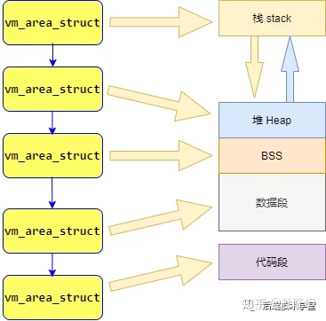
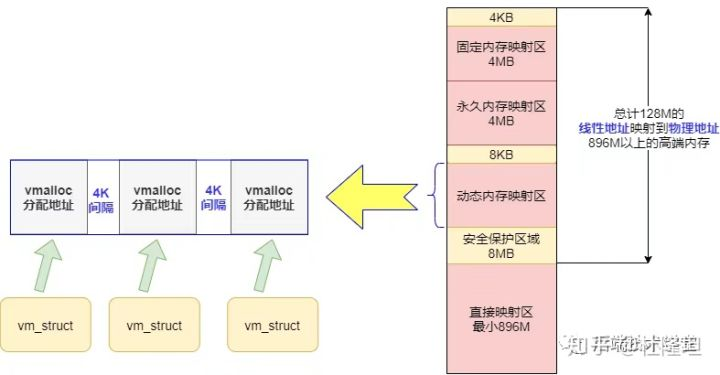
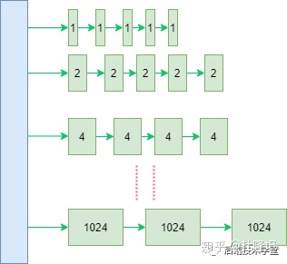

以32 bit linux 为例。

# 相关术语

- 储存介质

  ：保存数据或者程序的物质,不同层次有着不同的速度和容量

  > - 寄存器：CPU提供的，读写ns级别，容量字节级别。
  >
  > - CPU缓存：CPU和CPU间的缓存，读写10ns级别，容量较大一些，百到千节。
  >
  > - 主存：动态内存，读写100ns级别，容量GB级别。
  >
  > - 外部存储介质：磁盘、SSD，读写ms级别，容量可扩展到TB级别。
  >
  >   
  >
  >   其中 L1d 和 L1i 都是CPU内部的cache，L1d 是`数据cache`。L1i 是`指令缓存`
  >
  >   。L2是CPU内部的，不区分指令和数据的。由于现代PC有多个CPU，L3缓存多个核心共用一个。
  
- **物理地址(Physical Address)**: 这就是内存 DIMM 上的一个一个存储区间的物理编址，以字节为单位．

> 利用MMU 内存管理单元（Memory Management Unit ) 对虚拟地址分段和分页（段页式）地址转换。
>
> 

- **虚拟地址(Virtual Address)**: 技术上来讲，用户或内核用到的地址就是虚拟地址，需要 MMU (内存管理单元，一个用于支持虚拟内存的 CPU 片内机构) 翻译为物理地址。

> 这样做带来了以下优点：
>
> 1. 避免用户直接访问物理内存地址，防止一些破坏性操作，保护操作系统.
> 2. 每个进程都被分配了4GB的虚拟内存，用户程序可使用比实际物理内存更大的地址空间.

> 4GB （Linux 32bit）的进程虚拟地址空间被分成两部分：「用户空间」和「内核空间」
>
> 

- **内存分段(Segmentation)**：程序是由若干个逻辑分段组成的，如可由代码分段、数据分段、栈段、堆段组成。不同的段是有不同的属性的，所以就用分段（Segmentation）的形式把这些段分离出来。

- **内存页/页面(page)**：现代虚拟内存管理／分配的单位是一个物理内存页, 大小是 4096(4KB) 字节. 当然，很多 CPU 提供多种尺寸的物理内存页支持(如 X86, 除了4KB, 还有 2MB, 1GB页支持），但 Linux 内核中的默认页尺寸就是 4KB．内核初始化过程中，会对每个物理内存页分配一个描述符(struct page), 后文描述中可能多次提到这个描述符，它是 MM 内部，也是 MM 与其他子系统交互的一个接口描述符．

- **页表(page table)**: 从一个虚拟地址翻译为物理地址时，其实就是从一个稀疏哈希表中查找的过程，这个哈希表就是页表．

- **交换(swap)**: 内存紧缺时, MM 可能会把一些暂时不用的内存页转移到访问速度较慢的次级存储设备中(如磁盘, SSD), 以腾出空间,这个操作叫交换, 相应的存储设备叫交换设备或交换空间.

- **文件缓存页(`PageCache Page`)**: 内核会利用空闲的内存, 事先读入一些文件页, 以期不久的将来会用到, 从而避免在要使用时再去启动缓慢的外设(如磁盘)读入操作. 这些有后备存储介质的页面, 可以在内存紧缺时轻松丢弃, 等到需要时再次从外设读入. **典型的代表有可执行代码, 文件系统里的文件**.

- **匿名页(Anonymous Page)**: 这种页面的内容都是在内存中建立的,没有后备的外设, 这些页面在回收时不能简单的丢弃, 需要写入到交换设备中. **典型的代表有进程的栈, 使用 malloc() 分配的内存所在的页等** .

- **内存回收**:释放可回收的物理内存页的过程，被称之为回收，可以同步或者异步的回收操作。 根据页面的使用情况，Linux内存管理对其进行了不同的处理，可以随时释放的页面，称之为可回收页面，这类页面为：页面缓存或者是匿名内存（被再次交换到硬盘上）大多数情况下，保存内部内核数据并用DMA缓冲区的页面是不能重新被回收的，但是某些情况下，可以回收使用内核数据结构的页面。例如：**文件系统元数据的内存缓存**，当系统处于内存压力情况下，可以从主存中丢弃它们。 `（kswapd）`

- **compaction**:将被占用的页面，从内存区域合适的移动，以换取大块的空闲物理页的过程，由`kcompactd`守护进程完成.解决内存碎片

- **OOM killer**:机器上的内存可能会被耗尽，并且内核将无法回收足够的内存用于运行新的程序，为了保存系统的其余部分，内核会调用OOM killer杀掉一些进程，以释放内存。

- **NUMA(Non-Uniform Memory Access)**: 非一致性内存访问．NUMA 概念的引入是为了解决随着 CPU 个数的增长而出现的内存访问瓶颈问题，非一致性内存意为每个 NUMA 节点都有本地内存，提供高访问速度；也可以访问跨节点的内存，但要遭受较大的性能损耗．所以尽管整个系统的内存对任何进程来说都是可见的，但却存在访问速度差异，这一点对内存分配／内存回收都有着非常大的影响．Linux 内核于2.5版本引入对 NUMA的支持.

- NUMA node(NUMA节点)： NUMA 体系下，一个 node 一般是一个CPU socket(一个 socket 里可能有多个核）及它可访问的本地内存的整体．- zone(内存区): 一个 NUMA node 里的物理内存又被分为几个内存区(zone), 一个典型的 node 的内存区划分如下:

  

  可以看到每个node里，随着物理内存地址的增加，典型地分为三个区：

  > 1. **ZONE_DMA**: 这个区的存在有历史原因，古老的`ISA`总线外设，它们进行`DMA`操作时，只能访问内存物理空间低 `16MB` 的范围．所以故有这一区，用于给这些设备分配内存时使用．
  >    包含0MB~16MB之间的内存页框，可以由老式基于`ISA`的设备通过`DMA`使用，直接映射到内核的地址空间。

  > 1. **ZONE_NORMAL**: 这是 32位 CPU时代产物，很多内核态的内存分配都是在这个区间(用户态内存也可以在这部分分配，但优先在ZONE_HIGH中分配），但这部分的大小一般就只有 896 MB, 所以比较局限． 64位 CPU 情况下，内存的访问空间增大，这部分空间就增大了很多．关于为何这部分区间这么局限，且内核态内存分配在这个区间，感兴趣的可以看这个[回答](http://www.zhihu.com/question/34787574/answer/60214771).
  >    普通内存区域。包含16MB~896MB之间的内存页框，常规页框，直接映射到内核的地址空间。

  > 1. **ZONE_HIGH**: 典型情况下，这个区间覆盖系统所有剩余物理内存．这个区间叫做高端内存区(不是高级的意思，是地址区间高的意思). 这部分主要是用户态和部分内核态内存分配所处的区间．
  >
  > 物理内存划分图：
  >
  > 

# 用户空间和内核空间

在多用户通用操作系统中，为了保证各用户进程以及整个系统的安全性诞生了**用户空间**和**内核空间**的概念。


通过这里可以看出：

\- 32 位系统的内核空间占用 1G，位于最高处，剩下的 3G 是用户空间；
\- 64 位系统的内核空间和用户空间都是 128T，分别占据整个内存空间的最高和最低处，剩下的中间部分是未定义的。

区别：
\- 进程在用户态时，只能访问用户空间内存；
\- 只有进入内核态后，才可以访问内核空间的内存；

虽然每个进程都各自有独立的虚拟内存，但是**每个虚拟内存中的内核地址，其实关联的都是相同的物理内存**。这样，进程切换到内核态后，就可以很方便地访问内核空间内存。


## 用户空间

用户进程能访问的是「用户空间」，每个进程都有自己独立的用户空间，虚拟地址范围从从`0x00000000` 至 `0xBFFFFFFF` 总容量3G 。

用户进程通常只能访问用户空间的虚拟地址，只有在执行内陷操作或系统调用时才能访问内核空间。


### 进程内存模型

进程（执行的程序）占用的用户空间按照「 访问属性一致的地址空间存放在一起 」的原则，划分成 5个不同的内存区域。

访问属性指的是“可读、可写、可执行等。

- **代码段(.text)**：代码段是用来存放可执行文件的操作指令，可执行程序在内存中的镜像。代码段需要防止在运行时被非法修改，所以只准许读取操作，它是不可写的。
- **数据段(.data)**：数据段用来存放可执行文件中已初始化全局变量，换句话说就是存放程序静态分配的变量和全局变量。
- **BSS段(.bass)**：BSS段包含了程序中未初始化的全局变量，在内存中 `bss` 段全部置零。
- **堆(heap)**：堆是用于存放进程运行中被动态分配的内存段，它的大小并不固定，可动态扩张或缩减。当进程调用malloc等函数分配内存时，新分配的内存就被动态添加到堆上（堆被扩张）；当利用free等函数释放内存时，被释放的内存从堆中被剔除（堆被缩减）
- **文件映射段**，包括动态库、共享内存等，从低地址开始向上增长（[跟硬件和内核版本有关](http://lishiwen4.github.io/linux/linux-process-memory-location)）
- **栈 stack**: 栈是用户存放程序临时创建的局部变量，也就是函数中定义的变量（但不包括 static 声明的变量，static意味着在数据段中存放变量）。除此以外，在函数被调用时，其参数也会被压入发起调用的进程栈中，并且待到调用结束后，函数的返回值也会被存放回栈中。由于栈的先进先出特点，所以栈特别方便用来保存/恢复调用现场。从这个意义上讲，我们可以把堆栈看成一个寄存、交换临时数据的内存区。

上述几种内存区域中数据段、BSS 段、堆通常是被连续存储在内存中，在位置上是连续的，而代码段和栈往往会被独立存放。**堆和栈两个区域在 i386 体系结构中栈向下扩展、堆向上扩展，相对而生**。


使用`size`查看编译后程序的各个内存区域大小

```
size /usr/local/sbin/ssh
text    data     bss     dec     hex filename
592777    2324   13072  608173   947ad /usr/bin/ssh
```

## 内核空间

`x86 32`位系统里，Linux 内核地址空间是指虚拟地址从 `0xC0000000` 开始到 `0xFFFFFFFF` 为止的高端内存地址空间，总计 `1G` 的容量， 包括了内核镜像、物理页面表、驱动程序等运行在内核空间 。


### 直接映射区

直接映射区 `Direct Memory Region`：从内核空间起始地址开始，最大896M的内核空间地址区间，为直接内存映射区。

直接映射区的896MB的「线性地址」直接与「物理地址」的前896MB进行映射，也就是说线性地址和分配的物理地址都是连续的。内核地址空间的线性地址`0xC0000001`所对应的物理地址为`0x00000001`，它们之间相差一个偏移量`PAGE_OFFSET = 0xC0000000`

该区域的线性地址和物理地址存在线性转换关系`「线性地址 = PAGE_OFFSET + 物理地址」`也可以用 `virt_to_phys()`函数将内核虚拟空间中的线性地址转化为物理地址。

### 高端内存线性地址空间

内核空间线性地址从 896M 到 1G 的区间，容量 128MB 的地址区间是高端内存线性地址空间，为什么叫高端内存线性地址空间？下面给你解释一下：

前面已经说过，内核空间的总大小 1GB，从内核空间起始地址开始的 896MB 的线性地址可以直接映射到物理地址大小为 896MB 的地址区间。

退一万步，即使内核空间的1GB线性地址都映射到物理地址，那也最多只能寻址 1GB 大小的物理内存地址范围。

所以，内核空间拿出了最后的 128M 地址区间，划分成下面三个高端内存映射区，以达到对整个物理地址范围的寻址。而在 `64` 位的系统上就不存在这样的问题了，因为可用的线性地址空间远大于可安装的内存。

#### 动态内存映射区

`vmalloc Region` 该区域由内核函数`vmalloc`来分配，特点是：线性空间连续，但是对应的物理地址空间不一定连续。`vmalloc` 分配的线性地址所对应的物理页可能处于低端内存，也可能处于高端内存。

#### 永久内存映射区

`Persistent Kernel Mapping Region` 该区域可访问高端内存。访问方法是使用 `alloc_page (_GFP_HIGHMEM)` 分配高端内存页或者使用`kmap`函数将分配到的高端内存映射到该区域。

#### 固定映射区

Fixing kernel Mapping Region 该区域和 4G 的顶端只有 4k 的隔离带，其每个地址项都服务于特定的用途，如 ACPI_BASE 等。

内核空间物理内存映射：


## 内存全景图


## 内存数据结构

要让内核管理系统中的虚拟内存，必然要从中抽象出内存管理数据结构，内存管理操作如「分配、释放等」都基于这些数据结构操作，这里列举两个管理虚拟内存区域的数据结构。

### 用户空间内存数据结构

在前面「用户空间」章节我们提到，Linux进程可以划分为 5 个不同的内存区域，分别是：代码段、数据段、BSS、堆、栈，内核管理这些区域的方式是，将这些内存区域抽象成`vm_area_struct`的内存管理对象。

`vm_area_struct`是描述进程地址空间的基本管理单元，一个进程往往需要多个`vm_area_struct`来描述它的用户空间虚拟地址，需要使用「链表」和「红黑树」来组织各个 `vm_area_struct` 。

链表用于需要遍历全部节点的时候用，而红黑树适用于在地址空间中定位特定内存区域。内核为了内存区域上的各种不同操作都能获得高性能，所以同时使用了这两种数据结构。

用户空间进程的地址管理模型：



### 内核空间动态分配内存数据结构

在内核空间章节我们提到过「动态内存映射区」，该区域由内核函数`vmalloc`来分配，特点是：线性空间连续，但是对应的物理地址空间不一定连续。`vmalloc` 分配的线性地址所对应的物理页可能处于低端内存，也可能处于高端内存。

`vmalloc` 分配的地址则限于`vmalloc_start`与`vmalloc_end`之间。每一块`vmalloc`分配的内核虚拟内存都对应一个`vm_struct`结构体，不同的内核空间虚拟地址之间有4k大小的防越界空闲区间隔区。

与用户空间的虚拟地址特性一样，这些虚拟地址与物理内存没有简单的映射关系，必须通过内核页表才可转换为物理地址或物理页，它们有可能尚未被映射，当发生缺页时才真正分配物理页面。

动态内存映射



# 物理内存管理

早期 Intel 的处理器从 80286 开始使用的是段式内存管理。但是很快发现，光有段式内存管理而没有页式内存管理是不够的，这会使它的 X86 系列会失去市场的竞争力。因此，在不久以后的 80386 中就实现了页式内存管理。也就是说，80386 除了完成并完善从 80286 开始的段式内存管理的同时还实现了页式内存管理。

但是这个 80386 的页式内存管理设计时，没有绕开段式内存管理，而是建立在段式内存管理的基础上，这就意味着，**页式内存管理的作用是在由段式内存管理所映射而成的地址上再加上一层地址映射**。

由于此时由段式内存管理映射而成的地址不再是“物理地址”了，Intel 就称之为“`线性地址`”（也称`虚拟地址`）。于是，段式内存管理先将`逻辑地址`映射成`虚拟地址`，然后再由页式内存管理将虚拟地址映射成`物理地址`。


这里说明下逻辑地址和线性地址：

\- 程序所使用的地址，通常是没被段式内存管理映射的地址，称为逻辑地址；
\- 通过段式内存管理映射的地址，称为线性地址，也叫虚拟地址；

逻辑地址是「段式内存管理」转换前的地址，线性地址则是「页式内存管理」转换前的地址。

## 段式内存管理

分段机制下的虚拟地址由两部分组成，**段选择子**和**段内偏移量**。


- **段选择因子**就保存在段寄存器里面。段选择因子里面最重要的是**段号**，用作段表的索引。段表里面保存的是这个**段的基地址、段的界限和特权等级**等。
- 虚拟地址中的**段内偏移量**应该位于 0 和段界限之间，如果段内偏移量是合法的，就将段基地址加上段内偏移量得到物理内存地址。

在上面，知道了虚拟地址是通过段表与物理地址进行映射的，分段机制会把程序的虚拟地址分成 4 个段，每个段在段表中有一个项，在这一项找到段的基地址，再加上偏移量，于是就能找到物理内存中的地址，如下图：


如果要访问段 3 中偏移量 500 的虚拟地址，我们可以计算出物理地址为，段 3 基地址 7000 + 偏移量 500 = 7500。

## 页式内存管理

页表实际上存储在 CPU 的**内存管理单元 （MMU）**中，于是 CPU 就可以直接通过 MMU（稀疏表格），找出要实际要访问的物理内存地址。

而当进程访问的虚拟地址在页表中查不到时，系统会产生一个缺页异常，进入系统内核空间分配物理内存、更新进程页表，最后再返回用户空间，恢复进程的运行。

> 分页是怎么解决分段的内存碎片、内存交换效率低的问题？

由于内存空间都是预先划分好的，也就不会像分段会产生间隙非常小的内存，这正是分段会产生内存碎片的原因。而**采用了分页，那么释放的内存都是以页为单位释放的，也就不会产生无法给进程使用的小内存**。

如果内存空间不够，操作系统会把其他正在运行的进程中的「最近没被使用」的内存页面给释放掉，也就是暂时写在硬盘上，称为**换出（Swap Out）**。一旦需要的时候，再加载进来，称为**换入（Swap In）**。所以，一次性写入磁盘的也只有少数的一个页或者几个页，不会花太多时间，内存交换的效率就相对比较高。


### 虚拟地址和物理地址是如何映射

在分页机制下，虚拟地址分为两部分，**页号**和**页内偏移**。页号作为页表的索引，**页表**包含物理页每页所在**物理内存的基地址**，这个基地址与页内偏移的组合就形成了物理内存地址，见下图。


总结一下，对于一个内存地址转换，其实就是这样三个步骤：

- 把虚拟内存地址，切分成页号和偏移量；
- 根据页号，从页表里面，查询对应的物理页号；
- 直接拿物理页号，加上前面的偏移量，就得到了物理内存地址。


### 页表存在的问题

因为操作系统是可以同时运行非常多的进程的，那这不就意味着页表会非常的庞大。在 32 位的环境下，虚拟地址空间共有 4GB，假设一个页的大小是 4KB（2^12^），那么就需要大约 100 万 （2^20^） 个页，每个「页表项」需要 4 个字节大小来存储，那么整个 4GB 空间的映射就需要有 4MB 的内存来存储页表。

这 4MB 大小的页表，看起来也不是很大。但是要知道每个进程都是有自己的虚拟地址空间的，也就说都有自己的页表。

那么，100 个进程的话，就需要 400MB 的内存来存储页表，这是非常大的内存了，更别说 64 位的环境了。

### 多级页表

要解决上面的问题，就需要采用的是一种叫作多级页表（Multi-Level Page Table）的解决方案。

在前面我们知道了，对于单页表的实现方式，在 32 位和页大小 4KB 的环境下，一个进程的页表需要装下 100 多万个「页表项」，并且每个页表项是占用 4 字节大小的，于是相当于每个页表需占用 4MB 大小的空间。

我们把这个 100 多万个「页表项」的单级页表再分页，将页表（一级页表）分为 1024 个页表（二级页表），每个表（二级页表）中包含 1024 个「页表项」，形成**二级分页**。如下图所示：


需要注意的是，我们不会把所有应用的虚拟地址页数据全部映射到页表中，而只会把需要的页映射上去，如果需要映射的地址不存在页表中则会触发**缺页异常**。

每个进程都有 4GB 的虚拟地址空间，而显然对于大多数程序来说，其使用到的空间远未达到 4GB，因为会存在部分对应的页表项都是空的，根本没有分配，对于已分配的页表项，如果存在最近一定时间未访问的页表，在物理内存紧张的情况下，操作系统会将页面换出到硬盘，也就是说不会占用物理内存。

一级页表就可以覆盖整个 4GB 虚拟地址空间，但**如果某个一级页表的页表项没有被用到，也就不需要创建这个页表项对应的二级页表了**，即可以在需要时才创建二级页表。做个简单的计算，假设只有 20% 的一级页表项被用到了，那么页表占用的内存空间就只有 4KB（一级页表） + 20% * 4MB（二级页表）= 0.804MB，这对比单级页表的 4MB 是不是一个巨大的节约？

那么为什么不分级的页表就做不到这样节约内存呢？我们从页表的性质来看，保存在内存中的页表承担的职责是将虚拟地址翻译成物理地址。假如虚拟地址在页表中找不到对应的页表项，计算机系统就不能工作了。所以**页表一定要覆盖全部虚拟地址空间，不分级的页表就需要有 100 多万个页表项来映射，而二级分页则只需要 1024 个页表项**（此时一级页表覆盖到了全部虚拟地址空间，二级页表在需要时创建）。

我们把二级分页再推广到多级页表，就会发现页表占用的内存空间更少了，这一切都要归功于对**局部性原理**的充分应用。对于 64 位的系统，两级分页肯定不够了，就变成了四级目录，分别是：

- 全局页目录项 PGD（Page Global Directory）
- 上层页目录项 PUD（Page Upper Directory）
- 中间页目录项 PMD（Page Middle Directory）
- 页表项 PTE（Page Table Entry）


### TLB

多级页表虽然解决了空间上的问题，但是虚拟地址到物理地址的转换就多了几道转换的工序，这显然就降低了这俩地址转换的速度，也就是带来了时间上的开销。

程序是有局部性的，即在一段时间内，整个程序的执行仅限于程序中的某一部分。相应地，执行所访问的存储空间也局限于某个内存区域。

我们就可以利用这一特性，把最常访问的几个页表项存储到访问速度更快的硬件，于是计算机科学家们，就在 CPU 芯片中，加入了一个专门存放程序最常访问的页表项的 Cache，这个 Cache 就是 TLB（Translation Lookaside Buffer） ，通常称为**页表缓存、转址旁路缓存、快表**等。


在 CPU 芯片里面，封装了`内存管理单元（Memory Management Unit）`芯片，它用来完成地址转换和 TLB 的访问与交互。

有了 TLB 后，那么 CPU 在寻址时，会先查 TLB，如果没找到，才会继续查常规的页表。

TLB流程


TLB 的命中率其实是很高的，因为程序最常访问的页就那么几个。

### 段页式内存管理

内存分段和内存分页并不是对立的，它们是可以组合起来在同一个系统中使用的，那么组合起来后，通常称为**段页式内存管理**。

段页式内存管理实现的方式：

- 先将程序划分为多个有逻辑意义的段，也就是前面提到的分段机制；
- 接着再把每个段划分为多个页，也就是对分段划分出来的连续空间，再划分固定大小的页；

这样，地址结构就由**段号、段内页号和页内位移**三部分组成。

用于段页式地址变换的数据结构是每一个程序一张段表，每个段又建立一张页表，段表中的地址是页表的起始地址，而页表中的地址则为某页的物理页号，如图所示：


段页式地址变换中要得到物理地址须经过三次内存访问：

- 第一次访问段表，得到页表起始地址；
- 第二次访问页表，得到物理页号；
- 第三次将物理页号与页内位移组合，得到物理地址。

可用软、硬件相结合的方法实现段页式地址变换，这样虽然增加了硬件成本和系统开销，但提高了内存的利用率。

# Linux内存管理

**Linux 内存主要采用的是页式内存管理，但同时也不可避免地涉及了段机制。**

这主要是上面 Intel 处理器发展历史导致的，因为 Intel X86 CPU 一律对程序中使用的地址先进行段式映射，然后才能进行页式映射。既然 CPU 的硬件结构是这样，Linux 内核也只好服从 Intel 的选择。

但是事实上，Linux 内核所采取的办法是使段式映射的过程实际上不起什么作用。也就是说，“上有政策，下有对策”，若惹不起就躲着走。

**Linux 系统中的每个段都是从 0 地址开始的整个 4GB 虚拟空间（32 位环境下），也就是所有的段的起始地址都是一样的。这意味着，Linux 系统中的代码，包括操作系统本身的代码和应用程序代码，所面对的地址空间都是线性地址空间（虚拟地址），这种做法相当于屏蔽了处理器中的逻辑地址概念，段只被用于访问控制和内存保护。**

## 物理页管理面临的问题

假如系统需要大块内存，则可以用多页内存拼凑，而不必要求大块连续内存。你看不管内存大小都能收放自如，分页机制多么完美的解决方案！

But，理想很丰满，现实很骨感。如果就直接这样把内存分页使用，不再加额外的管理还是存在一些问题，下面我们来看下，系统在多次分配和释放物理页的时候会遇到哪些问题。

物理内存页分配会出现外部碎片和内部碎片问题，所谓的「内部」和「外部」是针对「页框内外」而言，一个页框内的内存碎片是内部碎片，多个页框间的碎片是外部碎片。

### 外部碎片

当需要分配大块内存的时候，要用好几页组合起来才够，而系统分配物理内存页的时候会尽量分配连续的内存页面，频繁的分配与回收物理页导致大量的小块内存夹杂在已分配页面中间，形成外部碎片，举个例子：


### 内部碎片

物理内存是按页来分配的，这样当实际只需要很小内存的时候，也会分配至少是 4K 大小的页面，而内核中有很多需要以字节为单位分配内存的场景，这样本来只想要几个字节而已却不得不分配一页内存，除去用掉的字节剩下的就形成了内部碎片。


## 页面管理算法

方法总比困难多，因为存在上面的这些问题，聪明的程序员灵机一动，引入了页面管理算法来解决上述的碎片问题。

### Buddy（伙伴）分配算法

Linux 内核引入了**伙伴系统算法（Buddy system）**，什么意思呢？就是把相同大小的页框块用链表串起来，页框块就像手拉手的好伙伴，也是这个算法名字的由来。

具体的，所有的空闲页框分组为11个块链表，每个块链表分别包含大小为1，2，4，8，16，32，64，128，256，512和1024个连续页框的页框块。最大可以申请1024个连续页框，对应4MB大小的连续内存。



因为任何正整数都可以由 `2^n` 的和组成，所以总能找到合适大小的内存块分配出去，减少了外部碎片产生 。

**分配实例**

比如：需要申请4个页框，但是长度为4个连续页框块链表没有空闲的页框块，伙伴系统会从连续8个页框块的链表获取一个，并将其拆分为两个连续4个页框块，取其中一个，另外一个放入连续4个页框块的空闲链表中。释放的时候会检查，释放的这几个页框前后的页框是否空闲，能否组成下一级长度的块。

命令查看

```
cat /proc/buddyinfo 
Node 0, zone      DMA   1331   1396   1353     93    122     79     27     10      0      0      0
Node 0, zone  HighMem     45     24     13     12      3      0      0      0      0      0      0
```


### slab分配器

看到这里你可能会想，有了伙伴系统这下总可以管理好物理内存了吧？不，还不够，否则就没有slab分配器什么事了。

那什么是slab分配器呢？

一般来说，内核对象的生命周期是这样的：分配内存-初始化-释放内存，内核中有大量的小对象，比如文件描述结构对象、任务描述结构对象，如果按照伙伴系统按页分配和释放内存，对小对象频繁的执行「分配内存-初始化-释放内存」会非常消耗性能。

伙伴系统分配出去的内存还是以页框为单位，而对于内核的很多场景都是分配小片内存，远用不到一页内存大小的空间。slab分配器，**「通过将内存按使用对象不同再划分成不同大小的空间」**，应用于内核对象的缓存。

伙伴系统和slab不是二选一的关系，slab 内存分配器是对伙伴分配算法的补充。

原理：

对于每个内核中的相同类型的对象，如：`task_struct`、`file_struct` 等需要重复使用的小型内核数据对象，都会有个 slab 缓存池，缓存住大量常用的「已经初始化」的对象，每当要申请这种类型的对象时，就从缓存池的slab 列表中分配一个出去；而当要释放时，将其重新保存在该列表中，而不是直接返回给伙伴系统，从而避免内部碎片，同时也大大提高了内存分配性能。

主要优点：

- slab 内存管理基于内核小对象，不用每次都分配一页内存，充分利用内存空间，避免内部碎片。
- slab 对内核中频繁创建和释放的小对象做缓存，重复利用一些相同的对象，减少内存分配次数。

#### 数据结构


`kmem_cache` 是一个cache_chain 的链表组成节点，代表的是一个内核中的相同类型的「对象高速缓存」，每个 `kmem_cache` 通常是一段连续的内存块，包含了三种类型的 `slabs` 链表：

- `slabs_full` (完全分配的 slab 链表)
- `slabs_partial` (部分分配的slab 链表)
- `slabs_empty` ( 没有被分配对象的slab 链表)

`kmem_cache` 中有个重要的结构体 `kmem_list3` 包含了以上三个数据结构的声明。


`slab` 是 `slab` 分配器的最小单位，在实现上一个 slab 由一个或多个连续的物理页组成（通常只有一页）。单个slab可以在 slab 链表之间移动，例如如果一个「半满slabs_partial链表」被分配了对象后变满了，就要从 `slabs_partial` 中删除，同时插入到「全满slabs_full链表」中去。内核slab对象的分配过程是这样的：

1. 如果slabs_partial链表还有未分配的空间，分配对象，若分配之后变满，移动 slab 到slabs_full 链表
2. 如果slabs_partial链表没有未分配的空间，进入下一步
3. 如果slabs_empty 链表还有未分配的空间，分配对象，同时移动slab进入slabs_partial链表
4. 如果slabs_empty为空，请求伙伴系统分页，创建一个新的空闲slab， 按步骤 3 分配对象


命令查看

```
cat /proc/slabinfo #查看系统中slab 信息
# name            <active_objs> <num_objs> <objsize> <objperslab> <pagesperslab> : tunables <limit> <batchcount> <sharedfactor> : slabdata <active_slabs> <num_slabs> <sharedavail>
kvm_async_pf           0      0    136   30    1 : tunables    0    0    0 : slabdata      0      0      0
kvm_vcpu               0      0  11328    1    4 : tunables    0    0    0 : slabdata      0      0      0
kvm_mmu_page_header      0      0    168   24    1 : tunables    0    0    0 : slabdata      0      0      0
x86_emulator           0      0   2672   12    8 : tunables    0    0    0 : slabdata      0      0      0
...

slabtop #实时显示内核 slab 内存缓存信息
```


#### slab高速缓存的分类

slab高速缓存分为两大类，「通用高速缓存」和「专用高速缓存」。

通用高速缓存：`slab` 分配器中用 `kmem_cache` 来描述高速缓存的结构，它本身也需要 `slab` 分配器对其进行高速缓存。 `cache_cache` 保存着对「高速缓存描述符的高速缓存」，是一种通用高速缓存，保存在cache_chain 链表中的第一个元素。

另外， `slab` 分配器所提供的小块连续内存的分配，也是通用高速缓存实现的。通用高速缓存所提供的对象具有几何分布的大小，范围为32到131072字节。内核中提供了 `kmalloc()` 和 `kfree()` 两个接口分别进行内存的申请和释放。

专用高速缓存：内核为专用高速缓存的申请和释放提供了一套完整的接口，根据所传入的参数为指定的对象分配slab缓存。

专用高速缓存的申请和释放：`kmem_cache_create()` 用于对一个指定的对象创建高速缓存。它从 cache_cache 普通高速缓存中为新的专有缓存分配一个高速缓存描述符，并把这个描述符插入到高速缓存描述符形成的 `cache_chain` 链表中。`kmem_cache_destory()` 用于撤消和从 `cache_chain` 链表上删除高速缓存。

slab的申请和释放：slab 数据结构在内核中的定义，如下：


`kmem_cache_alloc()` 在其参数所指定的高速缓存中分配一个slab，对应的 `kmem_cache_free()` 在其参数所指定的高速缓存中释放一个slab。

## 虚拟内存分配

前面讨论的都是对物理内存的管理，Linux 通过虚拟内存管理，欺骗了用户程序假装每个程序都有 4G 的虚拟内存寻址空间。

**注意，分配的虚拟内存还没有映射到物理内存，只有当访问申请的虚拟内存时，才会发生缺页异常，再通过上面介绍的伙伴系统和 slab 分配器申请物理内存。**


