# Shell基础

shell是一个程序，接受来自键盘输入的命令，然后传递给OS去执行。几乎所有的Linux发行版都提供一个名为bash的来自GNU的shell程序。

shell提示符的一般格式为：

`[user@hostname workingDirectory]$`

当最后一个符号不是$号而是#号时，说明当前用户具有超级用户权限。

一些简单的命令：

```shell
[root@docker ~]# date
2021年 01月 29日 星期五 10:25:03 CST
[root@docker ~]# cal
      一月 2021     
日 一 二 三 四 五 六
                1  2
 3  4  5  6  7  8  9
10 11 12 13 14 15 16
17 18 19 20 21 22 23
24 25 26 27 28 29 30
31
# 查看磁盘剩余空间，全称为disk free
[root@docker ~]# df
文件系统                   1K-块    已用     可用 已用% 挂载点
devtmpfs                  919672       0   919672    0% /dev
tmpfs                     931504       0   931504    0% /dev/shm
tmpfs                     931504    9696   921808    2% /run
tmpfs                     931504       0   931504    0% /sys/fs/cgroup
/dev/mapper/centos-root 49250820 4086216 45164604    9% /
/dev/sda1                1038336  197880   840456   20% /boot
tmpfs                     186304       0   186304    0% /run/user/0
# 查看空闲内存大小
[root@docker ~]# free
              total        used        free      shared  buff/cache   available
Mem:        1863012      217200     1378896        9696      266916     1494396
Swap:             0           0           0
```

使用exit命令可以退出当前终端。

Shell支持的通配符：

| 通配符      | 描述                               |
| ----------- | ---------------------------------- |
| *           | 任意个字符                         |
| ?           | 任意单个字符                       |
| `[abc]`     | 匹配a或b或c                        |
| `[!abc]`    | 匹配不是a或b或c的字符              |
| [[:class:]] | 匹配任意一个属于指定字符类中的字符 |

class包括：`alnum`、alpha、digit、lower、upper等。

接收文件名作为参数的任何命令都可以使用通配符。

shell在执行命令之前，首先会对输入的字符进行展开，例如对’*‘进行展开。

## 算数表达式

shell允许算术表达式通过展开来执行，格式为：`$((expression))`

```shell
[root@docker ~]# echo $((2+2*6))
14
[root@docker ~]# echo $((5**2*3))
75
```

## 花括号展开

```shell
[root@docker ~]# echo Num_{1..5}
Num_1 Num_2 Num_3 Num_4 Num_5
[root@docker ~]# echo {a..z}
a b c d e f g h i j k l m n o p q r s t u v w x y z
[root@docker ~]# echo a{A{1,2},B{3,4}}
aA1 aA2 aB3 aB4
```

可用于一键生成多个路径：

```shell
[root@docker dir1]# mkdir {2007..2009}-0{0..9} {2007..2009}-{10..12}
[root@docker dir1]# ls
2007-00  2007-03  2007-06  2007-09  2007-12  2008-02  2008-05  2008-08  2008-11  2009-01  2009-04  2009-07  2009-10
2007-01  2007-04  2007-07  2007-10  2008-00  2008-03  2008-06  2008-09  2008-12  2009-02  2009-05  2009-08  2009-11
2007-02  2007-05  2007-08  2007-11  2008-01  2008-04  2008-07  2008-10  2009-00  2009-03  2009-06  2009-09  2009-12
```

## 命令替换

利用`$(command)`可以将一个命令的输出作为一个展开模式来使用。

```shell
[root@docker dir1]# ls -l $(which sh)
lrwxrwxrwx. 1 root root 4 8月   9 21:08 /usr/bin/sh -> bash
# 和管道结合
[root@docker dir1]# file $(ls /usr/bin/* | grep zip)
/usr/bin/gpg-zip: POSIX shell script, ASCII text executable
/usr/bin/gunzip:  POSIX shell script, ASCII text executable
/usr/bin/gzip:    ELF 64-bit LSB executable, x86-64, version 1 (SYSV), dynamically linked (uses shared libs), for GNU/Linux 2.6.32, BuildID[sha1]=526d77ff7164870f948d8f97aaf0a888cc561b30, stripped

```

## 引号

**双引号内，只有环境变量，算术表达式展开和命令替换有效。**

```shell
[root@docker dir1]# echo "$USER $((5%4)) $(ls | head -2)"
root 1 2007-00
2007-01
```

在双引号内，单词分割被禁止，内嵌的空格不会被当作定界符，而是会作为参数的一部分。没有双引号时，换行被视为定界符，从而会对输出结果产生一定影响：

```shell
# 命令中包括38个参数
[root@docker dir1]# echo $(cal)
一月 2021 日 一 二 三 四 五 六 1 2 3 4 5 6 7 8 9 10 11 12 13 14 15 16 17 18 19 20 21 22 23 24 25 26 27 28 29 30 31
# 命令中只包括一个参数
[root@docker dir1]# echo "$(cal)"
      一月 2021     
日 一 二 三 四 五 六
                1  2
 3  4  5  6  7  8  9
10 11 12 13 14 15 16
17 18 19 20 21 22 23
24 25 26 27 28 29 30
31
```

**如果需要禁止一切展开，则使用单引号。**

## 自动补全

与自动补全相关的控制键：

`Alt+?`：显示可能的自动补全列表，也可以通过按两次tab键实现。

`Alt+*`：插入所有可能的自动补全。

# 文件系统

基本命令：

- `pwd`：print working directory，输出当前工作目录（绝对路径）。
- `cd`：change directory，更改目录。
- `ls`：list，列出目录内容。

相对路径：`.`表示工作目录，`..`表示工作目录的上级目录。

一些快捷键：

- `cd`：更改工作目录到当前用户的Home Directory。
- `cd -`：更改工作目录到之前的工作目录。
- `cd ~user_name`：更改工作目录到特定user的Home Directory。

## ls

```shell
# 输出指定目录的内容
[root@docker hello-image]# ls /usr
bin  etc  games  include  lib  lib64  libexec  local  sbin  share  src  tmp
# 输出当前目录的内容
[root@docker hello-image]# ls
dockerfile  hello  hello.c
# ls后可以跟多个路径
[root@docker hello-image]# ls ~ /usr
/root:
2  anaconda-ks.cfg  hello-image

/usr:
bin  etc  games  include  lib  lib64  libexec  local  sbin  share  src  tmp
```

ls命令有大量的选项，以下是一些常用的选项：

| 选项 | 长选项             | 描述                                                         |
| ---- | ------------------ | ------------------------------------------------------------ |
| `-a` | `--all`            | 列出所有文件，包括隐藏文件，以及当前目录和父目录对应的`.`和`..`。 |
| `-A` |                    | 列出包括隐藏文件在内的所有文件，不包括当前目录和父目录。等价于`ls .[!.]?*` |
| `-d` | `--directory`      | 和`-l`配合，输出目录的信息，而不是列出目录内的文件信息       |
| `-F` | `--classify`       | 区分文件和路径，在路径后加一个`/`                            |
| `-h` | `--human-readable` | 和`-l`配合，以可读的格式显示文件大小。                       |
| `-l` |                    | 以长格式显示结果。                                           |
| `-r` | `--reverse`        | 逆序输出（ls的结果通常按字母升序排列）。                     |
| `-S` |                    | 按照文件大小来排序（从大到小）。                             |
| `-t` |                    | 按照修改时间来排序。                                         |
| `-i` |                    | 展示文件索引编号。                                           |

示例：

```shell
[root@docker hello-image]# ls -hl
总用量 852K
drwxr-xr-x 2 root root    6 1月  29 10:58 books
-rw-r--r-- 1 root root   37 10月  6 00:36 dockerfile
-rwxr-xr-x 1 root root 841K 10月  6 00:18 hello
-rw-r--r-- 1 root root   61 10月  6 00:15 hello.c
# 按文件从小到大的顺序输出
[root@docker hello-image]# ls -Sr
books  dockerfile  hello.c  hello
# 输出当前路径的详细信息
[root@docker hello-image]# ls -ld
drwxr-xr-x 2 root root 52 10月  6 00:36 .
```

对`-l`的输出结果：`-rw-r--r-- 1 root root   37 10月  6 00:36 dockerfile`，各个字段的含义如下。

| 字段         | 含义                                                         |
| ------------ | ------------------------------------------------------------ |
| `-rw-r--r--` | 文件的访问权限。第一个字符指出文件类型，`-`表示要给普通文件，d表示一个目录。之后的三个字符是文件所有者的访问权限，再其后的三个字符是文件所属组中成员的访问权限，最后三个字符是其他所有人的访问权限。 |
| 1            | 文件的硬链接数目。                                           |
| root         | 文件主人的用户名。                                           |
| root         | 文件所属的用户组名。                                         |
| 37           | 文件大小，单位为字节。                                       |
| 10月6 00：36 | 文件最后修改时间。                                           |
| `dockerfile` | 文件名。                                                     |

## less/more

```shell
# 浏览文件内容
[root@docker ~]# less /etc/dracut.conf
```

less程序常用的键盘命令：

| 命令              | 行为           |
| ----------------- | -------------- |
| `PageUp`或b       | 向上翻页       |
| `PageDown`或space | 向下翻页       |
| G                 | 移动到最后一行 |
| g                 | 移动到第一行   |
| `/str`            | 向前查找`str`  |
| q                 | 退出less程序   |

less是more的改良版，less可以通过键盘的上下左右来浏览文件，而more不支持。

## 文件说明

| /             | 根目录                                                       |
| ------------- | ------------------------------------------------------------ |
| `/bin`        | 系统启动和运行必须的二进制文件。                             |
| `/boot`       | 包含Linux内核，最初的RMA磁盘映像和启动加载程序。             |
| `/dev`        | 包含设备节点，内核在该目录维护其支持的设备。                 |
| `/etc`        | 系统层面的配置文件。                                         |
| `/home`       | 普通用户的目录所在的目录。                                   |
| `/lib`        | 核心系统程序所需的库文件。                                   |
| `/lost+found` | 文件系统损坏时需要使用到的目录。                             |
| `/media`      | 在现在的Linux系统中，/media目录包含可移除设备的挂载点。      |
| `/mnt`        | 早期Linux系统中，`/mnt`包含可移除设备的挂载点。              |
| `/opt`        | 存储可能安装在系统中的商业软件产品。                         |
| `/proc`       | 由Linux内核维护的虚拟文件系统，读取进程的一些数据（包括内存页表等）。 |
| `/root`       | root账户的Home Directory。                                   |
| `/sbin`       | 这个目录包含“系统”二进制文件。它们是完成重大系统任务的程序，通常为超级用户保留。 |
| `/tmp`        | 临时文件目录，系统每次重启时都会清空该目录。                 |
| `/usr`        | 包含普通用户所需要的所有程序和文件。                         |
| `/usr/bin`    | `系统安装的可执行程序。`                                     |
| `/usr/lib`    | 包括由`/usr/bin`中的程序共享的库文件。                       |
| `/var`        | 可能需要改动的文件存储的地方。                               |

## 操作文件和目录

### `mkdir`

创建目录。

使用方式：

- `mkdir dir1`
- `mkdir dir1 dir2 dir3`

### `cp`

复制文件和目录。

使用方式：

用法：`cp [选项]... [-T] 源文件 目标文件`
　或：`cp [选项]... 源文件... 目录`
　或：`cp [选项]... -t 目录 源文件...`

```shell
# 1 复制单个文件到当前目录
[root@docker ~]# ls
2  anaconda-ks.cfg  dir1  dir2  file1  file2  hello-image
[root@docker ~]# cp file1 file3
[root@docker ~]# ls
2  anaconda-ks.cfg  dir1  dir2  file1  file2  file3  hello-image
# 2 复制单个文件到目标目录，文件在目标目录中存在，此时会询问是否对同名文件进行覆盖
[root@docker ~]# cp file1 ./file2
cp：是否覆盖"./file2"？ y
# 3 复制整个目录，目标目录存在。此时会把整个目录拷贝到目标目录中。
[root@docker ~]# cp -a dir1 dir2
[root@docker ~]# cd dir2
[root@docker dir2]# ls
dir1
# 4 复制整个目录，目标目录不存在。此时会创建目标目录，并把源目录中的内容拷贝到目标目录。 
[root@docker ~]# cp -a dir1 dir3
[root@docker ~]# ls
2  anaconda-ks.cfg  dir1  dir2  dir3  file1  file2  file3  hello-image
[root@docker ~]# cd dir3
[root@docker dir3]# ls
asfs
# 5 复制多个文件到目标目录，目标目录必须存在。
[root@docker ~]# cp file1 file2 dir1
# 6 复制目录1的所有文件到目录2，目录2必须存在
[root@docker ~]# cp dir1/* dir2
```

`cp`命令的常用选项：

| 选项                | 意义                                                         |
| ------------------- | ------------------------------------------------------------ |
| `-a,--archive`      | 复制文件和目录，以及它们的属性，包括所有权和权限。通常，拷贝具有用户所操作文件的默认属性。 |
| `-i，--interactive` | 重写文件之前提醒用户确认，默认开启。                         |
| `-r,--recursive`    | 递归地复制目录及目录中的内容。复制目录时需要加上`-r`或`-a`。 |
| `-u,--update`       | 复制文件时仅复制目标目录中不存在的文件，或者文件内容新于目标目录中已存在文件的文件。 |
| `-v,--verbose`      | 限制具体操作信息。                                           |

### mv

移动文件或重命名。

使用：

- `mv item1 item2`
- `mv item... dir`

`mv`的选项与`cp`类似。

### `rm`

删除文件或目录。

常用选项：

| 选项                | 意义                                           |
| ------------------- | ---------------------------------------------- |
| `-f,--force`        | 强制删除文件。                                 |
| `-i，--interactive` | 删除文件之前提醒用户确认，默认开启。           |
| `-r,--recursive`    | 递归地删除文件，需要删除路径时必须指定该选项。 |
| `-v,--verbose`      | 限制具体操作信息。                             |

### `ln`

创建硬链接：`ln file link`

创建符号链接：`ln -s file/dir link`

每个文件都有一个硬链接，因为文件名就是由硬链接创建的，硬链接和文件没有什么区别。删除一个硬链接时，文件不会被删除，当一个文件的所有硬链接都被删除时，文件才会被删除。

符号链接类似Windows中的快捷方式。

对于符号链接，有一点值得记住，执行的大多数文件操作是针对链接的对象，而不是链接本身。而 `rm` 命令是个特例。当你删除链接的时候，删除链接本身，而不是链接的对象。

### 压缩/解压缩

**1）打包并压缩文件：**

Linux 中的打包文件一般是以.tar 结尾的，压缩的命令一般是以.gz 结尾的。而一般情况下打包和压缩是一起进行的，打包并压缩后的文件的后缀名一般.tar.gz。 命令：`tar -zcvf 打包压缩后的文件名 要打包压缩的文件` ，其中：

- z：调用 gzip 压缩命令进行压缩
- c：打包文件
- v：显示运行过程
- f：指定文件名

比如：假如 test 目录下有三个文件分别是：aaa.txt bbb.txt ccc.txt，如果我们要打包 test 目录并指定压缩后的压缩包名称为 test.tar.gz 可以使用命令：**`tar -zcvf test.tar.gz aaa.txt bbb.txt ccc.txt` 或 `tar -zcvf test.tar.gz /test/`**

**2）解压压缩包：**

命令：`tar [-xvf] 压缩文件`

其中：x：代表解压

示例：

- 将 /test 下的 test.tar.gz 解压到当前目录下可以使用命令：**`tar -xvf test.tar.gz`**
- 将 /test 下的 test.tar.gz 解压到根目录/usr 下:**`tar -xvf test.tar.gz -C /usr`**（- C 代表指定解压的位置）

### find

**`find 目录 参数`：** 寻找目录（查）。

示例：

① 列出当前目录及子目录下所有文件和文件夹: `find .`

② 在`/home`目录下查找以.txt 结尾的文件名:`find /home -name "*.txt"` ,忽略大小写: `find /home -iname "*.txt"` 

③ 当前目录及子目录下查找所有以.txt 和.pdf 结尾的文件:`find . \( -name "*.txt" -o -name "*.pdf" \)`或`find . -name "*.txt" -o -name "*.pdf"`

# 命令

命令可以是下面四种形式之一：
1. 可执行程序，就像我们所看到的位于目录`/usr/bin`中的文件一样。
2. shell自带的命令(`bulitins`)。bash支持若干命令，叫做shell内部命令。例如cd命令。
3. 一个shell脚本。
4. 是一个命令别名。我们可以在其它命令之上定义自己的命令。

## type

type用于显示命令的类别：`type command`

```shell
[root@docker ~]# type type
type 是 shell 内嵌
[root@docker ~]# type ls
ls 是 `ls --color=auto' 的别名
[root@docker ~]# type cp
cp 是 `cp -i' 的别名
```

## which

显示一个可执行程序的位置。

```shell
[root@docker ~]# which sh
/usr/bin/sh
[root@docker ~]# which ls
alias ls='ls --color=auto'
	/usr/bin/ls
[root@docker ~]# which cd
/usr/bin/cd
```

## help

显示帮助：`help command`

## man

显示手册：`man program`

## `whatis`

`whatis`程序显示匹配特定关键字的手册页的名字和一行命令说明。

## 别名alias

使用alias可以创建自定义的命令。

**通过分号可以把多个命令放在同一行上。**

示例：

```shell
# 创建一个由三个命令组成的alias
[root@docker ~]# alias foo='cd /usr;ls;cd ~'
[root@docker ~]# foo
bin  etc  games  include  lib  lib64  libexec  local  sbin  share  src  tmp
[root@docker ~]# type foo
foo 是 `cd /usr;ls;cd ~' 的别名
# 删除alias
[root@docker ~]# unalias foo
```

使用不带参数的alias命令查看系统中所有的alias：

```shell
[root@docker ~]# alias
alias cp='cp -i'
alias egrep='egrep --color=auto'
alias fgrep='fgrep --color=auto'
alias grep='grep --color=auto'
alias l.='ls -d .* --color=auto'
alias ll='ls -l --color=auto'
alias ls='ls --color=auto'
alias mv='mv -i'
alias rm='rm -i'
alias which='alias | /usr/bin/which --tty-only --read-alias --show-dot --show-tilde'
```

## IO重定向

默认情况下，标准输出和标准错误连接到屏幕，而标准输入连接到键盘。IO重定向允许我们更改输入和输出的方向。

### 输出重定向

使用`>`符号将某个输出重定向到指定的文件。

```shell
# 将ls命令的结果输出到指定的文件中（文件不存在时将自动创建）
[root@docker ~]# ls -l /usr/bin > ls-output.txt
[root@docker ~]# ls -hl ls-output.txt 
-rw-r--r-- 1 root root 51K 1月  30 10:40 ls-output.txt
```

将目录换成一个不存在的目录时：

```shell
# 错误信息输出到stderr，由于stderr没有重定向，将输出到屏幕
[root@docker ~]# ls -hl notexist > ls-output.txt
ls: 无法访问notexist: 没有那个文件或目录
# ls-output.txt的内容会被清空
[root@docker ~]# ls -hl ls-output.txt 
-rw-r--r-- 1 root root 0 1月  30 11:30 ls-output.txt
```

可以使用这样的技巧清空一个文件或者创建一个文件：

`[root@docker ~]# > xxx.txt`

使用`>>`操作符可以把输出的内容添加到文件尾。

`[root@docker ~]# ls -hl /usr/bin >> ls-output.txt`

### 重定向标准错误

重定向标准错误缺乏专用的重定向操作符，必须参考它的文件描述符。

一个程序可以在几个编号的文件流中的任一个上产生输出。这些文件流的前三个分别是标准输入，输出和错误，它们的文件描述符为0，1，2。shell 提供了一种表示法来重定向文件，示例如下：

```shell
# 在重定向符号前加上stderr的文件描述符2
[root@docker ~]# ls -hl notexist 2> errlog.txt
[root@docker ~]# cat errlog.txt 
ls: 无法访问notexist: 没有那个文件或目录
```

同时重定向标准错误和标准输出时：

```shell
# 方法一：首先重定向标准输出到out.txt，再重定向文件描述符2到文件描述符1
# 标准错误的重定向必须总是出现在标准输出重定向之后，要不然它不起作用。
[root@docker ~]# ls -hl notexist > out.txt 2>&1
# 方法二：新版bash支持
[root@docker ~]# ls -hl notexist &> out.txt
```

## cat(concatenate)

cat命令读取一个或多个文件，然后复制它们到标准输出。

使用cat连接文件：`cat movie.mpeg.0* > movie.mpeg`

使用cat创建文件：

```shell
# 方法一：使用Ctrl+d作为EOF
[root@docker ~]# cat > catfile
go
[root@docker ~]# cat catfile 
go
# 方法二：使用<<EOF，输入EOF结束（必须在一行的开头）
[root@docker ~]# cat > catfile <<EOF
> hands
> up
> EOF
[root@docker ~]# cat catfile 
hands
up
```

## 管道线

使用管道操作符`|`可以把一个命令的标准输出传送到另一个命令的标准输入。

```shell
[root@docker ~]# ls -l /usr/bin | less | grep 'name'
-rwxr-xr-x.   1 root root       29032 8月  20 2019 basename
-rwxr-xr-x.   1 root root       28992 8月  20 2019 dirname
lrwxrwxrwx.   1 root root           8 8月   9 21:08 dnsdomainname -> hostname
lrwxrwxrwx.   1 root root           8 8月   9 21:08 domainname -> hostname
-rwxr-xr-x.   1 root root       15784 10月 19 2019 hostname
-rwxr-xr-x.   1 root root      325704 8月   7 01:31 hostnamectl
-rwxr-xr-x.   1 root root       28984 8月  20 2019 logname
-rwxr-xr-x.   1 root root       28616 4月   1 2020 namei
lrwxrwxrwx.   1 root root           8 8月   9 21:08 nisdomainname -> hostname
-rwxr-xr-x.   1 root root        7232 8月   4 2017 nl-link-ifindex2name
-rwxr-xr-x.   1 root root        7216 8月   4 2017 nl-link-name2ifindex
lrwxrwxrwx.   1 root root           5 8月   9 21:09 nmtui-hostname -> nmtui
-rwxr-xr-x.   1 root root       11528 4月   1 2020 rename
-rwxr-xr-x.   1 root root       33080 8月  20 2019 uname
-rwxr-xr-x.   1 root root       19504 5月  12 2020 vmware-namespace-cmd
lrwxrwxrwx.   1 root root           8 8月   9 21:08 ypdomainname -> hostname
[root@docker ~]# ls / . | sort | cat

/:
.:
2
anaconda-ks.cfg
a.txt
bin
boot
catfile
dev
dir1
dir2
dir3
errlog.txt
etc
file1
file2
hello-image
home
...
```

`uniq`命令从标准输入或单个文件名参数接受数据有序列表，默认情况下，从数据列表中删除任何重复行。

```shell
[root@docker ~]# ls /bin /usr/bin | sort | uniq | head -10

[
a2p
addr2line
alias
apropos
ar
arch
as
aserver
```

为`uniq`命令添加`-d`参数，则不删除重复行。

## `wc`

`wc`命令用来显示文件所包含的行，字和字节数。例如：

```shell
[root@docker ~]# wc anaconda-ks.cfg 
  48  121 1241 anaconda-ks.cfg
```

`-l`参数限制`wc`命令只输出行数。

配合管道符，可以很轻松计数文件：

```shell
[root@docker ~]# ls /bin /usr/bin | sort | uniq | wc -l
829
```

## head/tail

打印文件的开头或结尾部分。默认情况下，head/tail命令打印文件的前十行或后十行。可以通过参数控制打印的行数。

```shell
# 方式一
[root@docker ~]# head -n 5 anaconda-ks.cfg 
#version=DEVEL
# System authorization information
auth --enableshadow --passalgo=sha512
# Use CDROM installation media
cdrom
# 方式二
[root@docker ~]# head -5 anaconda-ks.cfg 
#version=DEVEL
# System authorization information
auth --enableshadow --passalgo=sha512
# Use CDROM installation media
cdrom
```

tail命令的`-f`参数允许用户实时地浏览文件。

```shell
[root@docker ~]# tail -f /var/log/messages
Jan 30 15:37:46 docker NetworkManager[631]: <info>  [1611992266.1423] dhcp4 (ens33):   nameserver '192.168.15.2'
Jan 30 15:37:46 docker NetworkManager[631]: <info>  [1611992266.1424] dhcp4 (ens33):   domain name 'localdomain'
Jan 30 15:37:46 docker NetworkManager[631]: <info>  [1611992266.1424] dhcp4 (ens33): state changed bound -> bound
Jan 30 15:37:46 docker dbus[629]: [system] Activating via systemd: service name='org.freedesktop.nm_dispatcher' unit='dbus-org.freedesktop.nm-dispatcher.service'
Jan 30 15:37:46 docker systemd: Starting Network Manager Script Dispatcher Service...
Jan 30 15:37:46 docker dhclient[4834]: bound to 192.168.15.129 -- renewal in 846 seconds.
Jan 30 15:37:46 docker dbus[629]: [system] Successfully activated service 'org.freedesktop.nm_dispatcher'
Jan 30 15:37:46 docker nm-dispatcher: req:1 'dhcp4-change' [ens33]: new request (3 scripts)
Jan 30 15:37:46 docker systemd: Started Network Manager Script Dispatcher Service.
Jan 30 15:37:46 docker nm-dispatcher: req:1 'dhcp4-change' [ens33]: start running ordered scripts...
```

## tee

从`stdin`读取数据，同时输出到`stdout`（允许数据继续随着管道流动）和文件中。

```shell
# tee输出到标准输出时被管道传递给grep命令
[root@docker ~]# ls /usr/bin | tee ls.txt | grep zip
gpg-zip
gunzip
gzip
```

## history

通过history命令我们可以浏览历史输入。

```SHELL
[root@docker ~]# history 5
  621  history
  622  history -10
  623  history -n 10
  624  history 10
  625  history 5
```

# 权限

```shell
[root@docker ~]# ls -l a.txt
-rw-r--r-- 1 root root 0 1月  30 11:33 a.txt
```

前十个字符中，第一个字符`-`代表文件类型，有以下可能：

| 值   | 描述                                                         |
| ---- | ------------------------------------------------------------ |
| `-`  | 普通文件                                                     |
| `d`  | 目录                                                         |
| `l`  | 符号链接                                                     |
| `c`  | 字符设备文件，指的是按照字节流来处理数据的设备，如终端机、调制解调器等。 |
| `b`  | 块设备文件。指按照数据块来处理数据的设备，如硬盘等。         |

剩下9个字符分别为所有者，组用户和其他用户对该文件的权限。

## chmod

利用`chmod`命令可以更改文件的权限。通过3个八进制数字，可以设置文件的拥有者，组用户和其他用户的权限，对应关系如下：

| 十进制 | 二进制 | File Code |
| ------ | ------ | --------- |
| 0      | 000    | `---`     |
| 1      | 001    | `--x`     |
| 2      | 010    | `-w-`     |
| 3      | 101    | `r-x`     |
| …      |        |           |

修改权限示例：

```shell
[root@docker ~]# ls -l a.txt
-rw-r--r-- 1 root root 0 1月  30 11:33 a.txt
[root@docker ~]# chmod 700 a.txt
[root@docker ~]# ls -l a.txt
-rwx------ 1 root root 0 1月  30 11:33 a.txt
```

chmod命令支持一种符号表示法，通过字符u(user)、g(group)、o(others)、a(all)的组合指定要影响的对象，缺省时默认为a。

示例：

| 命令      | 作用                             |
| --------- | -------------------------------- |
| u+x       | 为文件所有者添加执行权限。       |
| u-x       | 删除文件所有者的执行权限。       |
| +x        | 为所有用户添加执行权限。         |
| o-rw      | 删除其他用户的读写权限。         |
| go=rw     | 给组用户和其他用户设置读写权限。 |
| u+x,go=rw | 多种设定可以用逗号分隔。         |

## umask

创建一个文件时，umask命令控制着文件的默认权限。

umask与默认权限的对应关系如下：

对于0002和0022的umask，其作用如下：

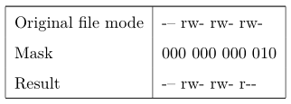

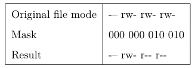

掩码为全0时，新文件的默认权限为：`-rw-rw-rw-`，掩码为1的位会将改位的权限变为`-`。

## 更改身份

su：以其他用户身份和组id运行一个shell。

格式：`su [-[l]] [user]`

包含`-l`选项时，会为指定用户启动一个需要登陆的shell。不指定用户时，默认为root用户。`-l`可以缩写为`-`。

```shell
# 切换用户
[test@docker root]$ su -l test2
密码：
上一次登录：日 1月 31 12:57:27 CST 2021pts/0 上
[test2@docker ~]$ 
# 退出当前shell
[test2@docker ~]$ exit
登出
[test@docker root]$ exit
exit
[root@docker ~]# 
```

可以通过`-c`参数执行单个命令：`su -c 'command'`

这样，命令会传递到一个新的shell中执行，必须加上单引号，因为我们不希望命令在当前shell中展开。

```shell
[test@docker root]$ su -c 'ls -l /root'
密码：
总用量 28
drwxr-xr-x  2 root root   60 11月 30 14:59 2
-rw-------. 1 root root 1241 8月   9 21:13 anaconda-ks.cfg
-rwx------  1 root root    0 1月  30 11:33 a.txt
-rw-r--r--  1 root root    3 1月  30 12:02 catfile
drwxr-xr-x  3 root root   30 1月  29 17:15 dir2
drwxr-xr-x  3 root root   30 1月  29 17:16 dir3
-rw-r--r--  1 root root   54 1月  30 11:42 errlog.txt
-rw-r--r--  1 root root    6 1月  29 17:00 file1
-rw-r--r--  1 root root    6 1月  29 17:08 file2
drwxr-xr-x  3 root root   65 1月  29 10:58 hello-image
-rw-r--r--  1 root root 7591 1月  30 15:40 ls.txt
```

sudo：类似于su，但是管理员可以配置sudo命令，从而允许一个普通用户以不同的身份，通过可控的方式来执行命令。sudo不需要输入超级用户的密码，而是需要用户使用自己的密码认证。

sudo和su的另一个区别时sudo不会启动一个新的shell，也不会加载另一个用户的shell运行环境。

## chown

chown命令用来更改文件或目录的所有者和用户组，使用该命令需要超级用户权限。

格式：`chown [owner][:[group]] file ...`

示例：

| 参数      | 作用                                  |
| --------- | ------------------------------------- |
| bob       | owner修改为bob                        |
| bob:users | owner修改为bob，组修改为users         |
| :admins   | 组修改为admins                        |
| bob:      | owner修改为bob，组修改为bob所属的组。 |

示例：

```shell
[root@docker ~]# cp a.txt ~test
[root@docker ~]# ls -l ~test/a.txt
-rwx------ 1 root root 0 1月  31 13:11 /home/test/a.txt
[root@docker ~]# chown test: ~test/a.txt
[root@docker ~]# ls -l ~test/a.txt
-rwx------ 1 test test 0 1月  31 13:11 /home/test/a.txt
```

## passwd

passwd命令用来修改密码，格式为：`passwd [user]`

# 进程

系统启动时，内核会先创建一系列进程，然后运行一个叫做init的程序，init再一次运行一系统位于/etc的被称为init脚本的shell脚本，它们可以启动所有系统服务。其中很多系统服务以守护进程的形式运行在后台。

## ps

```shell
# 无参的ps命令只输出与当前shell有关的进程
[root@docker ~]# ps
   PID TTY          TIME CMD
  1637 pts/0    00:00:00 bash
  1949 pts/0    00:00:00 su
  1950 pts/0    00:00:00 bash
  1967 pts/0    00:00:00 su
  1968 pts/0    00:00:00 bash
  2061 pts/0    00:00:00 su
  2083 pts/0    00:00:00 su
  2084 pts/0    00:00:00 bash
  2257 pts/0    00:00:00 su
  2290 pts/0    00:00:00 su
  2291 pts/0    00:00:00 bash
  2682 pts/0    00:00:00 ps
# 加上'x'选项，ps会显示所有进程，TTY代表控制某线程的终端
[root@docker ~]# ps x
   PID TTY      STAT   TIME COMMAND
     1 ?        Ss     0:01 /usr/lib/systemd/systemd --switched-root --system --deserialize 22
     2 ?        S      0:00 [kthreadd]
     4 ?        S<     0:00 [kworker/0:0H]
     5 ?        S      0:00 [kworker/u256:0]
     6 ?        S      0:00 [ksoftirqd/0]
     7 ?        S      0:00 [migration/0]
     8 ?        S      0:00 [rcu_bh]
     9 ?        R      0:00 [rcu_sched]
    10 ?        S<     0:00 [lru-add-drain]
......
```

STAT代表线程的状态，其内容包括：

| 状态 | 意义                            |
| ---- | ------------------------------- |
| R    | 进程正在运行或准备运行。        |
| S    | 进程处于睡眠状态。              |
| D    | 不可中断睡眠，进程正在等待I/O。 |
| T    | 已停止。                        |
| Z    | 一个死进程或者僵尸进程。        |
| <    | 一个高优先级进程。              |
| N    | 一个低优先级进程。              |

使用“aux”选项组合可以看到进程的更多信息：

```shell
# VSZ：虚拟内存大小；RSS：物理内存大小；
[root@docker ~]# ps aux
USER        PID %CPU %MEM    VSZ   RSS TTY      STAT START   TIME COMMAND
root          1  0.0  0.2 125352  3844 ?        Ss   10:29   0:01 /usr/lib/systemd/systemd --switched-root --system --deseria
root          2  0.0  0.0      0     0 ?        S    10:29   0:00 [kthreadd]
root          4  0.0  0.0      0     0 ?        S<   10:29   0:00 [kworker/0:0H]
root          5  0.0  0.0      0     0 ?        S    10:29   0:00 [kworker/u256:0]
root          6  0.0  0.0      0     0 ?        S    10:29   0:00 [ksoftirqd/0]
root          7  0.0  0.0      0     0 ?        S    10:29   0:00 [migration/0]
root          8  0.0  0.0      0     0 ?        S    10:29   0:00 [rcu_bh]
root          9  0.0  0.0      0     0 ?        R    10:29   0:00 [rcu_sched]
......
```

参数含义:

-e 显示所有进程。-f 全格式。-h 不显示标题。-l 长格式。-w 宽输出。a 显示终端上的所有进程，包括其他用户的进程。r 只显示正在运行的进程。x 显示没有控制终端的进程。

## top

虽然ps命令能够展示许多计算机运行状态的信息，但是它只是提供ps命令执行时刻的机器状态快照。为了看到更多动态的信息，可以使用 top 命令。

```shell
[root@docker ~]# top
top - 16:13:25 up  5:44,  1 user,  load average: 0.00, 0.01, 0.05
Tasks: 110 total,   1 running, 109 sleeping,   0 stopped,   0 zombie
%Cpu(s):  0.3 us,  0.0 sy,  0.0 ni, 99.7 id,  0.0 wa,  0.0 hi,  0.0 si,  0.0 st
KiB Mem :  1863012 total,  1363392 free,   230540 used,   269080 buff/cache
KiB Swap:        0 total,        0 free,        0 used.  1479080 avail Mem 

   PID USER      PR  NI    VIRT    RES    SHR S %CPU %MEM     TIME+ COMMAND                                                 
   639 root      20   0  305500   6652   5260 S  1.7  0.4   0:16.39 vmtoolsd                                                
    42 root      20   0       0      0      0 S  0.3  0.0   0:00.23 kworker/u256:1                                          
   976 root      20   0  668032  69444  26736 S  0.3  3.7   0:04.76 dockerd                                                 
  2707 root      20   0  162112   2228   1556 R  0.3  0.1   0:00.02 top                                                     
     1 root      20   0  125352   3844   2564 S  0.0  0.2   0:01.37 systemd                                                 
     2 root      20   0       0      0      0 S  0.0  0.0   0:00.00 kthreadd     ......
```

top程序能够动态地显示系统进程更新的信息。

信息字段的解释如下：

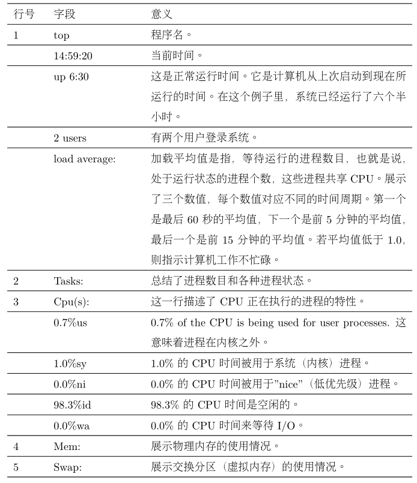

按h显示程序的帮助屏幕，按q退出程序。

## kill

kill命令用来向进程发送信号，它最常见的语法格式如下：

`kill [-signal] pid ...`

命令：

| 编号 | 名字 | 含义                                                         |
| ---- | ---- | ------------------------------------------------------------ |
| 1    | HUP  | 挂起。                                                       |
| 2    | INT  | 中断。实现和Ctrl-c一样的功能，中断一个程序。                 |
| 9    | KILL | 杀死。操作系统从内核级别强制杀死一个进程，模拟系统断电。     |
| 15   | TERM | 终止。kill命令发送的默认信号，通知进程结束。如果程序正常运行，接收到该信号后，会做一些预定义的清理工作，然后退出。 |
| 18   | CONT | 恢复运行。                                                   |
| 19   | STOP | 停止。                                                       |

# Shell环境

我们可以通过set和printenv命令来查看环境变量。

```shell
# set命令可以显示shell变量和环境变量，printenv只显示环境变量
[root@docker ~]# printenv
XDG_SESSION_ID=1
HOSTNAME=docker
SHELL=/bin/bash
TERM=xterm
HISTSIZE=1000
USER=root
LS_COLORS=rs=0:di=01;34:ln=01;36:mh=00:pi=40;33:so=01;35:do=01;35:bd=40;33;01:cd=40;33;01:or=40;31;01:mi=01;05;37;41:su=37;41:sg=30;43:ca=30;41:tw=30;42:ow=34
......
[root@docker ~]# set
BASH=/bin/bash
BASHOPTS=checkwinsize:cmdhist:expand_aliases:extquote:force_fignore:histappend:hostcomplete:interactive_comments:login_shell:progcomp:promptvars:sourcepath
BASH_ALIASES=()
BASH_ARGC=()
BASH_ARGV=()
BASH_CMDS=()
BASH_LINENO=()
BASH_SOURCE=()
BASH_VERSINFO=([0]="4" [1]="2" [2]="46" [3]="2" [4]="release" [5]="x86_64-redhat-linux-gnu")
BASH_VERSION='4.2.46(2)-release'
COLUMNS=125
DIRSTACK=()
EUID=0
......

# 查看单个环境变量
[root@docker ~]# printenv USER
root
[root@docker ~]# echo $USER
root
```

登录shell会读取一个或多个启动文件，如下表：

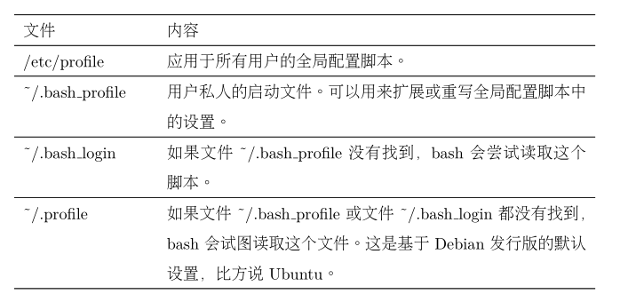

自定义shell环境：

```shell
[root@docker ~]# cat .bash_profile 
# .bash_profile

# Get the aliases and functions
if [ -f ~/.bashrc ]; then
	. ~/.bashrc
fi

# User specific environment and startup programs
# 将用户目录的bin目录添加到环境变量PATH中
PATH=$PATH:$HOME/bin

export PATH
```

可以通过修改`.bashrc`文件来自定义shell环境。

例如将下列行添加到`.bashrc`文件末尾，即可覆盖系统默认的配置：

```shell
umask 0002
export HISTCONTROL=ignoredups
export HISTSIZE=1000
alias l.='ls -d .* --color=auto'
alias ll='ls -l --color=auto'
```

使用`source .bashrc`命令使得更改立即生效。

# vi

启动vi：`vi xxx`

退出：`:q`

撤销：u

vi命令模式的常用命令：

| 按键       | 作用                                 |
| ---------- | ------------------------------------ |
| l或右箭头  | 向右移动一个字符                     |
| h或左箭头  | 向左移动一个字符                     |
| j或下箭头  | 向下移动一个字符                     |
| k或上箭头  | 向上移动一个字符                     |
| 0（数字0） | 移动到当前行的行首                   |
| ^          | 移动到当前行的第一个非空字符         |
| $          | 移动到当前行的末尾                   |
| w          | 移动到下一个单词或标点符号的开头     |
| W          | 移动到下一个单词的开头               |
| b          | 移动到上一个单词或标点符号的开头     |
| B          | 移动到上一个单词的开头               |
| PgUp或PgDn | 翻页                                 |
| numG       | 移动到第num行。例如，10G移动到第10行 |
| G          | 移动到文件尾                         |

## 插入模式

vi有几种不同的进入插入模式的命令：

i：插入文本。

a：在文件尾部插入文本。

A：在当前行行尾插入文本。

o：在当前行的下方插入一行。

O：在当前行的上方插入一行。

在光标位置之后插入另一个文件的所有文本：

`:r a.txt`

## 删除文本

示例：

| 命令 | 删除的文本                         |
| ---- | ---------------------------------- |
| x    | 当前字符                           |
| 3x   | 当前字符及之后的两个字符           |
| dd   | 当前行                             |
| 3dd  | 当前行及之后的2行                  |
| dW   | 当前单词                           |
| d$   | 当前光标位置到行尾所有字符，闭区间 |
| d0   | 光标位置到行首所有字符，闭区间     |
| dG   | 当前光标到文件尾所有字符           |
| d20G | 当前行到文件第20行所有字符         |

## 复制、粘贴、剪切

每次使用d命令时，删除的文本还会被复制到一个粘贴缓冲区中，之后可以执行p命令把剪贴板的文本粘贴到光标位置之后，或使用P命令粘贴到光标之前。

y用来复制文本，格式与d类似：

| 命令 | 复制的内容                         |
| ---- | ---------------------------------- |
| yy   | 当前行                             |
| 3yy  | 当前行及之后的2行                  |
| yW   | 从当前光标位置到下一个单词的开头   |
| y$   | 当前光标位置到行尾所有字符，闭区间 |
| y0   | 光标位置到行首所有字符，闭区间     |
| yG   | 当前光标到文件尾所有字符           |
| y20G | 当前行到文件第20行所有字符         |

## 连接行

vi对于行的概念相当严格。通常，不可能把光标移到行尾，再删除行尾结束符（回车符）来连接当前行和它下面的一行。由于这个原因，vi 提供了一个特定的命令，大写的 J（不要与小写的 j 混淆了，j 是用来移动光标的）把行与行之间连接起来。

连接之后，两个不同的行之间会用一个空格间隔。

## 查找和替换

f命令查找一行，移动光标到下一个所指定的字符上。例如，命令fa会把光标定位到同一行中下一个出现的 “a” 字符上。在一行中执行了字符的查找命令之后，通过输入分号来重复这个查找。

查找整个文件：

输入`/`，然后输入待查找的字符串，再按回车，即可将光标定位到目标字符串的起始位置。通过n命令来重复之前的查找。

替换：

vi使用ex命令来执行替换操作。把整个文件的“Line”更改成“line”，可以输入以下命令：

`:%s/Line/line/g`

冒号代表执行一个ex命令；%代表要操作的行数，%指代所有行，也可以用a，b来代替，指定操作第a行到第b行，默认为当前行；s代表执行的操作，替换；`/Line`和`/line`指定需要替换掉的文本；g代表全局替换，省略g时仅对每一行的第一个匹配的字符串进行替换。

可以指定一个需要用户确认的替换命令。通过添加一个 “c” 字符到这个命令的末尾，来完成这个替换命令。例如：

`:%s/Line/line/gc`

在每次执行替换时，vi会输出以下提示信息：

`replace with Line (y/n/a/q/l/^E/^Y)?`

其中：

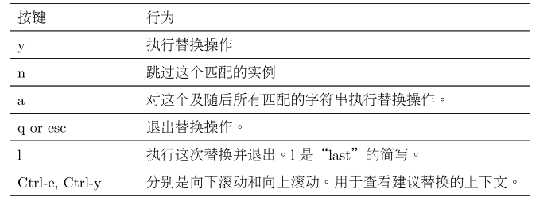

## 编辑多个文件

使用vi打开多个文件：`vi a.txt b.txt c.txt`

使用ex命令`:n`跳转到下一个文件，`:N`跳转到上一个文件。


# 网络系统

## ping

ping命令发送一个特殊的网络数据包，ICMP_ECHO_REQUEST到一台指定的主机。大多数接收这个数据包的网络设备会回复它，来允许网络连接验证。

```shell
[root@docker ~]# ping -4 linuxcommand.org
PING linuxcommand.org (216.105.38.11) 56(84) bytes of data.
64 bytes from secureprojects.sourceforge.net (216.105.38.11): icmp_seq=2 ttl=128 time=210 ms
64 bytes from secureprojects.sourceforge.net (216.105.38.11): icmp_seq=3 ttl=128 time=193 ms
64 bytes from secureprojects.sourceforge.net (216.105.38.11): icmp_seq=4 ttl=128 time=202 ms
64 bytes from secureprojects.sourceforge.net (216.105.38.11): icmp_seq=5 ttl=128 time=203 ms
64 bytes from secureprojects.sourceforge.net (216.105.38.11): icmp_seq=6 ttl=128 time=191 ms
...
```

## traceroute

traceroute命令会显示从本地到指定主机要经过的所有“跳数”的网络流量列表。

```shell
[root@docker ~]# traceroute -I www.baidu.com
traceroute to www.baidu.com (180.101.49.42), 30 hops max, 60 byte packets
 1  gateway (192.168.15.2)  0.232 ms  0.171 ms  0.083 ms
 2  * * *
 3  * * *
 4  * * *
 5  * * *
 6  * * *
 7  * * *
 8  * * *
 9  * * *
10  * * *
11  * * *
12  * * *
13  * * *
14  * * *
15  * * *
16  180.101.49.42 (180.101.49.42)  79.209 ms  79.226 ms  79.574 ms
```

## netstat

netstat程序用来检查各种网络设置与统计数据。通过该命令的参数，可以查看网络设置的各种特性。

使用`-ie`选项可以查看系统中的网络接口。

```shell
[root@docker ~]# netstat -ie
Kernel Interface table
docker0: flags=4099<UP,BROADCAST,MULTICAST>  mtu 1500
        inet 172.17.0.1  netmask 255.255.0.0  broadcast 172.17.255.255
        ether 02:42:c8:38:02:01  txqueuelen 0  (Ethernet)
        RX packets 0  bytes 0 (0.0 B)
        RX errors 0  dropped 0  overruns 0  frame 0
        TX packets 0  bytes 0 (0.0 B)
        TX errors 0  dropped 0 overruns 0  carrier 0  collisions 0

ens33: flags=4163<UP,BROADCAST,RUNNING,MULTICAST>  mtu 1500
        inet 192.168.15.131  netmask 255.255.255.0  broadcast 192.168.15.255
        inet6 fe80::5e1b:9220:703c:ded4  prefixlen 64  scopeid 0x20<link>
        ether 00:50:56:36:d4:db  txqueuelen 1000  (Ethernet)
        RX packets 25483  bytes 13414841 (12.7 MiB)
        RX errors 0  dropped 0  overruns 0  frame 0
        TX packets 9370  bytes 1353246 (1.2 MiB)
        TX errors 0  dropped 0 overruns 0  carrier 0  collisions 0

lo: flags=73<UP,LOOPBACK,RUNNING>  mtu 65536
        inet 127.0.0.1  netmask 255.0.0.0
        inet6 ::1  prefixlen 128  scopeid 0x10<host>
        loop  txqueuelen 1000  (Local Loopback)
        RX packets 0  bytes 0 (0.0 B)
        RX errors 0  dropped 0  overruns 0  frame 0
        TX packets 0  bytes 0 (0.0 B)
        TX errors 0  dropped 0 overruns 0  carrier 0  collisions 0
```

使用`-r`选项可以查看内核的网络路由表：

```shell
[root@docker ~]# netstat -r
Kernel IP routing table
Destination     Gateway         Genmask         Flags   MSS Window  irtt Iface
default         gateway         0.0.0.0         UG        0 0          0 ens33
172.17.0.0      0.0.0.0         255.255.0.0     U         0 0          0 docker0
192.168.15.0    0.0.0.0         255.255.255.0   U         0 0          0 ens33
```

## ftp

ftp基于FTP协议从FTP服务器上下载文件，FTP并不是安全的，因为它会以明码形式发送帐号的姓名和密码。这就意味着这些数据没有加密，任何嗅探网络的人都能看到。由于此种原因，几乎因特网中所有FTP 服务器都是匿名的。一个匿名服务器能允许任何人使用注册名“anonymous”和无意义的
密码登录系统。

## wget

一、使用wget下载单个文件

```shell
[root@docker ~]# wget http://linuxcommand.org/index.php
--2021-02-01 19:59:01--  http://linuxcommand.org/index.php
正在解析主机 linuxcommand.org (linuxcommand.org)... 216.105.38.11
正在连接 linuxcommand.org (linuxcommand.org)|216.105.38.11|:80... 已连接。
已发出 HTTP 请求，正在等待回应... 200 OK
长度：3874 (3.8K) [text/html]
正在保存至: “index.php”

100%[===================================================================================>] 3,874       1.46KB/s 用时 2.6s   

2021-02-01 19:59:07 (1.46 KB/s) - 已保存 “index.php” [3874/3874])

[root@docker ~]# ls
2  anaconda-ks.cfg  a.txt  catfile  dir2  dir3  errlog.txt  file1  file2  hello-image  index.php  ls.txt
```

二、使用wget -O下载并以指定文件名保存

`wget -O myIndex.php http://linuxcommand.org/index.php  `

三、使用wget -c断点续传

`wget -c http://linuxcommand.org/index.php `

四、使用wget -b后台下载

`wget -b https://cn.wordpress.org/wordpress-4.9.4-zh_CN.tar.gz`

可以使用以下命令查看进度：

`tail -f wget-log`

五、使用wget -i下载多个文件

```shell
# 首先，保存一份下载链接文件
cat > urlList.txt
url1
url2
url3

# 然后使用wget下载
wget -i urlList.txt
```

## ssh

SSH由两部分组成。SSH服务器在远程主机22号端口上监听将要到来的
连接，而SSH客户端运行在本地系统中，用来和远端服务器通信。

```shell
# 在powershell中连接SSH服务器
PS C:\WINDOWS\system32> ssh root@192.168.15.131
root@192.168.15.131's password:
Last login: Mon Feb  1 20:12:33 2021 from 192.168.15.1
[root@docker ~]#
```

ssh还允许仅在远程服务器上执行一条命令：

```shell
PS C:\WINDOWS\system32> ssh root@192.168.15.131 free
root@192.168.15.131's password:
              total        used        free      shared  buff/cache   available
Mem:        1863012      230752     1167496        9676      464764     1474224
Swap:             0           0           0
PS D:\> ssh root@192.168.15.131 'ls ~/*' > a.txt
root@192.168.15.131's password:
PS D:\>
```

## scp/sftp

OpenSSH中还包含两个用于传输文件的程序，scp和sftp，利用SSH加密通道在网络间复制文件。

示例：

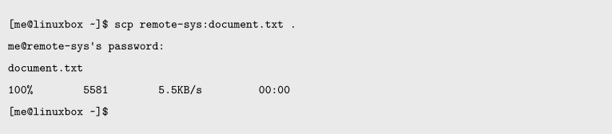

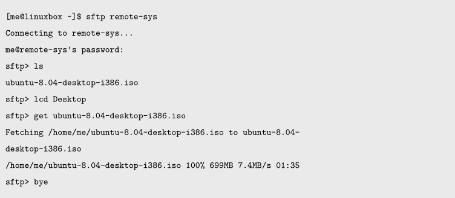


# 正则表达式

## grep

grep命令的格式：

`grep [options] regx [file...]`

regx是指一个正则表达式。

grep的常用选项如下：

| 选项 | 描述                                                         |
| ---- | ------------------------------------------------------------ |
| -i   | 忽略大小写。                                                 |
| -v   | 不匹配。通常，grep程序打印出包含匹配项的文本行，加上该选项后，grep程序会打印出不包含匹配项的文本行。 |
| -c   | 打印匹配的数量。                                             |
| -l   | 打印包含匹配项的文件名，而不是文本行本身。                   |
| -L   | 打印不包含匹配项的文件名。                                   |
| -n   | 在每个匹配行之前打印出其位于文件中的相应行号。               |
| -h   | 用于多文件搜索，不输出文件名。                               |
| -E   | 识别一个ERE（扩展的正则表达式）                              |

示例：

```shell
[root@docker ~]# ls /bin > dirlist-bin.txt
[root@docker ~]# ls /usr/sbin > dirlist-usr-sbin.txt
[root@docker ~]# ls /sbin > dirlist-sbin.txt
[root@docker ~]# ls /usr/bin > dirlist-usr-bin.txt
[root@docker ~]# ls dir*.txt
dirlist-bin.txt  dirlist-sbin.txt  dirlist-usr-bin.txt  dirlist-usr-sbin.txt
# 列出含有name字符串的文件名
[root@docker ~]# grep -l name dirlist*.txt
dirlist-bin.txt
dirlist-sbin.txt
dirlist-usr-bin.txt
dirlist-usr-sbin.txt
# 列出不含有name字符串的文件名
[root@docker ~]# grep -L lvm dirlist*.txt
dirlist-bin.txt
dirlist-usr-bin.txt
```

正则表达式元字符：

| 元字符       | 含义                                                         |
| ------------ | ------------------------------------------------------------ |
| 基本元字符： |                                                              |
| `.`          | 匹配任意单个字符                                             |
| `^`          | 只有在文本行的开始匹配到正则表达式时才认为发生一次匹配；     |
| `$`          | 只有在文本行的结尾匹配到正则表达式时才认为发生一次匹配       |
| `[ ]`        | 中括号表达式匹配中括号中的集合中匹配任意单个字符             |
| `[^...]`     | 在中括号里的^字符表示否定，匹配不在中括号字符集合里的任意单个字符 |
| `[-]`        | 表示范围，例如0-9，a-z                                       |
| *            | 匹配任意长度字符串                                           |
| 扩展元字符： |                                                              |
| ?            | 匹配0个或1个元素                                             |
| +            | 匹配一个或多个元素                                           |
| \|           | 或，分割字符串                                               |
| ( )          | 优先级                                                       |
| { }          | 匹配指定个数的元素                                           |

需要在正则表达式中包含一个连字符时，要把连字符放在第一个字符的位置：`grep -h '[-AZ]' dirlist*.txt`

锚点示例：

```shell
[me@linuxbox ~]$ grep -h '^zip' dirlist*.txt
zip
zipcloak
zipgrep
zipinfo
zipnote
zipsplit
[me@linuxbox ~]$ grep -h 'zip$' dirlist*.txt
gunzip
gzip
funzip
gpg-zip
preunzip
prezip
unzip
zip
[me@linuxbox ~]$ grep -h '^zip$' dirlist*.txt
zip
```

字符区域：

```shell
[root@docker ~]# grep -h '^[A-Z]' dirlist*.txt
VGAuthService
NetworkManager
VGAuthService
NetworkManager
[root@docker ~]# grep -h '^[A-Za-z0-9]*ve$' dirlist*.txt
ifenslave
logsave
lvremove
pvmove
pvremove
vgremove
ifenslave
logsave
lvremove
pvmove
pvremove
vgremove
```

## Posix字符集

字符区域不总是工作，在ls命令中，它会产生一些错误的结果。

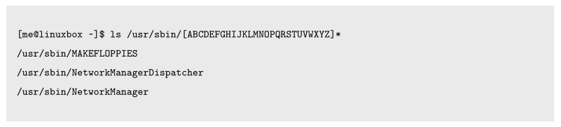

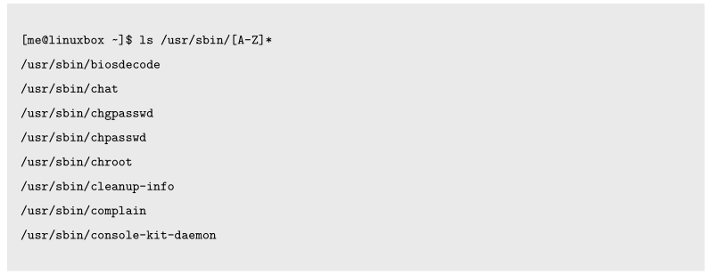

原因：

ASCII排序规则的字符集：

`ABCDEFGHIJKLMNOPQRSTUVWXYZabcdefghijklmnopqrstuvwxyz`

locale不是US时，系统可能使用其他排序规则的字符集，例如：

`aAbBcCdDeEfFgGhHiIjJkKlLmMnNoOpPqQrRsStTuUvVwWxXyYzZ`

此时，[a-z]会同时包含大小写字母。

解决方式为使用POSIX字符集：

| 类           | 描述                                            |
| ------------ | ----------------------------------------------- |
| `[:alnum:]`  | 任意字母和数字，同`A-Za-z0-9`                   |
| `[:alpha:]`  | 任意字母                                        |
| `[:blank:]`  | 空格和制表符，同\\\t                            |
| `[:cntrl:]`  | ASCII控制字符，0-31和127                        |
| `[:digit:]`  | 任意数字                                        |
| `[:print:]`  | 任意可打印字符                                  |
| `[:graph:]`  | 不包括空格的任意可打印字符，包括33-126          |
| `[:punct:]`  | 不在`cntrl`和`alnum`中的任意字符                |
| `[:space:]`  | 包括空格在内的任意空白字符，同`\\f\\n\\r\\t\\v` |
| `[:upper:]`  | 任意大写字母                                    |
| `[:lower:]`  | 任意小写字母                                    |
| `[:xdigit:]` | 任意十六进制数                                  |
| `[:word:]`   | alnum加上下划线                                 |

POSIX将正则表达式分成了基本正则表达式(BRE)和扩展正则表达式(ERE)。

BRE可以辨别以下元字符：

`^ $ . [ ] *`

ERE添加了以下元字符：

`( ) { } ? + |`

ERE的第一个特性是交替：

BRE示例：

```shell
[root@docker ~]# echo "AAA" | grep AAA
AAA
[root@docker ~]# echo "BBB" | grep AAA
[root@docker ~]# 
```

ERE示例：

```shell
# 将|用单引号引起来防止shell将其解释成管道
[root@docker ~]# echo "AAA" | grep -E 'AAA|BBB'
AAA
[root@docker ~]# echo "BBB" | grep -E 'AAA|BBB'
BBB
[root@docker ~]# echo "CCC" | grep -E 'AAA|BBB'
[root@docker ~]# 
```

限定符（指定一个元素被匹配的次数）

eg. 匹配以下格式的电话号码：

```
(nnn) nnn-nnnn
nnn nnn-nnnn
```

可以构造这样的正则表达式：

`^\(?[0-9][0-9][0-9]\)? [0-9][0-9][0-9]-[0-9][0-9][0-9][0-9]$`

需要对圆括号添加\进行转义，圆括号之后的？代表他们可以出现也可以不出现。

{ }可以用来匹配特定个数的元素，它可以通过四种方法来指定：

| 限定符 | 含义                                                    |
| ------ | ------------------------------------------------------- |
| n      | 匹配前面的元素，如果它确切地出现了 n 次。               |
| n,m    | 匹配前面的元素，如果它至少出现了 n 次，但是不多于 m次。 |
| n,     | 匹配前面的元素，如果它出现了 n 次或多于 n 次。          |
| ,m     | 匹配前面的元素，如果它出现的次数不多于 m 次。           |

之前匹配电话号码的正则表达式可优化为：

`^\(?[0-9]{3}\)? [0-9]{3}-[0-9]{4}$`

# 文本处理


# Shell脚本

编写第一个shell脚本：Hello World

```shell
#!/bin/bash
# This is our first script
echo 'Hello World'
```

每一个shell脚本都需要把`#!/bin/bash`放在第一行，来告诉操作系统执行此脚本需要的解释器的名字。

为了使得脚本可执行，需要修改权限：

```shell
[root@m1node3 tmp]# ls -ll | grep hello
-r-xr-xr-x 1 root root 31 Mar  2 10:33 hello.sh
[root@m1node3 tmp]# chmod 644 hello.sh 
[root@m1node3 tmp]# ls -ll | grep hello
-rw-r--r-- 1 root root 31 Mar  2 10:33 hello.sh
[root@m1node3 tmp]# chmod 744 hello.sh 
[root@m1node3 tmp]# ls -ll | grep hello
-rwxr--r-- 1 root root 31 Mar  2 10:33 hello.sh
[root@m1node3 tmp]# ./hello.sh 
hello world
```

当没有给出可执行程序的明确路径名时，系统会在PATH环境变量中搜索置否存在该可执行程序。

```shell
[root@m1node3 tmp]# echo $PATH
/usr/local/sbin:/usr/local/bin:/usr/sbin:/usr/bin:/root/bin
```

∼/bin 目录存放个人使用的脚本。

如果我们编写了一个脚本，系统中的每个用户都可以使用它，那么这个脚本的位置应该是/usr/local/bin。

系统管理员使用的脚本经常放到/usr/local/sbin 目录下。

大多数情况下，本地支持的软件，不管是脚本还是编译过的程序，都应该放到/usr/local 目录下，而不是在/bin 或/usr/bin 目录下。这些目录都是由 Linux 文件系统层次结构标准指定，只包含由 Linux 发行商所提供和维护的文件。

通过使用行继续符\，可以将复杂的命令写成若干行，提高可读性。

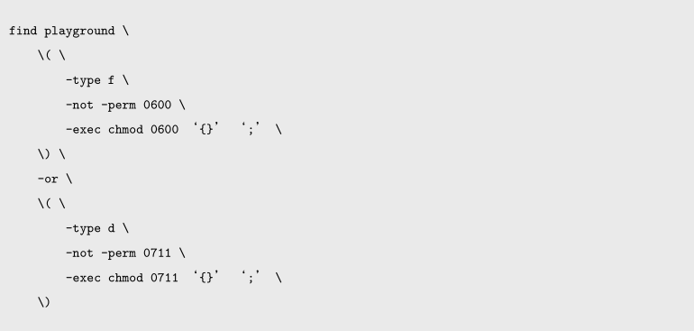


双引号中可以包括换行符。

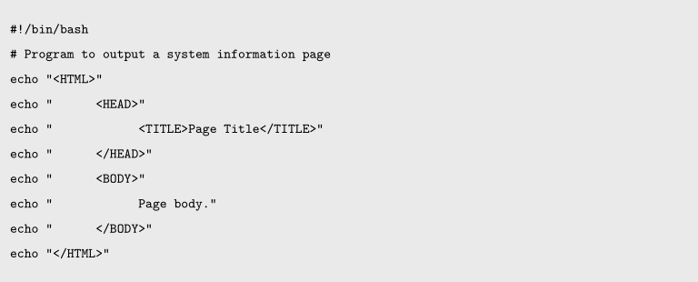

上图程序等价于：

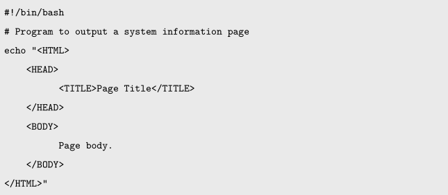

在命令行中：

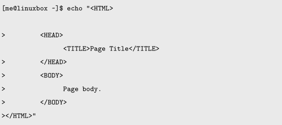

\>符号是在shell中键入多行语句时的提示符。

shell变量赋值：`variable=value`

## Shell字符串


# 注意事项

## 一、标准输入和参数的区别

这个问题一定是最容易让人迷惑的，具体来说，就是搞不清什么时候用管道符`|`和文件重定向`>`，`<`，什么时候用变量`$`。

比如说，我现在有个自动连接宽带的 shell 脚本`connect.sh`，存在我的家目录：

```shell
$ where connect.sh
/home/fdl/bin/connect.sh
```

如果我想删除这个脚本，而且想少敲几次键盘，应该怎么操作呢？我曾经这样尝试过：

```shell
$ where connect.sh | rm
```

实际上，这样操作是错误的，正确的做法应该是这样的：

```shell
$ rm $(where connect.sh)
```

前者试图将`where`的结果连接到`rm`的标准输入，后者试图将结果作为命令行参数传入。

**标准输入就是编程语言中诸如`scanf`或者`readline`这种命令；而参数是指程序的`main`函数传入的`args`字符数组**。

前文「Linux文件描述符」说过，管道符和重定向符是将数据作为程序的标准输入，而`$(cmd)`是读取`cmd`命令输出的数据作为参数。

用刚才的例子说，`rm`命令源代码中肯定不接受标准输入，而是接收命令行参数，删除相应的文件。作为对比，`cat`命令是既接受标准输入，又接受命令行参数：

```shell
$ cat filename
...file text...

$ cat < filename
...file text...

$ echo 'hello world' | cat
hello world
```

**如果命令能够让终端阻塞，说明该命令接收标准输入，反之就是不接受**，比如你只运行`cat`命令不加任何参数，终端就会阻塞，等待你输入字符串并回显相同的字符串。

## 二、后台运行程序

比如说你远程登录到服务器上，运行一个 Django web 程序：

```shell
$ python manager.py runserver 0.0.0.0
Listening on 0.0.0.0:8080...
```

现在你可以通过服务器的 IP 地址测试 Django 服务，但是终端此时就阻塞了，你输入什么都不响应，除非输入 Ctrl-C 或者 Ctrl-/ 终止 python 进程。

可以在命令之后加一个`&`符号，这样命令行不会阻塞，可以响应你后续输入的命令，但是如果你退出服务器的登录，就不能访问该网页了。

如果你想在退出服务器之后仍然能够访问 web 服务，应该这样写命令 `(cmd &)`：

```shell
$ (python manager.py runserver 0.0.0.0 &)
Listening on 0.0.0.0:8080...

$ logout
```

**底层原理是这样的**：

每一个命令行终端都是一个 shell 进程，你在这个终端里执行的程序实际上都是这个 shell 进程分出来的子进程。正常情况下，shell 进程会阻塞，等待子进程退出才重新接收你输入的新的命令。加上`&`号，只是让 shell 进程不再阻塞，可以继续响应你的新命令。但是无论如何，你如果关掉了这个 shell 命令行端口，依附于它的所有子进程都会退出。

而`(cmd &)`这样运行命令，则是将`cmd`命令挂到一个`systemd`系统守护进程名下，认`systemd`做爸爸，这样当你退出当前终端时，对于刚才的`cmd`命令就完全没有影响了。

类似的，还有一种后台运行常用的做法是这样：

```shell
$ nohub some_cmd &
```

`nohub`命令也是类似的原理，不过通过我的测试，还是`(cmd &)`这种形式更加稳定。

## 三、单引号和双引号的区别

不同的 shell 行为会有细微区别，但有一点是确定的，**对于`$`，`(`，`)`这几个符号，单引号包围的字符串不会做任何转义，双引号包围的字符串会转义**。

shell 的行为可以测试，使用`set -x`命令，会开启 shell 的命令回显，你可以通过回显观察 shell 到底在执行什么命令：

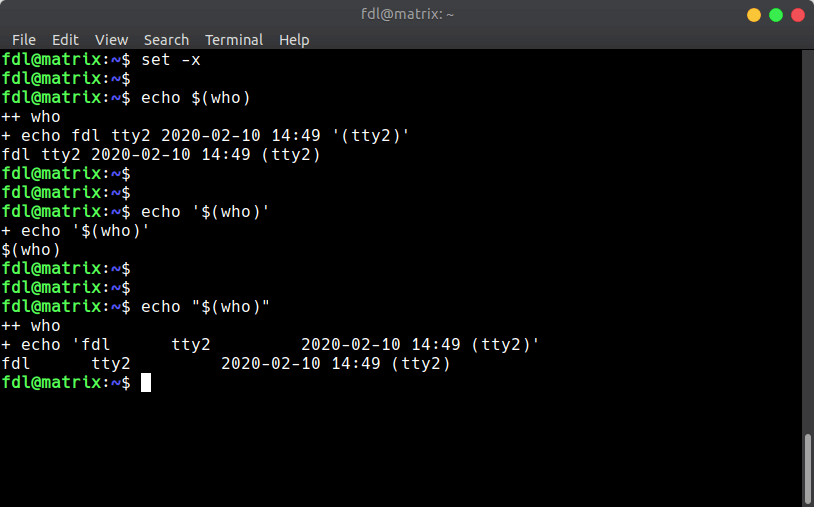

可见 `echo $(cmd)` 和 `echo "$(cmd)"`，结果差不多，但是仍然有区别。注意观察，双引号转义完成的结果会自动增加单引号，而前者不会。

**也就是说，如果 `$` 读取出的参数字符串包含空格，应该用双引号括起来，否则就会出错**。

## 四、sudo 找不到命令

有时候我们普通用户可以用的命令，用 `sudo` 加权限之后却报错 command not found：

```shell
$ connect.sh
network-manager: Permission denied

$ sudo connect.sh
sudo: command not found
```

原因在于，`connect.sh` 这个脚本仅存在于该用户的环境变量中：

```shell
$ where connect.sh 
/home/fdl/bin/connect.sh
```

**当使用 `sudo` 时，系统会使用 `/etc/sudoers` 这个文件中规定的该用户的权限和环境变量**，而这个脚本在 `/etc/sudoers` 环境变量目录中当然是找不到的。

解决方法是使用脚本文件的路径，而不是仅仅通过脚本名称：

```shell
$ sudo /home/fdl/bin/connect.sh
```
