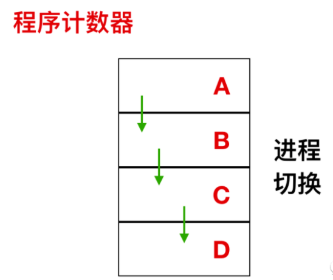
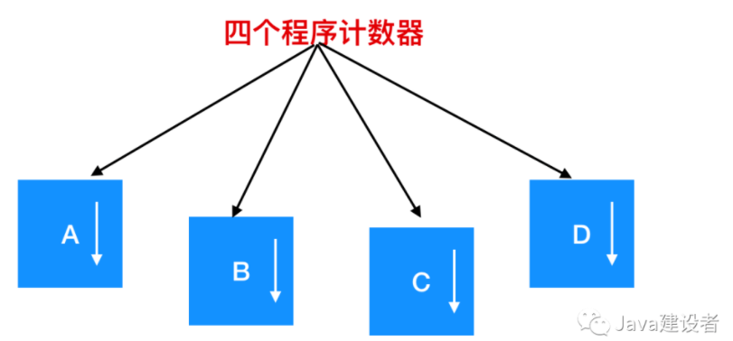
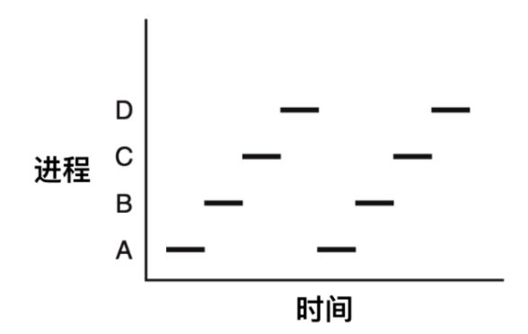
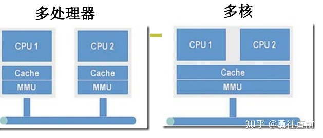
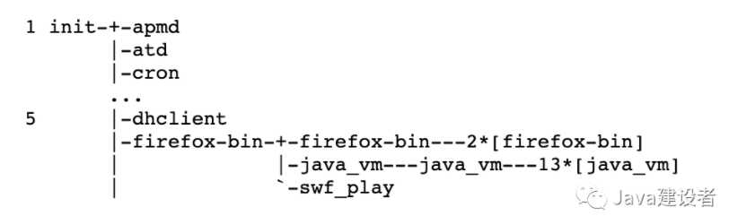
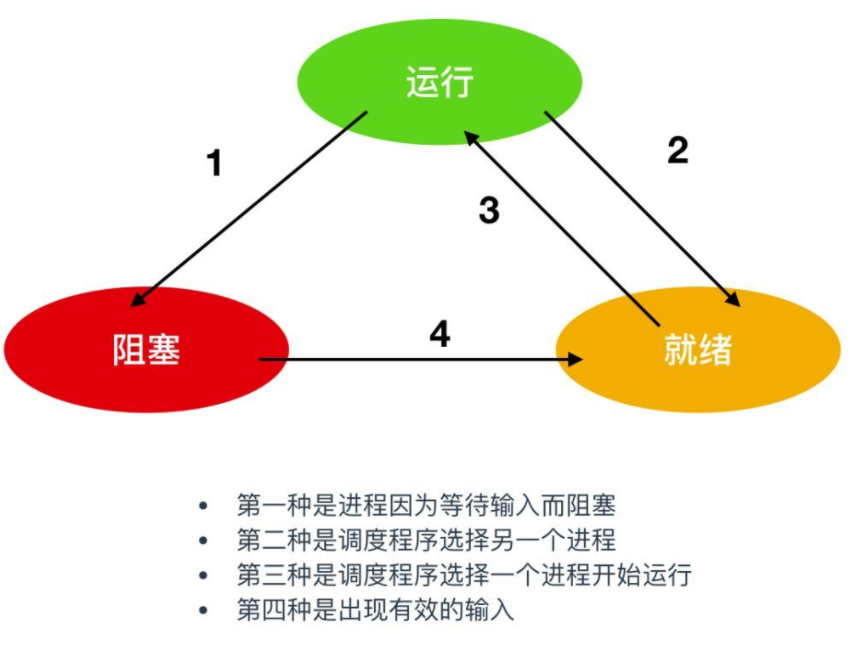
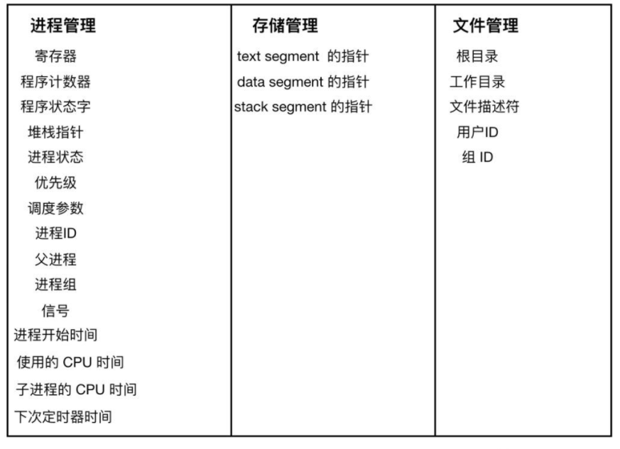

# 进程

操作系统中最核心的概念就是 `进程`，进程是对正在运行中的程序的一个抽象。操作系统的其他所有内容都是围绕着进程展开的。进程是操作系统提供的最古老也是最重要的概念之一。即使可以使用的 CPU 只有一个，它们也支持（伪）并发操作。它们会将一个单独的 CPU 抽象为多个虚拟机的 CPU。可以说：没有进程的抽象，现代操作系统将不复存在。

进程由程序段、数据段和进程控制块三部分组成。

## 进程模型

在进程模型中，所有计算机上运行的软件，通常也包括操作系统，被组织为若干`顺序进程(sequential processes)`，简称为 `进程(process)` 。一个进程就是一个正在执行的程序的实例，进程也包括程序计数器、寄存器和变量的当前值。从概念上来说，每个进程都有各自的虚拟 CPU，但是实际情况是 CPU 会在各个进程之间进行来回切换。



如上图所示，这是一个具有 4 个程序的多道处理程序，在进程不断切换的过程中，程序计数器也在不同的变化。



在上图中，这 4 道程序被抽象为 4 个拥有各自控制流程（即每个自己的程序计数器）的进程，并且每个程序都独立的运行。当然，实际上只有一个物理程序计数器，每个程序要运行时，其逻辑程序计数器会装载到物理程序计数器中。当程序运行结束后，其物理程序计数器就会是真正的程序计数器，然后再把它放回进程的逻辑计数器中。

从下图我们可以看到，在观察足够长的一段时间后，所有的进程都运行了，**但在任何一个给定的瞬间仅有一个进程真正运行**。



由于 CPU 会在各个进程之间来回快速切换，所以每个进程在 CPU 中的运行时间是无法确定的。并且当同一个进程再次在 CPU 中运行时，其在 CPU 内部的运行时间往往也是不固定的。



对于多核心的架构，由于共用一套MMU和cache，所以地址空间是一个，同一时刻只能运行一个进程，此时进程不能并行只能并发。同一个进程下的多线程可以并行执行，因为多线程共享同一套进程空间资源。

多CPU架构可以支持进程并行。

## 进程的创建

操作系统需要一些方式来创建进程。下面是一些创建进程的方式：

- 系统初始化（`init`）
- 正在运行的程序执行了创建进程的系统调用（比如 `fork`）
- 用户请求创建一个新进程
- 初始化一个批处理工作

### 系统初始化

启动操作系统时，通常会创建若干个进程。其中有些是前台进程(numerous processes)，也就是同用户进行交互并替他们完成工作的进程。一些运行在后台，并不与特定的用户进行交互，例如，设计一个进程来接收发来的电子邮件，这个进程大部分的时间都在休眠，但是只要邮件到来后这个进程就会被唤醒。还可以设计一个进程来接收对该计算机上网页的传入请求，在请求到达的进程唤醒来处理网页的传入请求。进程运行在后台用来处理一些活动像是 e-mail，web 网页，新闻，打印等等被称为 守护进程(daemons)。大型系统会有很多守护进程。在 UNIX 中，`ps` 程序可以列出正在运行的进程， 在 Windows 中，可以使用任务管理器。

### 系统调用创建

除了在启动阶段创建进程之外，一些新的进程也可以在后面创建。通常，一个正在运行的进程会发出系统调用来创建一个或多个新进程来帮助其完成工作。例如，如果有大量的数据需要经过网络调取并进行顺序处理，那么创建一个进程读数据，并把数据放到共享缓冲区中，而让第二个进程取走并正确处理会比较容易些。在多处理器中，让每个进程运行在不同的 CPU 上也可以使工作做的更快。

### 用户请求创建

在许多交互式系统中，输入一个命令或者双击图标就可以启动程序，以上任意一种操作都可以选择开启一个新的进程，在基本的 UNIX 系统中运行 X，新进程将接管启动它的窗口。在 Windows 中启动进程时，它一般没有窗口，但是它可以创建一个或多个窗口。每个窗口都可以运行进程。通过鼠标或者命令就可以切换窗口并与进程进行交互。

### 批处理创建

最后一种创建进程的情形会在大型机的批处理系统中应用。用户在这种系统中提交批处理作业。当操作系统决定它有资源来运行另一个任务时，它将创建一个新进程并从其中的输入队列中运行下一个作业。

从技术上讲，在所有这些情况下，让现有流程执行流程是通过创建系统调用来创建新流程的。该进程可能是正在运行的用户进程，是从键盘或鼠标调用的系统进程或批处理程序。这些就是系统调用创建新进程的过程。该系统调用告诉操作系统创建一个新进程，并直接或间接指示在其中运行哪个程序。

在 UNIX 中，仅有一个系统调用来创建一个新的进程，这个系统调用就是 `fork`。这个调用会创建一个与调用进程相关的副本。在 fork 后，一个父进程和子进程会有相同的内存映像，相同的环境字符串和相同的打开文件。通常，子进程会执行 `execve` 或者一个简单的系统调用来改变内存映像并运行一个新的程序。例如，当一个用户在 shell 中输出 sort 命令时，shell 会 fork 一个子进程然后子进程去执行 sort 命令。这两步过程的原因是允许子进程在 fork 之后但在 execve 之前操作其文件描述符，以完成标准输入，标准输出和标准错误的重定向。

在 Windows 中，情况正相反，一个简单的 Win32 功能调用 `CreateProcess`，会处理流程创建并将正确的程序加载到新的进程中。这个调用会有 10 个参数，包括了需要执行的程序、输入给程序的命令行参数、各种安全属性、有关打开的文件是否继承控制位、优先级信息、进程所需要创建的窗口规格以及指向一个结构的指针，在该结构中新创建进程的信息被返回给调用者。除了 `CreateProcess` Win 32 中大概有 100 个其他的函数用于处理进程的管理，同步以及相关的事务。下面是 UNIX 操作系统和 Windows 操作系统系统调用的对比


在 UNIX 和 Windows 中，进程创建之后，父进程和子进程有各自不同的地址空间。如果其中某个进程在其地址空间中修改了一个词，这个修改将对另一个进程不可见。在 UNIX 中，子进程的地址空间是父进程的一个拷贝，但是却是两个不同的地址空间；不可写的内存区域是共享的。某些 UNIX 实现是正是在两者之间共享，因为它不能被修改。或者，子进程共享父进程的所有内存，但是这种情况下内存通过写时拷贝(copy-on-write)共享，这意味着一旦两者之一想要修改部分内存，则这块内存首先被明确的复制，以确保修改发生在私有内存区域。再次强调，**可写的内存是不能被共享的**。但是，对于一个新创建的进程来说，确实有可能共享创建者的资源，比如可以共享打开的文件。**在 Windows 中，从一开始父进程的地址空间和子进程的地址空间就是不同的**。


### copy-on-write


### fork

当程序调用 fork（）函数时，系统会创建新的进程，为其分配资源，例如存储数据和代码的空间。然后把原来的进程的所有值都复制到新的进程中，只有少量数值与原来的进程值不同，相当于克隆了一个自己。

fork只调用一次，但是会返回两次，在 父进程中，fork返回子进程的PID，在子进程中，fork返回0。

下面给出一段实例代码，命名为 fork_example.c。

复制代码

```
 
#include <unistd.h>
#include <stdio.h>
int main (){
   pid_t fpid; //fpid 表示 fork 函数返回的值
   int count=0;
   fpid=fork();
   if (fpid < 0)printf("error in fork!");
   else if (fpid == 0) {
       printf("I am child. Process id is %d/n",getpid());
   }
   else {
       printf("i am parent. Process id is %d/n",getpid());
   }
   return 0;
}
```

编译并执行，结果如下。

复制代码

```
 
root@local:~# gcc -Wall fork_example.c && ./a.out
I am parent. Process id is 28365
I am child. Process id is 28366
```

使用 fork() 后，父进程有义务监控子进程的运行状态，并在子进程退出后自己才能正常退出，否则子进程就会成为“孤儿”进程。


## 进程的终止

进程在创建之后，它就开始运行并做完成任务。然而，没有什么事儿是永不停歇的，包括进程也一样。进程早晚会发生终止，但是通常是由于以下情况触发的

- 正常退出(自愿的)
- 错误退出(自愿的)
- 严重错误(非自愿的)
- 被其他进程杀死(非自愿的)

### 正常退出

多数进程是由于完成了工作而终止。当编译器完成了所给定程序的编译之后，编译器会执行一个系统调用告诉操作系统它完成了工作。这个调用在 UNIX 中是 `exit` ，在 Windows 中是 `ExitProcess`。面向屏幕中的软件也支持自愿终止操作。字处理软件、Internet 浏览器和类似的程序中总有一个供用户点击的图标或菜单项，用来通知进程删除它所打开的任何临时文件，然后终止。

### 错误退出

进程发生终止的第二个原因是发现严重错误，例如，如果用户执行如下命令

```javascript
gcc foo.c    
```

编译 `foo.c` 但是该文件不存在，于是编译器就会发出声明并退出。在给出了错误参数时，面向屏幕的交互式进程通常并不会直接退出，因为这从用户的角度来说并不合理，用户需要知道发生了什么并想要进行重试，所以这时候应用程序通常会弹出一个对话框告知用户发生了系统错误，是需要重试还是退出。

### 严重错误

进程终止的第三个原因是由进程引起的错误，通常是由于程序中的错误所导致的。例如，执行了一条非法指令，引用不存在的内存，或者除数是 0 等。在有些系统比如 UNIX 中，进程可以通知操作系统，它希望自行处理某种类型的错误，在这类错误中，进程会收到信号（中断），而不是在这类错误出现时直接终止进程。

### 被其他进程杀死

第四个终止进程的原因是，某个进程执行系统调用告诉操作系统杀死某个进程。在 UNIX 中，这个系统调用是 kill。在 Win32 中对应的函数是 `TerminateProcess`（注意不是系统调用）。

### kill


## 进程的层次结构

在一些系统中，当一个进程创建了其他进程后，父进程和子进程就会以某种方式进行关联。子进程它自己就会创建更多进程，从而形成一个进程层次结构。

### UNIX 进程体系

在 UNIX 中，进程和它的所有子进程以及子进程的子进程共同组成一个进程组。当用户从键盘中发出一个信号后，该信号被发送给当前与键盘相关的进程组中的所有成员（它们通常是在当前窗口创建的所有活动进程）。每个进程可以分别捕获该信号、忽略该信号或采取默认的动作，即被信号 kill 掉。

这里有另一个例子，可以用来说明层次的作用，考虑 `UNIX` 在启动时如何初始化自己。一个称为 `init` 的特殊进程出现在启动映像中 。当 init 进程开始运行时，它会读取一个文件，文件会告诉它有多少个终端。然后为每个终端创建一个新进程。这些进程等待用户登录。如果登录成功，该登录进程就执行一个 shell 来等待接收用户输入指令，这些命令可能会启动更多的进程，以此类推。因此，整个操作系统中所有的进程都隶属于一个单个以 init 为根的进程树。



### Windows 进程体系

相反，Windows 中没有进程层次的概念，Windows 中所有进程都是平等的，唯一类似于层次结构的是在创建进程的时候，父进程得到一个特别的令牌（称为句柄），该句柄可以用来控制子进程。然而，这个令牌可能也会移交给别的操作系统，这样就不存在层次结构了。

## 进程状态

尽管每个进程是一个独立的实体，有其自己的程序计数器和内部状态，但是，进程之间仍然需要相互帮助。例如，一个进程的结果可以作为另一个进程的输入，在 shell 命令中：

```javascript
cat chapter1 chapter2 chapter3 | grep tree
```

第一个进程是 `cat`，将三个文件级联并输出。第二个进程是 `grep`，它从输入中选择具有包含关键字 `tree` 的内容，根据这两个进程的相对速度（这取决于两个程序的相对复杂度和各自所分配到的 CPU 时间片），可能会发生下面这种情况，`grep` 准备就绪开始运行，但是输入进程还没有完成，于是必须阻塞 grep 进程，直到输入完毕。

当一个进程开始运行时，它可能会经历下面这几种状态：



图中会涉及三种状态：

1. `运行态`，运行态指的就是进程实际占用 CPU 时间片运行时
2. `就绪态`，就绪态指的是可运行，但因为其他进程正在运行而处于就绪状态
3. `阻塞态`，除非某种外部事件发生，否则进程不能运行

如果有大量处于阻塞状态的进程，进程可能会占用着物理内存空间，显然不是我们所希望的，毕竟物理内存空间是有限的，被阻塞状态的进程占用着物理内存就一种浪费物理内存的行为。

所以，在虚拟内存管理的操作系统中，通常会把阻塞状态的进程的物理内存空间换出到硬盘，等需要再次运行的时候，再从硬盘换入到物理内存。


那么，就需要一个新的状态，来**描述进程没有占用实际的物理内存空间的情况，这个状态就是挂起状态**。这跟阻塞状态是不一样，阻塞状态是等待某个事件的返回。

另外，挂起状态可以分为两种：

- 阻塞挂起状态：进程在外存（硬盘）并等待某个事件的出现；
- 就绪挂起状态：进程在外存（硬盘），但只要进入内存，即刻立刻运行；

这两种挂起状态加上前面的五种状态，就变成了七种状态变迁，见如下图：


导致进程挂起的原因不只是因为进程所使用的内存空间不在物理内存，还包括如下情况：

- 通过 sleep 让进程间歇性挂起，其工作原理是设置一个定时器，到期后唤醒进程。
- 用户希望挂起一个程序的执行，比如在 Linux 中用 `Ctrl+Z` 挂起进程；


## 进程的实现

操作系统为了执行进程间的切换，会维护着一张表格，这张表就是 `进程表(process table)`。每个进程占用一个进程表项。该表项包含了进程状态的重要信息，包括程序计数器、堆栈指针、内存分配状况、所打开文件的状态、账号和调度信息，以及其他在进程由运行态转换到就绪态或阻塞态时所必须保存的信息，从而保证该进程随后能再次启动，就像从未被中断过一样。

下面展示了一个典型系统中的关键字段：



第一列内容与进程管理有关，第二列内容与 存储管理有关，第三列内容与文件管理有关。

与每一 I/O 类相关联的是一个称作 `中断向量表(interrupt vector)` 的位置（靠近内存底部的固定区域）。它包含中断服务程序的入口地址。假设当一个磁盘中断发生时，用户进程 3 正在运行，则中断硬件将程序计数器（指示下一条待执行指令的位置）、程序状态字（溢出、进位、符号、允许中断等标志位）、有时还有一个或多个寄存器压入堆栈，计算机随即跳转到中断向量所指示的地址。这就是硬件所做的事情。然后软件就随即接管一切剩余的工作。

当中断结束后，操作系统会调用一个 C 程序来处理中断剩下的工作。在完成剩下的工作后，会使某些进程就绪，接着调用调度程序，决定随后运行哪个进程。然后将控制权转移给一段汇编语言代码，为当前的进程装入寄存器值以及内存映射并启动该进程运行，下面显示了中断处理和调度的过程。

1. 硬件压入堆栈程序计数器等
2. 硬件从中断向量装入新的程序计数器
3. 汇编语言过程保存寄存器的值
4. 汇编语言过程设置新的堆栈
5. C 中断服务器运行（典型的读和缓存写入）
6. 调度器决定下面哪个程序先运行
7. C 过程返回至汇编代码
8. 汇编语言过程开始运行新的当前进程

一个进程在执行过程中可能被中断数千次，但关键每次中断后，被中断的进程都返回到与中断发生前完全相同的状态。

进程的数据结构：

```c
struct task_struct {
	// 进程状态
	long			  state;
	// 虚拟内存结构体
	struct mm_struct  *mm;
	// 进程号
	pid_t			  pid;
	// 指向父进程的指针
	struct task_struct __rcu  *parent;
	// 子进程列表
	struct list_head		children;
	// 存放文件系统信息的指针
	struct fs_struct		*fs;
	// 一个数组，包含该进程打开的文件指针
	struct files_struct		*files;
};
```

`task_struct`就是Linux内核对于一个进程的描述，也叫做进程描述符。

文件描述符files：一个进程会从files[0]读取输入，输出到files[1]，错误信息输出到files[2]，每个进程被创建时，files的前三位被写入默认值，标准输入，标准输出和标准错误。


**Linux中一切皆文件。**

## 进程上下文切换

CPU的上下文包括：CPU寄存器+PC

CPU进行上下文切换时需要保存上一个程序的CPU寄存器+PC信息，并加载下一个程序的CPU寄存器+PC。

进程是由内核管理和调度的，所以进程的切换只能发生在内核态。

**进程的上下文切换不仅包含了虚拟内存、栈、全局变量等用户空间的资源，还包括了内核堆栈、寄存器等内核空间的资源。**

通常，会把交换的信息保存在进程的 PCB，当要运行另外一个进程的时候，我们需要从这个进程的 PCB 取出上下文，然后恢复到 CPU 中，这使得这个进程可以继续执行，如下图所示：


大家需要注意，进程的上下文开销是很关键的，我们希望它的开销越小越好，这样可以使得进程可以把更多时间花费在执行程序上，而不是耗费在上下文切换。

> 发生进程上下文切换有哪些场景？

- 为了保证所有进程可以得到公平调度，CPU 时间被划分为一段段的时间片，这些时间片再被轮流分配给各个进程。这样，当某个进程的时间片耗尽了，进程就从运行状态变为就绪状态，系统从就绪队列选择另外一个进程运行；
- 进程在系统资源不足（比如内存不足）时，要等到资源满足后才可以运行，这个时候进程也会被挂起，并由系统调度其他进程运行；
- 当进程通过睡眠函数 sleep 这样的方法将自己主动挂起时，自然也会重新调度；
- 当有优先级更高的进程运行时，为了保证高优先级进程的运行，当前进程会被挂起，由高优先级进程来运行；
- 发生硬件中断时，CPU 上的进程会被中断挂起，转而执行内核中的中断服务程序；


## 进程调度算法


- **先到先服务(FCFS)调度算法** : 从就绪队列中选择一个最先进入该队列的进程为之分配资源，使它立即执行并一直执行到完成或发生某事件而被阻塞放弃占用 CPU 时再重新调度。
- **短作业优先(SJF)的调度算法** : 从就绪队列中选出一个估计运行时间最短的进程为之分配资源，使它立即执行并一直执行到完成或发生某事件而被阻塞放弃占用 CPU 时再重新调度。
- **长作业优先(LJF)的调度算法** : 从就绪队列中选出一个估计运行时间最长的进程为之分配资源，使它立即执行并一直执行到完成或发生某事件而被阻塞放弃占用 CPU 时再重新调度。
- **时间片轮转调度算法** : 时间片轮转调度是一种最古老，最简单，最公平且使用最广的算法，又称 RR(Round robin)调度。每个进程被分配一个时间段，称作它的时间片，即该进程允许运行的时间。
- **多级反馈队列调度算法** ：多级反馈队列调度算法既能使高优先级的作业得到响应又能使短作业（进程）迅速完成。，因而它是目前**被公认的一种较好的进程调度算法**，UNIX 操作系统采取的便是这种调度算法。
- **优先级调度** ： 为每个流程分配优先级，首先执行具有最高优先级的进程，依此类推。具有相同优先级的进程以 FCFS 方式执行。可以根据内存要求，时间要求或任何其他资源要求来确定优先级。

## 死锁的必要条件

以下四个条件同时出现时，就可能引起死锁：

- **互斥**：资源必须处于非共享模式，即一次只有一个进程可以使用。如果另一进程申请该资源，那么必须等待直到该资源被释放为止。
- **占有并等待**：一个进程至少应该占有一个资源，并等待另一资源，而该资源被其他进程所占有。
- **非抢占**：资源不能被抢占。只能在持有资源的进程完成任务后，该资源才会被释放。
- **循环等待**：有一组等待进程 `{P0, P1,..., Pn}`， `P0` 等待的资源被 `P1` 占有，`P1` 等待的资源被 `P2` 占有，......，`Pn-1` 等待的资源被 `Pn` 占有，`Pn` 等待的资源被 `P0` 占有。


### 死锁的处理策略

|          | 资源分配策略                                     | 各种可能模式                   | 主要优点                                     | 主要缺点                       |
| -------- | ------------------------------------------------ | ------------------------------ | -------------------------------------------- | ------------------------------ |
| 死锁预防 | 保守，宁可资源闲置                               | 一次请求所有资源，资源按需分配 | 不必进行剥夺                                 | 效率低，进程初始化时间长       |
| 死锁避免 | 是“预防”和“检测”的折中，在运行时判断是否可能死锁 | 寻找可能的安全允许顺序         | 不必进行剥夺                                 | 必须知道将来的资源需求         |
| 死锁检测 | 宽松，只要允许就分配资源                         | 定期检测死锁是否发生           | 不延长进程初始化时间，允许对死锁进行现场处理 | 通过剥夺解除死锁，造成性能损失 |

预防死锁：

- 破坏互斥条件：有些资源必须互斥使用，无法破坏互斥条件
- 破坏不剥夺条件：无法获得资源的进程释放已获取的资源，但反复申请和释放资源会增加系统开销，且释放已获取的资源可能导致前一阶段的工作失效。
- 破坏请求和保持条件：预先申请所需的全部资源。严重浪费系统资源，还可能导致饥饿现象 
- 破坏循环等待条件：顺序资源分配法。浪费系统资源，并造成编程不便


死锁避免：找到一个分配资源的序列使得所有进程都能顺利完成，采用银行家算法实现。进程首次申请资源时，判断剩余资源是否能满足进程的最大需求。

死锁检测：通过死锁化简图判断出死锁存在后，剥夺资源|进程回滚|终止进程来解除死锁。


# 进程间通信

每个进程的用户地址空间都是独立的，一般而言是不能互相访问的，但内核空间是每个进程都共享的，所以进程之间要通信必须通过内核。

## 管道

如果你学过 Linux 命令，那你肯定很熟悉「`|`」这个竖线。

```bash
$ ps auxf | grep mysql
```

上面命令行里的「`|`」竖线就是一个**管道**，它的功能是将前一个命令（`ps auxf`）的输出，作为后一个命令（`grep mysql`）的输入，从这功能描述，可以看出**管道传输数据是单向的**，如果想相互通信，我们需要创建两个管道才行。

同时，我们得知上面这种管道是没有名字，所以「`|`」表示的管道称为**匿名管道**，用完了就销毁。

管道还有另外一个类型是**命名管道**，也被叫做 `FIFO`，因为数据是先进先出的传输方式。

在使用命名管道前，先需要通过 `mkfifo` 命令来创建，并且指定管道名字：

```bash
$ mkfifo myPipe
```

myPipe 就是这个管道的名称，基于 Linux 一切皆文件的理念，所以管道也是以文件的方式存在，我们可以用 ls 看一下，这个文件的类型是 p，也就是 pipe（管道） 的意思：

```bash
$ ls -l
prw-r--r--. 1 root    root         0 Jul 17 02:45 myPipe
```

接下来，我们往 myPipe 这个管道写入数据：

```bash
$ echo "hello" > myPipe  // 将数据写进管道
                         // 停住了 ...
```

你操作了后，你会发现命令执行后就停在这了，这是因为管道里的内容没有被读取，只有当管道里的数据被读完后，命令才可以正常退出。

于是，我们执行另外一个命令来读取这个管道里的数据：

```bash
$ cat < myPipe  // 读取管道里的数据
hello
```

可以看到，管道里的内容被读取出来了，并打印在了终端上，另外一方面，echo 那个命令也正常退出了。

我们可以看出，**管道这种通信方式效率低，不适合进程间频繁地交换数据**。当然，它的好处，自然就是简单，同时也我们很容易得知管道里的数据已经被另一个进程读取了。

匿名管道的创建，需要通过下面这个系统调用：

```c
int pipe(int fd[2])
```

这里表示创建一个匿名管道，并返回了两个描述符，一个是管道的读取端描述符 `fd[0]`，另一个是管道的写入端描述符 `fd[1]`。注意，这个匿名管道是特殊的文件，只存在于内存，不存于文件系统中。


其实，**所谓的管道，就是内核里面的一串缓存**。从管道的一段写入的数据，实际上是缓存在内核中的，另一端读取，也就是从内核中读取这段数据。另外，管道传输的数据是无格式的流且大小受限。

看到这，你可能会有疑问了，这两个描述符都是在一个进程里面，并没有起到进程间通信的作用，怎么样才能使得管道是跨过两个进程的呢？

我们可以使用 `fork` 创建子进程，**创建的子进程会复制父进程的文件描述符**，这样就做到了两个进程各有两个「 `fd[0]` 与 `fd[1]`」，两个进程就可以通过各自的 fd 写入和读取同一个管道文件实现跨进程通信了。


管道只能一端写入，另一端读出，所以上面这种模式容易造成混乱，因为父进程和子进程都可以同时写入，也都可以读出。那么，为了避免这种情况，通常的做法是：

- 父进程关闭读取的 fd[0]，只保留写入的 fd[1]；
- 子进程关闭写入的 fd[1]，只保留读取的 fd[0]；


所以说如果需要双向通信，则应该创建两个管道。

到这里，我们仅仅解析了使用管道进行父进程与子进程之间的通信，但是在我们 shell 里面并不是这样的。

在 shell 里面执行 `A | B`命令的时候，A 进程和 B 进程都是 shell 创建出来的子进程，A 和 B 之间不存在父子关系，它俩的父进程都是 shell。


所以说，在 shell 里通过「`|`」匿名管道将多个命令连接在一起，实际上也就是创建了多个子进程，那么在我们编写 shell 脚本时，能使用一个管道搞定的事情，就不要多用一个管道，这样可以减少创建子进程的系统开销。

我们可以得知，**对于匿名管道，它的通信范围是存在父子关系的进程**。因为管道没有实体，也就是没有管道文件，只能通过 fork 来复制父进程 fd 文件描述符，来达到通信的目的。

另外，**对于命名管道，它可以在不相关的进程间也能相互通信**。因为命令管道，提前创建了一个类型为管道的设备文件，在进程里只要使用这个设备文件，就可以相互通信。

不管是匿名管道还是命名管道，进程写入的数据都是缓存在内核中，另一个进程读取数据时候自然也是从内核中获取，同时通信数据都遵循**先进先出**原则，不支持 lseek 之类的文件定位操作。

## 消息队列

**消息队列是保存在内核中的消息链表**，在发送数据时，会分成一个一个独立的数据单元，也就是消息体（数据块），消息体是用户自定义的数据类型，消息的发送方和接收方要约定好消息体的数据类型，所以每个消息体都是固定大小的存储块，不像管道是无格式的字节流数据。如果进程从消息队列中读取了消息体，内核就会把这个消息体删除。

消息队列生命周期随内核，如果没有释放消息队列或者没有关闭操作系统，消息队列会一直存在，而前面提到的匿名管道的生命周期，是随进程的创建而建立，随进程的结束而销毁。

**消息队列不适合比较大数据的传输**，因为在内核中每个消息体都有一个最大长度的限制，同时所有队列所包含的全部消息体的总长度也是有上限。在 Linux 内核中，会有两个宏定义 `MSGMAX` 和 `MSGMNB`，它们以字节为单位，分别定义了一条消息的最大长度和一个队列的最大长度。

**消息队列通信过程中，存在用户态与内核态之间的数据拷贝开销**，因为进程写入数据到内核中的消息队列时，会发生从用户态拷贝数据到内核态的过程，同理另一进程读取内核中的消息数据时，会发生从内核态拷贝数据到用户态的过程。

## 共享内存

消息队列的读取和写入的过程，都会有发生用户态与内核态之间的消息拷贝过程。那**共享内存**的方式，就很好的解决了这一问题。

现代操作系统，对于内存管理，采用的是虚拟内存技术，也就是每个进程都有自己独立的虚拟内存空间，不同进程的虚拟内存映射到不同的物理内存中。所以，即使进程 A 和 进程 B 的虚拟地址是一样的，其实访问的是不同的物理内存地址，对于数据的增删查改互不影响。

**共享内存的机制，就是拿出一块虚拟地址空间来，映射到相同的物理内存中**。这样这个进程写入的东西，另外一个进程马上就能看到了，都不需要拷贝来拷贝去，传来传去，大大提高了进程间通信的速度。


## 信号量

**信号量是一个整型的计数器，主要用于实现进程间的互斥与同步，而不是用于缓存进程间通信的数据**。

信号量表示资源的数量，控制信号量的方式有两种原子操作：

- 一个是 **P 操作**，这个操作会把信号量减去 1，相减后如果信号量 < 0，则表明资源已被占用，进程需阻塞等待；相减后如果信号量 >= 0，则表明还有资源可使用，进程可正常继续执行。
- 另一个是 **V 操作**，这个操作会把信号量加上 1，相加后如果信号量 <= 0，则表明当前有阻塞中的进程，于是会将该进程唤醒运行；相加后如果信号量 > 0，则表明当前没有阻塞中的进程；

P 操作是用在进入共享资源之前，V 操作是用在离开共享资源之后，这两个操作是必须成对出现的。


## 信号

信号是进程间通信机制中**唯一的异步通信机制**，因为可以在任何时候发送信号给某一进程，一旦有信号产生，我们就有下面这几种，用户进程对信号的处理方式。

**1.执行默认操作**。Linux 对每种信号都规定了默认操作，例如，上面列表中的 SIGTERM 信号，就是终止进程的意思。

**2.捕捉信号**。我们可以为信号定义一个信号处理函数。当信号发生时，我们就执行相应的信号处理函数。

**3.忽略信号**。当我们不希望处理某些信号的时候，就可以忽略该信号，不做任何处理。有两个信号是应用进程无法捕捉和忽略的，即 `SIGKILL` 和 `SEGSTOP`，它们用于在任何时候中断或结束某一进程。

## socket

本地 socket 被用于在**同一台主机上进程间通信**的场景：

- 本地 socket 的编程接口和 IPv4 、IPv6 套接字编程接口是一致的，可以支持「字节流」和「数据报」两种协议；
- 本地 socket 的实现效率大大高于 IPv4 和 IPv6 的字节流、数据报 socket 实现；

对于本地字节流 socket，其 socket 类型是 AF_LOCAL 和 SOCK_STREAM。

对于本地数据报 socket，其 socket 类型是 AF_LOCAL 和 SOCK_DGRAM。

本地字节流 socket 和 本地数据报 socket 在 bind 的时候，不像 TCP 和 UDP 要绑定 IP 地址和端口，而是**绑定一个本地文件**，这也就是它们之间的最大区别。


# 线程

线程与进程的比较如下：

- 进程是资源（包括内存、打开的文件等）分配的单位，线程是 CPU 调度的单位；
- 进程拥有一个完整的资源平台，而线程只独享必不可少的资源，如寄存器和栈；
- 线程同样具有就绪、阻塞、执行三种基本状态，同样具有状态之间的转换关系；
- 线程能减少并发执行的时间和空间开销；

线程相比进程能减少开销，体现在：

- 线程的创建时间比进程快，因为进程在创建的过程中，还需要资源管理信息，比如内存管理信息、文件管理信息，而线程在创建的过程中，不会涉及这些资源管理信息，而是共享它们；
- 线程的终止时间比进程快，因为线程释放的资源相比进程少很多；
- 同一个进程内的线程切换比进程切换快，因为线程具有相同的地址空间（虚拟内存共享），这意味着同一个进程的线程都具有同一个页表，那么在切换的时候不需要切换页表。而对于进程之间的切换，切换的时候要把页表给切换掉，而页表的切换过程开销是比较大的；
- 由于同一进程的各线程间共享内存和文件资源，那么在线程之间数据传递的时候，就不需要经过内核了，这就使得线程之间的数据交互效率更高了；

系统调用`fork()`可以新建一个子进程，函数`pthread()`可以新建一个线程。**但无论线程还是进程，都是用`task_struct`结构表示的，唯一的区别线程之间代码段、数据段和打开的文件等资源**。

进程之间：


线程之间：


多线程：


线程的上下文：栈+寄存器

## 线程的实现

主要有三种线程的实现方式：

- **用户线程（User Thread）**：在用户空间实现的线程，不是由内核管理的线程，是由用户态的线程库来完成线程的管理；
- **内核线程（Kernel Thread）**：在内核中实现的线程，是由内核管理的线程；
- **轻量级进程（LightWeight Process）**：在内核中来支持用户线程；

那么，这还需要考虑一个问题，用户线程和内核线程的对应关系。

首先，第一种关系是**多对一**的关系，也就是多个用户线程对应同一个内核线程：


第二种是**一对一**的关系，也就是一个用户线程对应一个内核线程：


第三种是**多对多**的关系，也就是多个用户线程对应到多个内核线程：


实现在用户空间的线程称为用户级线程。用户线程是完全建立在用户空间的线程库，用户线程的创建、调度、同步和销毁全由用户空间的库函数完成，不需要内核的参与，因此这种线程的系统资源消耗非常低，且非常的高效。


用户线程的**优点**：

- 每个进程都需要有它私有的线程控制块（TCB）列表，用来跟踪记录它各个线程状态信息（PC、栈指针、寄存器），TCB 由用户级线程库函数来维护，可用于不支持线程技术的操作系统；
- 用户线程的切换也是由线程库函数来完成的，无需用户态与内核态的切换，所以速度特别快；


**内核线程是由操作系统管理的，线程对应的 TCB 自然是放在操作系统里的，这样线程的创建、终止和管理都是由操作系统负责。**

内核线程的模型，也就类似前面提到的**一对一**的关系，即一个用户线程对应一个内核线程，如下图所示：


内核线程的**优点**：

- 在一个进程当中，如果某个内核线程发起系统调用而被阻塞，并不会影响其他内核线程的运行；
- 内核级线级能参与全局的多核处理器资源分配，充分利用多核 CPU 优势。

内核线程的**缺点**：

- 内核级线程调度开销较大。调度内核线程的代价可能和调度进程差不多昂贵，代价要比用户级线程大很多。
- 线程表是存放在操作系统固定的表格空间或者堆栈空间里，所以内核级线程的数量是有限的。


**轻量级进程（Light-weight process，LWP）是内核支持的用户线程，一个进程可有一个或多个 LWP，每个 LWP 是跟内核线程一对一映射的，也就是 LWP 都是由一个内核线程支持。**

另外，LWP 只能由内核管理并像普通进程一样被调度，Linux 内核是支持 LWP 的典型例子。

在大多数系统中，**LWP与普通进程的区别也在于它只有一个最小的执行上下文和调度程序所需的统计信息**。一般来说，一个进程代表程序的一个实例，而 LWP 代表程序的执行线程，因为一个执行线程不像进程那样需要那么多状态信息，所以 LWP 也不带有这样的信息。

在 LWP 之上也是可以使用用户线程的，那么 LWP 与用户线程的对应关系就有三种：

- `1 : 1`，即一个 LWP 对应 一个用户线程；
- `N : 1`，即一个 LWP 对应多个用户线程；
- `M : N`，即多个 LWP 对应多个用户线程；

接下来针对上面这三种对应关系说明它们优缺点。先看下图的 LWP 模型：

**1 : 1 模式**

一个线程对应到一个 LWP 再对应到一个内核线程，如上图的进程 4，属于此模型。

- 优点：实现并行，当一个 LWP 阻塞，不会影响其他 LWP；
- 缺点：每一个用户线程，就产生一个内核线程，创建线程的开销较大。

**N : 1 模式**

多个用户线程对应一个 LWP 再对应一个内核线程，如上图的进程 2，线程管理是在用户空间完成的，此模式中用户的线程对操作系统不可见。

- 优点：用户线程要开几个都没问题，且上下文切换发生用户空间，切换的效率较高；
- 缺点：一个用户线程如果阻塞了，则整个进程都将会阻塞，另外在多核 CPU 中，是没办法充分利用 CPU 的。

**M : N 模式**

根据前面的两个模型混搭一起，就形成 `M:N` 模型，该模型提供了两级控制，首先多个用户线程对应到多个 LWP，LWP 再一一对应到内核线程，如上图的进程 3。

- 优点：综合了前两种优点，大部分的线程上下文发生在用户空间，且多个线程又可以充分利用多核 CPU 的资源。


# 协程

golang协程本质上是一种用户级的线程，协程的调度完全由用户控制。协程拥有自己的寄存器上下文和栈，协程调度切换时，将寄存器上下文和栈保存到其他地方，在切回来的时候，恢复先前保存的寄存器上下文和栈，直接操作栈则基本没有内核切换的开销。

## golang的线程模型

我们知道golang协程是一个用户级线程，而我们的程序是运行在操作系统上的，一个用户级线程必须要绑定一个内核级线程才能够被真正执行（或绑定到轻量级进程上，其底层也是对应了一个内核线程），但是操作系统内核并不知道有用户级线程的存在，它只知道它运行的是一个内核级线程。因而为了能够执行golang协程，需要将golang协程映射到内核级线程上去，由内核级线程去执行完成协程的逻辑，而这个映射关系就是golang中的线程模型。
