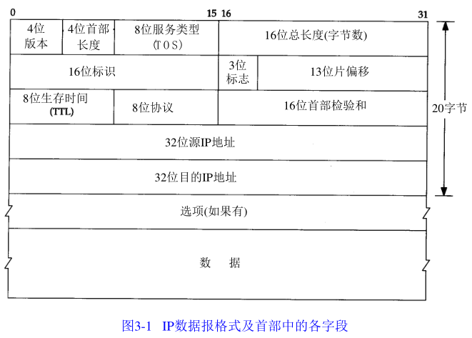
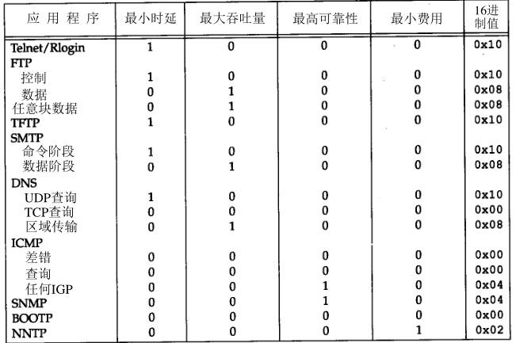
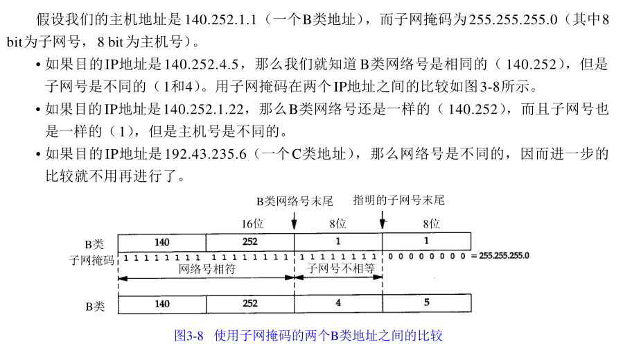
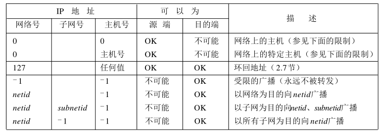

# IP地址分类

IP地址根据网络号和主机号来分，分为A、B、C三类及特殊地址D、E。  全0和全1的都保留不用。

A类：(1.0.0.0-126.0.0.0)（默认子网掩码：255.0.0.0或 0xFF000000）第一个字节为网络号，后三个字节为主机号。该类IP地址的最前面为“0”，所以地址的网络号取值于1~126之间。一般用于大型网络。

B类：(128.0.0.0-191.255.0.0)（默认子网掩码：255.255.0.0或0xFFFF0000）前两个字节为网络号，后两个字节为主机号。该类IP地址的最前面为“10”，所以地址的网络号取值于128~191之间。一般用于中等规模网络。

C类：(192.0.0.0-223.255.255.0)（子网掩码：255.255.255.0或 0xFFFFFF00）前三个字节为网络号，最后一个字节为主机号。该类IP地址的最前面为“110”，所以地址的网络号取值于192~223之间。一般用于小型网络。

D类：是多播地址。该类IP地址的最前面为“1110”，所以地址的网络号取值于224~239之间。一般用于多路广播用户[1] 。

E类：是保留地址。该类IP地址的最前面为“1111”，所以地址的网络号取值于240~255之间。

在IP地址3种主要类型里，各保留了3个区域作为私有地址，其地址范围如下： 
A类地址：10.0.0.0～10.255.255.255 
B类地址：172.16.0.0～172.31.255.255 
C类地址：192.168.0.0～192.168.255.255

回送地址：127.0.0.1。 也是本机地址，等效于localhost或本机IP。一般用于测试使用。

# IP首部

IP数据报的格式如下图所示，其首部一般为20个字节。

IP首部的最高位在左边，记作0bit，最低位在右边，31bit。

传输时按照0-7、8-15、16-23、24-31的次序传输，bit endian字节序（也叫网络字节序）。

以其他格式存储数据的机器在传输之前必须先将数据转换为网络字节序。

## 首部长度

首部长度以字为单位，指的是IP的首部有多少个长为4字节的字，即图中的一行。最大值为15，因此IP首部最长为15*4=60个字节。普通IP数据报的首部长度为5。

## 服务类型

服务类型(TOS)：包括4bit的TOS子字段和4个目前不用的bit。4个bit均为0时代表一般服务，4个bit中最多有一个bit置一。

对不同应用建议的TOS值：

Telnet和Rlogin这两个交互应用要求最小时延，而FTP文件传输则要求最大吞吐量。

## 总长度

总长度字段是指整个IP数据报的长度，以字节为单位。该字段长16bit，因此IP数据报的最大长度为65535字节。

通过总长度和头部长度两个字段即可计算出数据部分的开始位置。

总长度字段是IP首部中必须的内容，当链路层需要填充一些数据以达到最小长度时，需要用总长度来确定哪些内容是原始数据报中的内容。

## 标识

在数据报离开源主机时，由源主机给数据报定义一个唯一的标识，通常每发送一个数据报，标识字段都会加1。数据报分段时，标识字段的值就复制到了所有的分段中，用于在目的主机重组分段。

## 标志

3bit的标志位中，第1位保留；第2位称为不分段位，其值为1时，机器不能将该数据报分段，如果不分段无法通过某段网络，则丢弃数据报并报告一个ICMP差错报文；第3位为多分段位，如果其值为1，表示该分段不是某数据报的最后一个分段。

## 片偏移

13bit，表示分段在数据包中的相对位置，以8字节为单位。

## TTL

TTL规定了数据报最多可以经过的路由器数目。每经过1个路由器，TTL减1，TTL变为0时则丢弃该数据报。

## 协议

该字段定义了使用该IP数据报的高层协议，如TCP、ICMP、IGMP等。

## 校验和

整个首部，以16bit为单位，相加求和再取反。

# IP路由选择

当主机和目标主机处于同一个网络时，直接将数据报发送给目标主机，否则，将数据包发送给默认的路由器。

路由表中包括以下信息：

- 目的IP地址：一个主机地址或网络地址
- 下一跳路由器的IP地址
- 标志：一个标志指明目的IP地址是主机地址还是网络地址，另一个标志指明下一跳路由器是真正的下一跳路由器还是一个直接相连的端口
- 为数据报的传输指定一个接口

路由选择主要完成以下功能：

- 搜索能与目的IP地址完全匹配的表目，若找到则发送
- 搜索能与目的网络号匹配的表目，若找到则发送
- 搜索default表目，若找到则发送

若以上步骤都失败，则提交错误。

# 子网

A类和B类网络为主机号分配了太多的空间，同一个网络中往往用不到那么多主机，因此可以将主机号进一步划分为子网号与主机号。

# 子网掩码

由本机的IP地址可以判断其IP类别，进而推出其网络号。

然后，根据子网掩码和网络号可以推算出其子网号与主机号。

根据目的IP和子网掩码，就可以确定IP数据报的目的是：

1. 本子网上的主机
2. 本网络中其他子网的主机
3. 其他网络上的主机

举例

# 特殊的IP地址

0表示比特位全为0，-1表示比特位全为1。

# ifcfg

