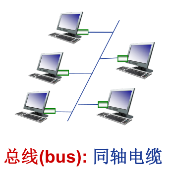
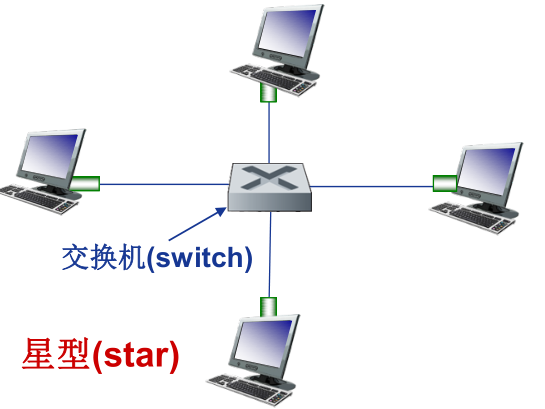
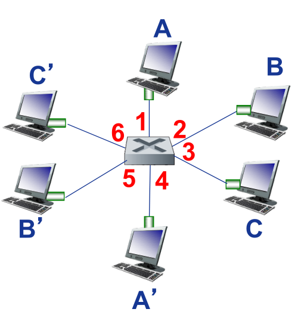
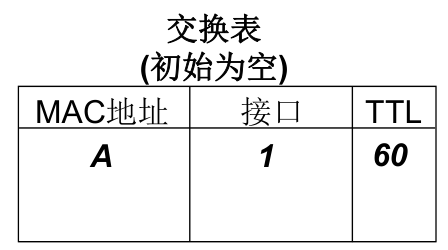
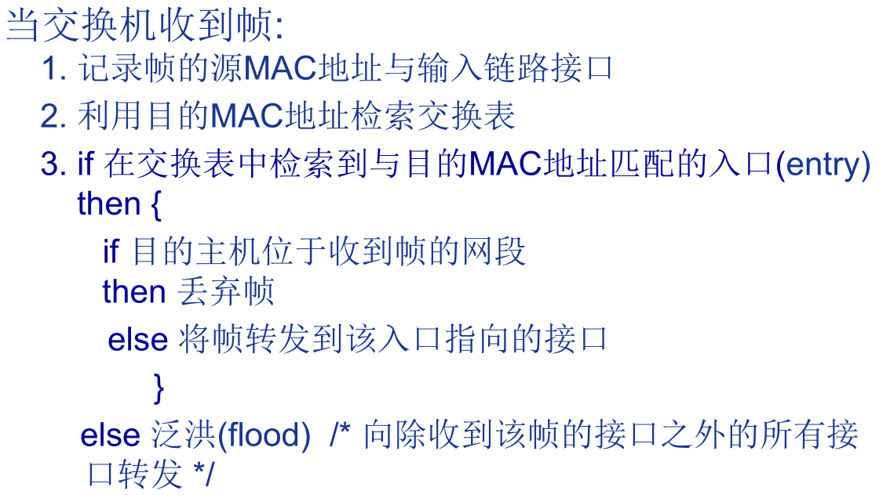
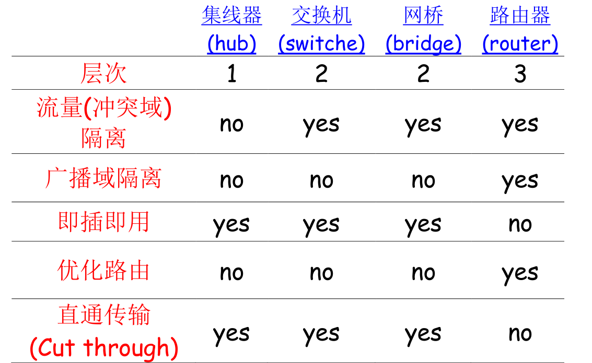

# 以太网

以太网是目前在局域网中使用最广泛的局域网技术，它的优势包括：

- 造价低廉
- 应用广泛
- 比令牌环网和ATM等简单、便宜
- 能够满足网络带宽需求：10Mbps-10Gbps

以太网对数据帧的长度都有一个限制，1500。称作

## 以太网的网络拓扑结构

一、总线型

上世纪90年代中期前流行，所有节点在同一冲突域。

二、星型

目前主流的以太网网络拓扑结构，所有主机与交换机相连。

星型拓扑最大的优点是每个节点一个单独的冲突域，节点间不会彼此冲突。

## 安全性

以太网是不可靠的，无连接的服务。

- 无连接（connectionless）：发送帧的网卡和接收帧的网卡间没有握手过程。

- 不可靠（unreliable）：接收网卡不向发送网卡进行确认。
  - 差错帧直接丢弃，由高层协议确保可靠性。

## MAC协议

传统以太网的MAC（介质访问控制）协议为：采用二进制指数退避算法的CSMA/CD（Carrier Sense, Multiple Access with Collision Detection）协议。

CSMA/CD算法：

1. NIC（网络接口控制器，即网卡，network interface controller）从网络层接收数据报，创建数据帧；
2. 监听信道：如果NIC监听到信道空闲，则开始发送帧；否则，一直等待到信道空闲，然后发送帧。
3. NIC发送整个帧的过程中没有检测到其他结点的数据发送，则NIC确认帧发送成功！
4. 如果在发送过程中检测到其他节点传输数据，则中止发送，并发送阻塞信号（jam signal）。
5. 中止发送后，NIC进入二进制指数规避。

二进制指数规避算法：

- 第m次冲突后，取n = min(m, 10)
- NIC从{0,1,2,3,…,2^n^-1}中随机取一个数K
- NIC等待K*512bit的传输时间后，再执行CSMA/CD的第二步。

冲突次数越大，等待的时间越长。

## 帧结构

以太网的帧结构为：

以太网帧长度为64-1518字节（不包含preamble）。

前导码：以太网包含8个字节的前导码，用于发送数据时进行同步，一般不计入以太网帧的长度。其中，前七个字节为10101010，第八个字节为10101011。

目的地址和源地址：长为6个字节的物理地址。

type：指示帧中封装的是哪种高层协议的分组（如，IP数据报、Novell IPX数据报、AppleTalk数据报等）。

Data：要求长度为46-1500字节，长度不够时需要进行填充。

CRC：循环冗余校验码，校验失败后丢弃帧。

## 补充

**1、以太网为什么限制数据部分的长度：**

由于传统以太网采用的是CSMA/CD协议，为了在发送帧的过程中检测冲突，必须保证可能的冲突信号返回前帧仍未发送结束，如果在2t内没有收到冲突信号，则发送成功。如果发送端在2t内已经发送结束，则即使发生了冲突也无法检测到。

一个以太网的最大长度被限制为2500米，然后根据电子在铜轴中的传输速度，计算出为了保证冲突检测正常工作，数据部分的最小长度应控制在64字节。以太网数据部分的最大长度被限制为1500是一个折衷，这样做的话，如果帧传输过程出错，只需要重传1.5kb的数据，但这也导致了大数据被拆分为多个帧后，每个帧都有额外的头部开销。

2、以太网的数据部分的最大值为1500字节，称为MTU，最大传输单元。如果IP数据报的大小大于MTU，则数据报就需要分片。

路径MTU：在整条通信线路上，最小的链路的MTU。

3、不同类型的以太网标准速率和物理介质不同，但都共享相同的MAC协议和帧格式（可能将帧中数据部分的某些位用作特殊用途）。

# 环回接口

`localhost:127.0.0.1`就是一个环回接口。

广播时会将数据报复制一份给环回接口，再发送到以太网。

# 交换机

交换机是一个链路层设备，其功能包括：

- 存储-转发以太网帧。
- 检验到达帧的目的MAC地址，选择性(selectively) 向一个或多个输出链路转发帧。
- 利用CSMA/CD访问链路，发送帧。

交换机对主机来说时透明的，是一种即插即用的设备，无需配置（利用自学习机制）。

特点：

- 主机利用独享链路直接连接交换机。
- 交换机能够缓存帧。
- 交换机在每段链路上使用CDMA/CD收发帧，全双工且不会产生冲突。
- 可以多端口同时与多个主机通信（通过交换表）。

交换机会维护一个交换表，记录主机与端口的绑定信息：当交换机接收到一个帧时，将帧的源MAC地址与收到该帧的端口进行绑定。

帧过滤和转发过程：

网络设备对比：

# 虚拟局域网

