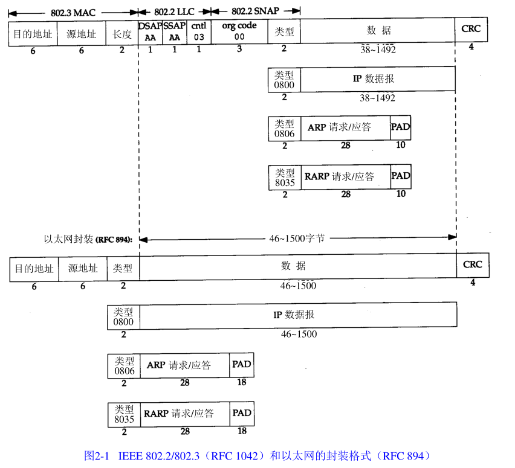
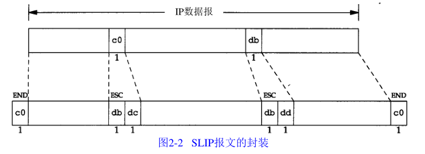
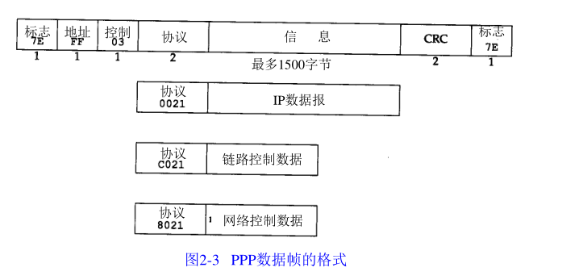
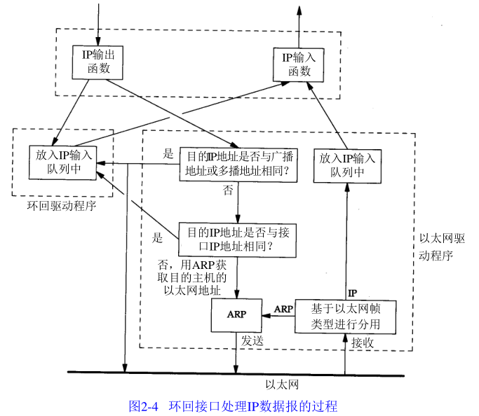

数据链路层的作用：

1. 为IP模块发送和接收IP数据报；
2. 为ARP模块发送ARP请求和接收ARP应答；
3. 为RARP发送RARP请求和接收RARP应答。

TCP/IP支持多种不同的以太网链路层协议，如以太网、令牌环网、FDDI（光纤分布式数据接口等）。

# 以太网和IEEE802

以太网通常指一套标准，第一个常见格式的以太网目前被称为“10Mb/s以太网“。以太网采用CSMA/CD(Carrier Sense, Multiple Access with Collision Detection)媒体接入方法，它的速率是10Mb/s，地址为48bit。基本的共享以太网包括多个站，它们被连接在同一个电缆段上，当介质空闲时，链路层的帧PDU可以从一个站发送到若干个站，如果多个站同时发送数据，则检测到冲突后，发送站会等待一个随机时间重新发送PDU（协议数据单元）。

> CSMA/CD：带有冲突检测的载波侦听多路访问。一个站首先检测目前网络上正在发送的信号，并在网络空闲时发送自己的帧。如果其他站恰好也在发送，检测到了碰撞，则等待一定时间后重新尝试发送该帧，或者在尝试一定次数后超时。是一种基于竞争的MAC（介质访问控制）协议。

802委员会公布了稍有不同的标准集，其中802.3针对整个CSMA/CD网络，802.4针对令牌总线网络，802.5针对令牌环网络，802.2定义了它们的公共特性。

主机需求RFC要求每台主机必须满足以下条件：

- 能够发送和接收以太网封装格式的分组；

- 能够接收IEEE802格式封装的分组；

- 发送IEEE802格式的分组（可选）；如果主机能够同时发送两种格式的分组，应该默认发送以太网封装格式的分组。

ARP和RARP协议对32bit的IP地址和48bit的物理地址进行映射。

802帧格式中，长度定义了它后续数据的字节长度（不包括CRC校验码），数据的类型由子网接入协议（SNAP，subnet access protocol）定义。

以太网的类型字段定义了它后续数据的类型。

以太网要求数据的最小长度为46字节，802则要求最少38字节。

CRC字段用于帧内后续字节差错的循环冗余码校验。

# SLIP：串行线路IP

SLIP的全称为Serial Linue IP，它是一种在串行线路上对IP数据进行封装的简单形式。

- SLIP协议在IP数据报的尾部添加一个END（0xc0）特殊字符，分隔不同的IP数据报；同时，为了防止数据报到来之前的线路噪声，在数据报的开始处也传一个END字符，将噪声作为一个数据报提交给上层，然后上层发现噪声无意义将其丢弃。

- 如果IP报文中存在END(0xc0)，会使用0xdb和0xdc来取代这个END。0xdb在SLIP中是一个转义字符。
- 如果IP报文中存在ESC(0xdb)，则使用0xdb和0xdd来取代该ESC。

例如：

串行线路的速率较低，在交互式通信中，可能会为了传输1个字节的数据而传送20个字节的IP首部和TCP首部。为此，人们提出了CSLIP协议，对首部进行压缩，提高交互通信效率。

# PPP：点对点协议

PPP协议解决了SLIP协议中的缺陷，它主要包括以下三个部分：

1. 在串行链路上封装IP数据报的方法：PPP既支持数据为8位和无奇偶校验的异步模式，还支持面向比特的同步链接。
2. 建立、配置和测试数据链路的链路控制协议(LCP：Link Control Protocol)。它允许通信双方进行协商以确定不同的配置。
3. 针对不同网络层协议的网络控制协议（NCP：Network Control Protocol）。例如，它允许双方商定是否对报文首部进行压缩，类似SSLIP。

PPP协议的转义规则为：

- 遇到0x7e时，传输0x7d和0x5e
- 遇到0x7d（转义字符）时，传输0x7d和0x5d
- 字符小于0x20时进行转义。例如，0x01 ——> 0x7d和0x21（从右向左，第六个比特取反）

PPP协议的优点：

- 支持在单根串行线路上运行多种协议
- 每一帧都有循环冗余校验
- 通信双方可以进行IP地址的动态协商
- 可以通过协商压缩首部长度

# 环回接口

`localhost:127.0.0.1`就是一个环回接口。

广播时会将数据报复制一份给环回接口，再发送到以太网。

# 最大传输单元MTU

以太网和802.3对数据帧的长度都有一个限制，其最大值分别是1500和1492字节。称作MTU，最大传输单元。

如果IP数据报的大小大于MTU，则数据报就需要分片。

路径MTU：在整条通信线路上，最小的链路的MTU。

