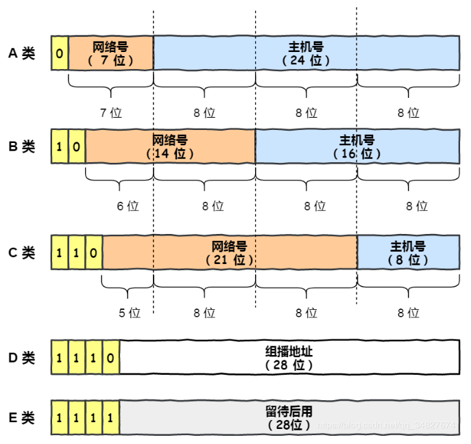
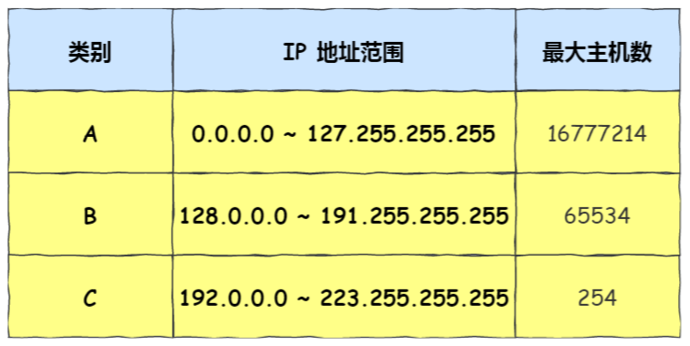
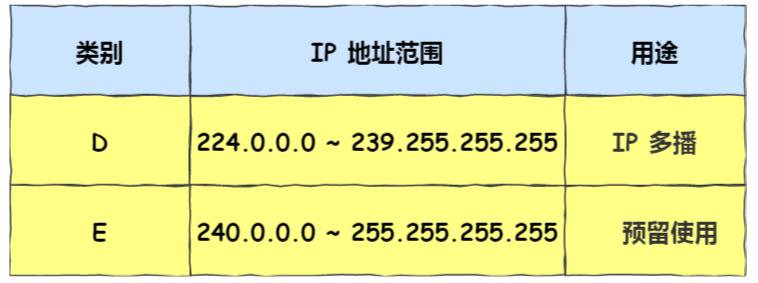
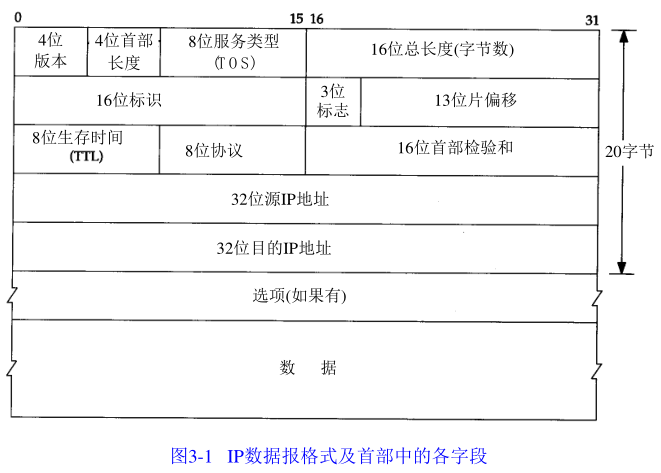
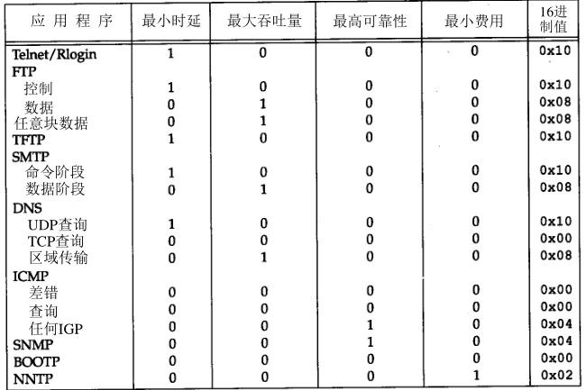
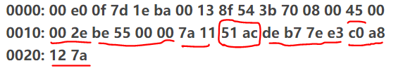
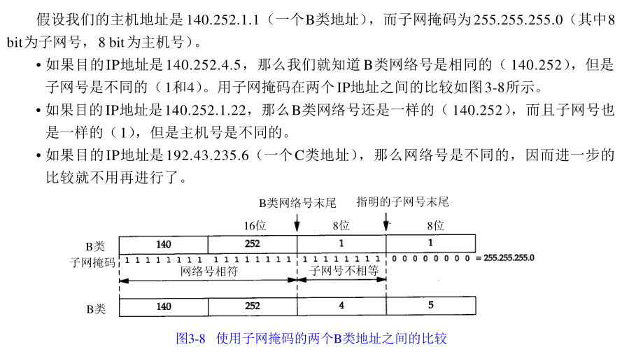

`IP` 层是「不可靠」的，它不保证网络包的交付、不保证网络包的按序交付、也不保证网络包中的数据的完整性。


# IPV4地址分类

IPV4约有43亿个地址。



IP地址根据网络号和主机号来分，分为A、B、C三类及特殊地址D、E。  全0和全1的都保留不用。



主机号全0和全1的地址用作特殊用途：

- 主机号全为 1 指定某个网络下的所有主机，用于广播
- 主机号全为 0 指定某个网络

回送地址：127.0.0.1。 也是本机地址，等效于localhost或本机IP。一般用于测试使用。

D 类和 E 类地址是没有主机号的，所以不可用于主机 IP，D 类常被用于**多播**，E 类是预留的分类，暂时未使用。




# IP首部

IP数据报的格式如下图所示，其首部一般为20个字节。



IP首部的最高位在左边，记作0bit，最低位在右边，31bit。

传输时按照0-7、8-15、16-23、24-31的次序传输，bit endian字节序（也叫网络字节序）。

以其他格式存储数据的机器在传输之前必须先将数据转换为网络字节序。

## 首部长度

首部长度以字为单位，指的是IP的首部有多少个长为4字节的字，即图中的一行。最大值为15，因此IP首部最长为15*4=60个字节。普通IP数据报的首部长度为5。

## 服务类型

服务类型(TOS)：包括4bit的TOS子字段和4个目前不用的bit。4个bit均为0时代表一般服务，4个bit中最多有一个bit置一。

对不同应用建议的TOS值：



Telnet和Rlogin这两个交互应用要求最小时延，而FTP文件传输则要求最大吞吐量。

## 总长度

总长度字段是指整个IP数据报的长度，以字节为单位。该字段长16bit，因此IP数据报的最大长度为65535字节。

通过总长度和头部长度两个字段即可计算出数据部分的开始位置。

总长度字段是IP首部中必须的内容，当链路层需要填充一些数据以达到最小长度时，需要用总长度来确定哪些内容是原始数据报中的内容。

## 标识

在数据报离开源主机时，由源主机给数据报定义一个唯一的标识，通常每发送一个数据报，标识字段都会加1。数据报分段时，标识字段的值就复制到了所有的分段中，用于在目的主机重组分段。

## 标志

3bit的标志位中，第1位保留；第2位称为不分段位，其值为1时，机器不能将该数据报分段，如果不分段无法通过某段网络，则丢弃数据报并报告一个ICMP差错报文；第3位为多分段位，如果其值为1，表示该分段不是某数据报的最后一个分段。

## 片偏移

13bit，表示分段在数据包中的相对位置，以8字节为单位。

## TTL

TTL规定了数据报最多可以经过的路由器数目。每经过1个路由器，TTL减1，TTL变为0时则丢弃该数据报。

## 协议

该字段定义了使用该IP数据报的高层协议，如TCP、ICMP、IGMP等。

## 校验和

整个首部，以16bit为单位，相加求和再取反。

demo：




```
45 00 00 2e----4表示ip版本号为ip第4版；5表示首部长度为5个32 bit字长，即为20字节；00 2e表示ip数据包总长度为46字节，其中ip数据部分为26字节。 
be 55 00 00----be 55表示标识符；00 00表示3 bit标志及13 bit片偏移量； 
7a 11 51 ac----7a表示ttl值为122；11表示协议号为17的udp协议；51 ac表示16 bit首部检验和值； 
de b7 7e e3----表示32 bit 源ip地址为222.183.126.227 
c0 a8 12 7a----表示32 bit 目的ip地址为192.168.18.122

检验和计算： 
首先,把校验和字段置为0。 
45 00 00 2e 
be 55 00 00 
7a 11 00 00<----检验和置为0 
de b7 7e e3 
c0 a8 12 7a 
其次，对整个首部中的每个16bit进行二进制反码求和，求和值为0x3_ae50，然后3+ae50=0xae53（这是根据源代码中算法 cksum = (cksum >> 16) + (cksum & 0xffff) 进行的 ） 
最后，ae53+51ac=ffff。因此判断ip首部在传输过程中没有发生任何差错。

"二进制反码求和" 等价于 "二进制求和再取反"
从源代码看,很关键的一点是二进制求出的和如果大于16位时所做的操作,用和值中高16位加上低16位的值作为最终的和值,然后再做取反运算.
```


# IP路由选择

当主机和目标主机处于同一个网络时，直接将数据报发送给目标主机，否则，将数据包发送给默认的路由器。

路由表中包括以下信息：

- 目的IP地址：一个主机地址或网络地址
- 下一跳路由器的IP地址
- 标志：一个标志指明目的IP地址是主机地址还是网络地址，另一个标志指明下一跳路由器是真正的下一跳路由器还是一个直接相连的端口
- 为数据报的传输指定一个接口

路由选择主要完成以下功能：

- 搜索能与目的IP地址完全匹配的表目，若找到则发送
- 搜索能与目的网络号匹配的表目，若找到则发送
- 搜索default表目，若找到则发送

若以上步骤都失败，则提交错误。

# 子网

A类和B类网络为主机号分配了太多的空间，C类的主机号又太少，为了解决该问题，提出了无分类地址的方案，CIDR。

# 子网掩码

由本机的IP地址可以判断其IP类别，进而推出其网络号。

然后，根据子网掩码和网络号可以推算出其子网号与主机号。

根据目的IP和子网掩码，就可以确定IP数据报的目的是：

1. 本子网上的主机
2. 本网络中其他子网的主机
3. 其他网络上的主机

举例



目前大部分主机、路由器和路由协议支持可变长度子网掩码（VLSM）。


# ARP协议

ARP协议用来解析某个IP的MAC地址


- 主机会通过**广播发送 ARP 请求**，这个包中包含了想要知道的 MAC 地址的主机 IP 地址。
- 当同个链路中的所有设备收到 ARP 请求时，会去拆开 ARP 请求包里的内容，如果 ARP 请求包中的目标 IP 地址与自己的 IP 地址一致，那么这个设备就将自己的 MAC 地址塞入 **ARP 响应包**返回给主机。

操作系统通常会把第一次通过 ARP 获取的 MAC 地址缓存起来，以便下次直接从缓存中找到对应 IP 地址的 MAC 地址。

不过，MAC 地址的缓存是有一定期限的，超过这个期限，缓存的内容将被清除。

ARP 协议是已知 IP 地址求 MAC 地址，那 RARP 协议正好相反，它是**已知 MAC 地址求 IP 地址**。例如将打印机服务器等小型嵌入式设备接入到网络时就经常会用得到。

通常这需要架设一台 `RARP` 服务器，在这个服务器上注册设备的 MAC 地址及其 IP 地址。然后再将这个设备接入到网络，接着：

- 该设备会发送一条「我的 MAC 地址是XXXX，请告诉我，我的IP地址应该是什么」的请求信息。
- RARP 服务器接到这个消息后返回「MAC地址为 XXXX 的设备，IP地址为 XXXX」的信息给这个设备。

最后，设备就根据从 RARP 服务器所收到的应答信息设置自己的 IP 地址。


# DHCP

位于应用层

DHCP过程：


- 客户端首先发起 **DHCP 发现报文（DHCP DISCOVER）** 的 IP 数据报，由于客户端没有 IP 地址，也不知道 DHCP 服务器的地址，所以使用的是 UDP **广播**通信，其使用的广播目的地址是 255.255.255.255（端口 67） 并且使用 0.0.0.0（端口 68） 作为源 IP 地址。DHCP 客户端将该 IP 数据报传递给链路层，链路层然后将帧广播到所有的网络中设备。
- DHCP 服务器收到 DHCP 发现报文时，用 **DHCP 提供报文（DHCP OFFER）** 向客户端做出响应。该报文仍然使用 IP 广播地址 255.255.255.255，该报文信息携带服务器提供可租约的 IP 地址、子网掩码、默认网关、DNS 服务器以及 **IP 地址租用期**。
- 客户端收到一个或多个服务器的 DHCP 提供报文后，从中选择一个服务器，并向选中的服务器发送 **DHCP 请求报文（DHCP REQUEST**进行响应，回显配置的参数。
- 最后，服务端用 **DHCP ACK 报文**对 DHCP 请求报文进行响应，应答所要求的参数。

一旦客户端收到 DHCP ACK 后，交互便完成了，并且客户端能够在租用期内使用 DHCP 服务器分配的 IP 地址。

如果租约的 DHCP IP 地址快期后，客户端会向服务器发送 DHCP 请求报文：

- 服务器如果同意继续租用，则用 DHCP ACK 报文进行应答，客户端就会延长租期。
- 服务器如果不同意继续租用，则用 DHCP NACK 报文，客户端就要停止使用租约的 IP 地址。

可以发现，DHCP 交互中，**全程都是使用 UDP 广播通信**。

# NAT协议


**两个私有 IP 地址都转换 IP 地址为公有地址 120.229.175.121，但是以不同的端口号作为区分。**

由于 NAT/NAPT 都依赖于自己的转换表，因此会有以下的问题：

- 外部无法主动与 NAT 内部服务器建立连接，因为 NAPT 转换表没有转换记录。
- 转换表的生成与转换操作都会产生性能开销。
- 通信过程中，如果 NAT 路由器重启了，所有的 TCP 连接都将被重置。

*第一种就是改用 IPv6*

IPv6 可用范围非常大，以至于每台设备都可以配置一个公有 IP 地址，就不搞那么多花里胡哨的地址转换了，但是 IPv6 普及速度还需要一些时间。

*第二种 NAT 穿透技术*

NAT 穿越技术拥有这样的功能，它能够让网络应用程序主动发现自己位于 NAT 设备之后，并且会主动获得 NAT 设备的公有 IP，并为自己建立端口映射条目，注意这些都是 NAT设备后的应用程序自动完成的。

也就是说，在 NAT 穿透技术中，NAT设备后的应用程序处于主动地位，它已经明确地知道 NAT 设备要修改它外发的数据包，于是它主动配合 NAT 设备的操作，主动地建立好映射，这样就不像以前由 NAT 设备来建立映射了。

说人话，就是客户端主动从 NAT 设备获取公有 IP 地址，然后自己建立端口映射条目，然后用这个条目对外通信，就不需要 NAT 设备来进行转换了。

# ICMP协议

ICMP 全称是 **Internet Control Message Protocol**，也就是**互联网控制报文协议**。

`ICMP` 主要的功能包括：**确认 IP 包是否成功送达目标地址、报告发送过程中 IP 包被废弃的原因和改善网络设置等。**

在 `IP` 通信中如果某个 `IP` 包因为某种原因未能达到目标地址，那么这个具体的原因将**由 ICMP 负责通知**。


如上图例子，主机 `A` 向主机 `B` 发送了数据包，由于某种原因，途中的路由器 `2` 未能发现主机 `B` 的存在，这时，路由器 `2` 就会向主机 `A` 发送一个 `ICMP` 目标不可达数据包，说明发往主机 `B` 的包未能成功。

ICMP 的这种通知消息会使用 `IP` 进行发送 。

因此，从路由器 `2` 返回的 ICMP 包会按照往常的路由控制先经过路由器 `1` 再转发给主机 `A` 。收到该 ICMP 包的主机 `A` 则分解 ICMP 的首部和数据域以后得知具体发生问题的原因。

ICMP 大致可以分为两大类：

- 一类是用于诊断的查询消息，也就是「**查询报文类型**」
- 另一类是通知出错原因的错误消息，也就是「**差错报文类型**」


## 查询类型报文

> 回送消息 —— 类型 `0` 和 `8`

**回送消息**用于进行通信的主机或路由器之间，判断所发送的数据包是否已经成功到达对端的一种消息，`ping` 命令就是利用这个消息实现的。


可以向对端主机发送**回送请求**的消息（`ICMP Echo Request Message`，类型 `8`），也可以接收对端主机发回来的**回送应答**消息（`ICMP Echo Reply Message`，类型 `0`）。


相比原生的 ICMP，这里多了两个字段：

- **标识符**：用以区分是哪个应用程序发 ICMP 包，比如用进程 `PID` 作为标识符；
- **序号**：序列号从 `0` 开始，每发送一次新的回送请求就会加 `1`， 可以用来确认网络包是否有丢失。

在**选项数据**中，`ping` 还会存放发送请求的时间值，来计算往返时间，说明路程的长短。

## 差错类型报文

- 目标不可达消息 —— 类型 为 `3`
- 原点抑制消息 —— 类型 `4`
- 重定向消息 —— 类型 `5`
- 超时消息 —— 类型 `11`

> 目标不可达消息（Destination Unreachable Message） —— 类型为 `3`

IP 路由器无法将 IP 数据包发送给目标地址时，会给发送端主机返回一个**目标不可达**的 ICMP 消息，并在这个消息中显示不可达的具体原因，原因记录在 ICMP 包头的**代码**字段。

由此，根据 ICMP 不可达的具体消息，发送端主机也就可以了解此次发送**不可达的具体原因**。

举例 6 种常见的目标不可达类型的**代码**：


- 网络不可达代码为 `0`
- 主机不可达代码为 `1`
- 协议不可达代码为 `2`
- 端口不可达代码为 `3`
- 需要进行分片但设置了不分片位代码为 `4`

## ping

ping 命令执行的时候，源主机首先会构建一个 **ICMP 回送请求消息**数据包。

ICMP 数据包内包含多个字段，最重要的是两个：

- 第一个是**类型**，对于回送请求消息而言该字段为 `8`；
- 另外一个是**序号**，主要用于区分连续 ping 的时候发出的多个数据包。

每发出一个请求数据包，序号会自动加 `1`。为了能够计算往返时间 `RTT`，它会在报文的数据部分插入发送时间。


然后，由 ICMP 协议将这个数据包连同地址 192.168.1.2 一起交给 IP 层。IP 层将以 192.168.1.2 作为**目的地址**，本机 IP 地址作为**源地址**，**协议**字段设置为 `1` 表示是 `ICMP` 协议，再加上一些其他控制信息，构建一个 `IP` 数据包。


接下来，需要加入 `MAC` 头。如果在本地 ARP 映射表中查找出 IP 地址 192.168.1.2 所对应的 MAC 地址，则可以直接使用；如果没有，则需要发送 `ARP` 协议查询 MAC 地址，获得 MAC 地址后，由数据链路层构建一个数据帧，目的地址是 IP 层传过来的 MAC 地址，源地址则是本机的 MAC 地址；还要附加上一些控制信息，依据以太网的介质访问规则，将它们传送出去。


主机 `B` 收到这个数据帧后，先检查它的目的 MAC 地址，并和本机的 MAC 地址对比，如符合，则接收，否则就丢弃。

接收后检查该数据帧，将 IP 数据包从帧中提取出来，交给本机的 IP 层。同样，IP 层检查后，将有用的信息提取后交给 ICMP 协议。

主机 `B` 会构建一个 **ICMP 回送响应消息**数据包，回送响应数据包的**类型**字段为 `0`，**序号**为接收到的请求数据包中的序号，然后再发送出去给主机 A。


在规定的时候间内，源主机如果没有接到 ICMP 的应答包，则说明目标主机不可达；如果接收到了 ICMP 回送响应消息，则说明目标主机可达。

此时，源主机会检查，用当前时刻减去该数据包最初从源主机上发出的时刻，就是 ICMP 数据包的时间延迟。

针对上面发送的事情，总结成了如下图：


当然这只是最简单的，同一个局域网里面的情况。如果跨网段的话，还会涉及网关的转发、路由器的转发等等。

但是对于 ICMP 的头来讲，是没什么影响的。会影响的是根据目标 IP 地址，选择路由的下一跳，还有每经过一个路由器到达一个新的局域网，需要换 MAC 头里面的 MAC 地址。

说了这么多，可以看出 ping 这个程序是**使用了 ICMP 里面的 ECHO REQUEST（类型为 8 ） 和 ECHO REPLY （类型为 0）**。

## traceroute

*1. traceroute 作用一*

traceroute 的第一个作用就是**故意设置特殊的 TTL，来追踪去往目的地时沿途经过的路由器。**

traceroute 的参数指向某个**目的 IP 地址**：

```bash
traceroute 192.168.1.100
```

> 这个作用是如何工作的呢？

它的原理就是利用 IP 包的**生存期限** 从 `1` 开始按照顺序递增的同时发送 **UDP 包**，强制接收 **ICMP 超时消息**的一种方法。

比如，将 TTL 设置 为 `1`，则遇到第一个路由器，就牺牲了，接着返回 ICMP 差错报文网络包，类型是**时间超时**。

接下来将 TTL 设置为 `2`，第一个路由器过了，遇到第二个路由器也牺牲了，也同时返回了 ICMP 差错报文数据包，如此往复，直到到达目的主机。

这样的过程，traceroute 就可以拿到了所有的路由器 IP。

当然有的路由器根本就不会返回这个 ICMP，所以对于有的公网地址，是看不到中间经过的路由的。

> 发送方如何知道发出的 UDP 包是否到达了目的主机呢？

traceroute 在发送 `UDP` 包时，会填入一个**不可能的端口号**值作为 UDP 目标端口号（大于 `3000` ）。当目的主机，收到 UDP 包后，会返回 ICMP 差错报文消息，但这个差错报文消息的类型是「**端口不可达**」。

所以，**当差错报文类型是端口不可达时，说明发送方发出的 UDP 包到达了目的主机。**

*2. traceroute 作用二*

traceroute 还有一个作用是**故意设置不分片，从而确定路径的 MTU**。

> 这么做是为了什么？

这样做的目的是为了**路径MTU发现**。

因为有的时候我们并不知道路由器的 `MTU` 大小，以太网的数据链路上的 `MTU` 通常是 `1500` 字节，但是非以太网的 `MTU` 值就不一样了，所以我们要知道 `MTU` 的大小，从而控制发送的包大小。


它的工作原理如下：

首先在发送端主机发送 `IP` 数据报时，将 `IP` 包首部的**分片禁止标志位设置为 1**。根据这个标志位，途中的路由器不会对大数据包进行分片，而是将包丢弃。

随后，通过一个 ICMP 的不可达消息将**数据链路上 MTU 的值**一起给发送主机，不可达消息的类型为「**需要进行分片但设置了不分片位**」。

发送主机端每次收到 ICMP 差错报文时就**减少**包的大小，以此来定位一个合适的 `MTU` 值，以便能到达目标主机。
