# 概述

传输层为运行在不同Host上的进程提供了一种逻辑通信机制。

发送方：将应用递交的消息分成一个或多个Segment，并向下传输给网络层。

接收方：将接收到的Segment重组为消息，上交给应用层。

# UDP

User Datagram Protocol，它基于 IP 协议进行了复用/分用，并添加了简单的错误校验。

UDP 提供尽力而为的服务，UDP的Segment可能会丢失或非按序到达，需要应用层保证可靠数据传输。

UDP 服务器端：

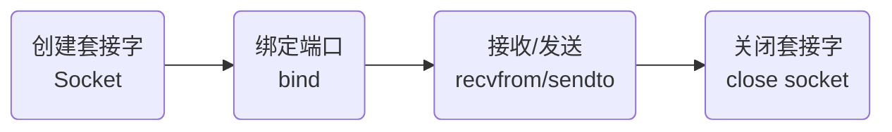
```mermaid
graph LR
A(创建套接字<br/>Socket)-->B(绑定端口<br/>bind)-->C(接收/发送<br/>recvfrom/sendto)
-->D(关闭套接字<br/>close socket)
```

UDP 客户端：
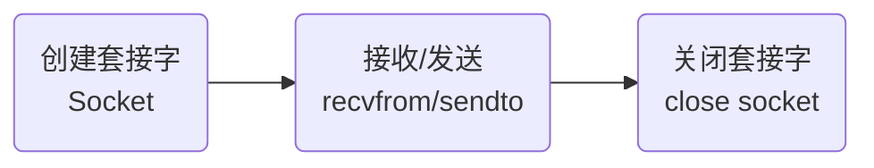
```mermaid
graph LR
A(创建套接字<br/>Socket)-->C(接收/发送<br/>recvfrom/sendto)
-->D(关闭套接字<br/>close socket)
```


优点：

- 实现简单，无需维护连接状态
- 头部开销少
- 无需建立连接，延迟低
- 没有拥塞控制：应用可以更好的控制发送时间和速率

应用：

- 流媒体应用（电话，视频会议等）
- 速率敏感
- DNS：域名服务
- NTP：`Network Time Protocol`
- DHCP、ICMP

UDP段的格式：

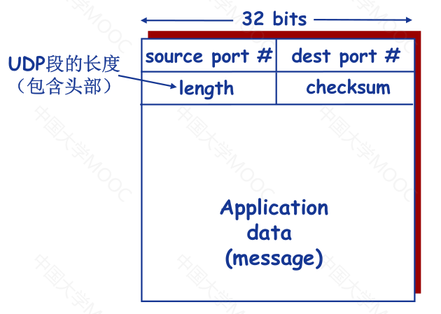

length：首部和数据的全部字节数（由于数据字段长度不定，需要一个明确的大小指定数据段长度）

UDP校验和：首部和数据全部参与运算，用于检测UDP段在传输时是否发生错误（不一定能准确检测）。

由于 IP 包只对头部做校验和，无法对数据部分进行纠错，因此 UDP 为自己实现校验和。

发送方为 UDP 数据报计算校验和，并将其保存在校验和字段中；接收方收到报文后，重新计算校验和并与报文中的校验和字段进行对比；以此确定报文在传输的过程中是否发生差错。

与 IP 校验和不同，UDP 整个报文都会参与校验和计算。除此之外，UDP 还会在报文前面拼接一个 IP 伪头部，同时参与校验和计算。IP 伪头部只用于计算校验和，不会真的发送。IP 伪头部会包含 IP 层的核心信息，包括：

- 源地址
- 目的地址
- 协议类型
- 报文长度（和UDP头部的length数值相同）


IP 已经有了首部校验和了，UDP 校验和计算为什么还要考虑这些关键字段呢？

答案很简单：**再上一道保险**。因为校验和长度是有限的，所以存在多个不同的 IP 包头，对应到同一个校验和的情况。换言之，校验和机制可能会漏判： IP 包头已经发生差错，但计算出来的校验和仍然匹配。

这样的话，系统可能会错收 UDP 包：假设 UDP 报文在传输过程中 IP 头部发生差错，目的地址变了，但 IP 头部校验和刚好揪不出。这时，“目的主机”就会错收这个 UDP 报文。

将 IP 包关键字段纳入 UDP 校验和计算后，就算 IP 层没能揪出 IP 包头部差错，UDP 层也很有可能会发现。当然了， UDP 校验和也可能会漏判，这时就只能由应用层来纠错了。


>  如果要你来设计一个 QQ，在网络协议上你会考虑如何设计？ 
>
> 登陆采用 TCP 协议和 HTTP 协议，你和好友之间发送消息，主要采用 UDP 协议，内网传文件采用了 P2P 技术。 
>
> - 登陆过程，客户端 client 采用 TCP 协议向服务器 server 发送信息，HTTP 协议下载信 息。登陆之后，会有一个 TCP 连接来保持在线状态。
>- 和好友发消息，客户端 client 采用 UDP 协议，但是需要通过服务器转发。腾讯为了确保传输消息的可靠，采用上层协议来保证可靠传输。如果消息发送失败，客户端会提示消息 送失败，并可重新发送。 
> 
> - 如果是在内网里面的两个客户端传文件，QQ 采用的是 P2P 技术，不需要服务器中转。


## 校验和算法

  首先，IP、ICMP、UDP和TCP报文头都有检验和字段，大小都是16bit，算法基本上也是一样的。

  在发送数据时，为了计算数据包的检验和。应该按如下步骤：

  1、把校验和字段设置为 0；

  2、把需要校验的数据看成以 16 位为单位的数字组成，依次进行二进制反码求和（最高位有进位时，将进位与临时结果再次相加），或先求和再取反；

  3、把得到的结果存入校验和字段中

  在接收数据时，计算数据包的检验和相对简单，按如下步骤：

  1、把数据看成以 16 位为单位的数字组成，求和，包括校验和字段；

  2、检查计算出的校验和的结果是否为 0；

  3、如果等于 0，说明被整除，校验和正确。否则，校验和就是错误的，协议栈要抛弃这个数据包。

 虽然说上面四种报文的校验和算法一样，但是在作用范围存在不同：IP 校验和只校验 20 字节的 IP 报头；而 ICMP 校验和覆盖整个报文( ICMP 报头+ ICMP 数据)；UDP 和 TCP 校验和不仅覆盖整个报文，而且还有 12 个字节的 IP 伪首部，包括源 IP 地址(4 字节)、目的 IP 地址( 4 字节)、协议( 2 字节)、TCP/UDP 包长( 2 字节)。另外UDP、TCP 数据报的长度可以为奇数字节，所以在计算校验和时需要在最后增加填充字节 0 (填充字节只是为了计算校验和，可以不被传送)。

在UDP传输协议中，校验和是可选的，当校验和字段为0时，表明该UDP报文未使用校验和，接收方就不需要校验和检查了！那如果 UDP 校验和的计算结果是 0 时怎么办？书上有一句话：“如果校验和的计算结果为 0，则存入的值为全1(65535)，这在二进制反码计算中是等效的。”

**什么是二进制反码求和**

对一个无符号的数，先求其反码，然后从低位到高位，按位相加，有进位则向高位进1(和一般的二进制法则一样),若最高位有进位，则向最低位进1。

下面是两种二进制反码求和的运算：

原码加法运算：3(0011)+5(0101)=8(1000)

​         8(1000)+9(1001)=1(0001)

反码加法运算：3(1100)+5(1010)=8(0111)

​         8(0111)+9(0110)=2(1101)

从上面的例子中，当加法未发生溢出时，原码与反码加法运算结果一样；当有溢出时，结果就不一样了，原码是满10000溢出，而反码是满1111溢出，所以相差正好是1.

另外，关于二进制反码求和运算需要说明的一点是，先取反后相加与先相加后取反，得到的结果是一样的。

**优势：**

- 不依赖系统是大端存储还是小端存储
- 计算简单，快捷

# 可靠数据传输

reliable data transfer(RDT)

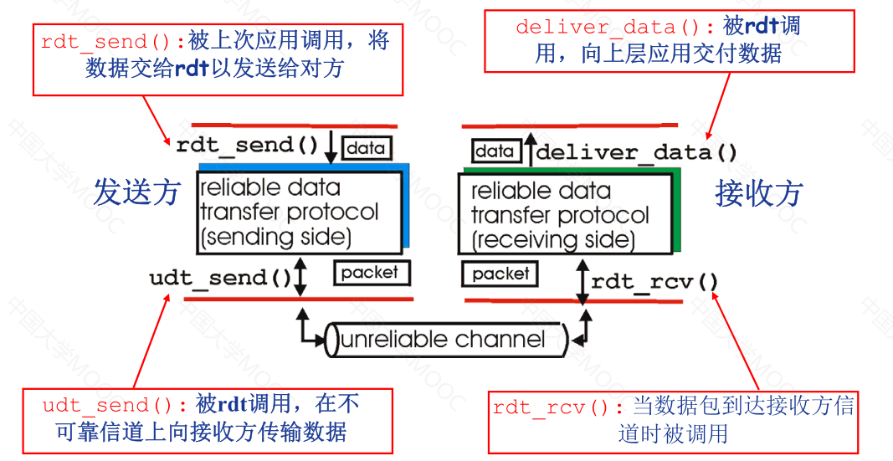

RDT基于停等协议。

## RDT1.0

底层信道完全可靠。

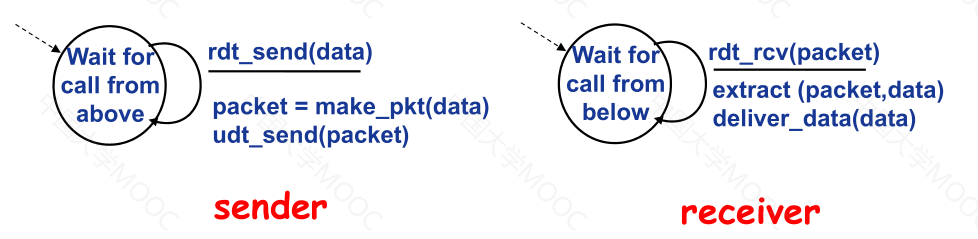

## RDT2.0

RDT2.x假设信道只会发生位错误。

引入差错检测机制：利用校验和检测位翻转错误。

确认机制：

- ACK：接收方显式地告知发送方分组已正确接收。
- NAK：接收方显式地告知发送方分组有错误。

重传机制：发生错误时，重传分组。

停等协议：发送数据后，等收到ACK或者NAK后再进行下一次发送。

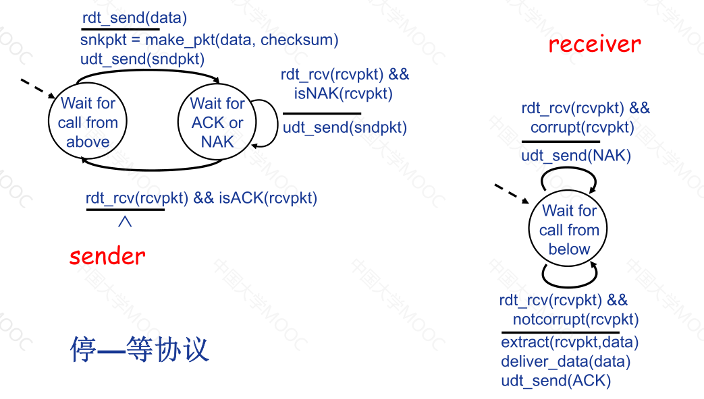

## RDT2.1

RDT2.0的问题：ACK/NAK 消息可能会发生错误（可以由checksum检验出来）。

解决方式：当收到被破坏的 ACK/NAK 消息时，重传分组（为了避免服务器识别分组是重传都分组还是下一个分组，需要为分组添加序列号）。

RDT2.1同样基于停等机制：

发送方

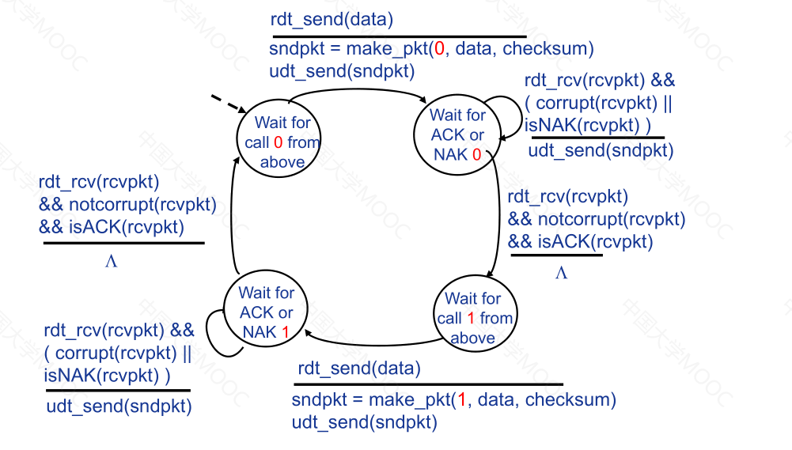

接收方

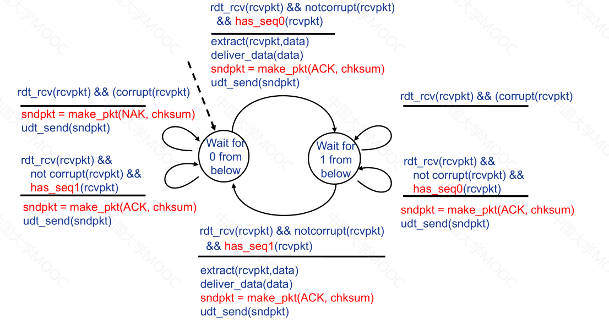

## RDT2.2

取消了NAK，收到重复ACK后重传当前分组。

- 接收方通过ACK告知最后一个被正确接收的分组
- 在ACK消息中显式地加入被确认分组的序列号

## RDT3.0

RDT3.0假设信道既会发生位错误又会发生分组丢失。

加入了定时器。

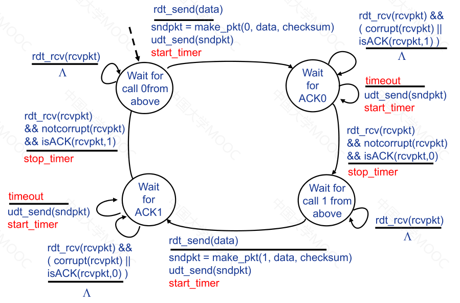

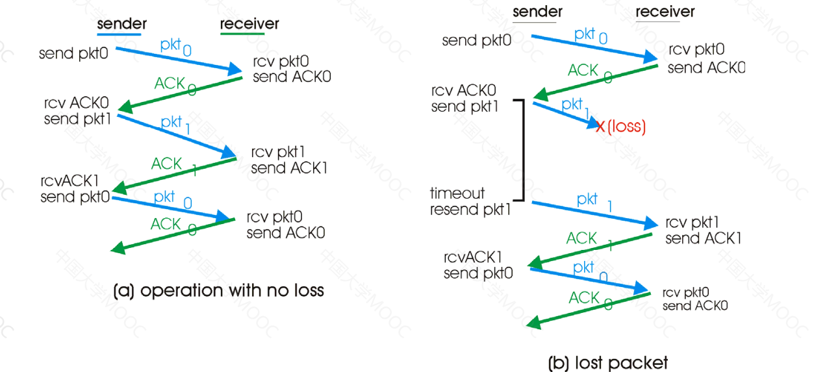

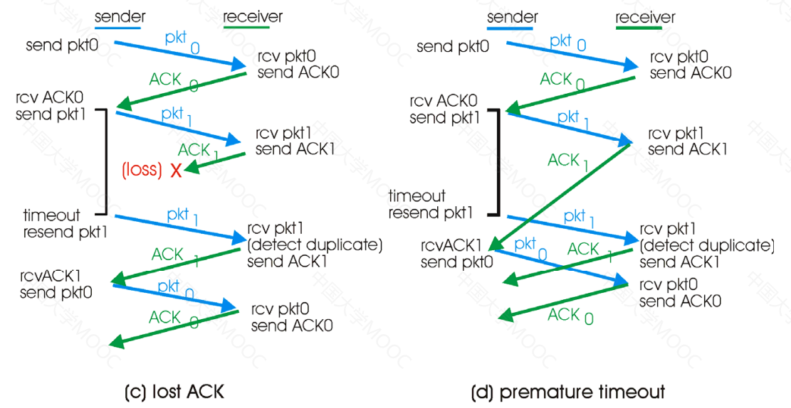

效率很低。

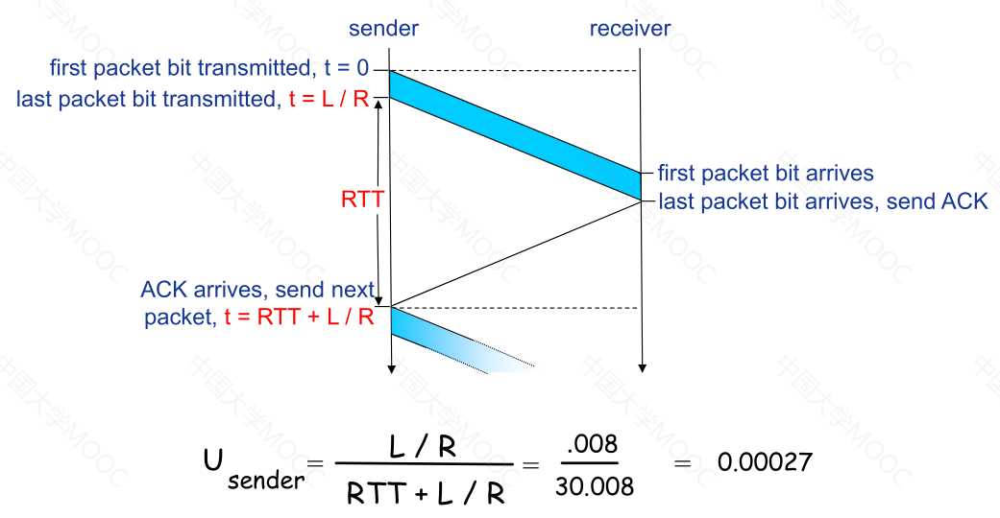

# 滑动窗口协议

Go Back N

为了允许发送方在接收到ACK之前发送多个分组：

- 设置更大的存储空间来缓存分组
- 设置更大的序列号范围

滑动窗口协议：Sliding Window Protocol

窗口：允许使用的序列号范围。窗口尺寸为N，最多有N个未确认的消息。

滑动窗口协议：GBN（回退N帧），SR（选择性重传）。

## GBN

分组首部包含k-bit序列号。

ACK(n)：使用累积确认机制，表示直到序号n的分组均已被正确接收。

Timeout(n)事件：重传序列号大于等于n的所有分组。

发送方：

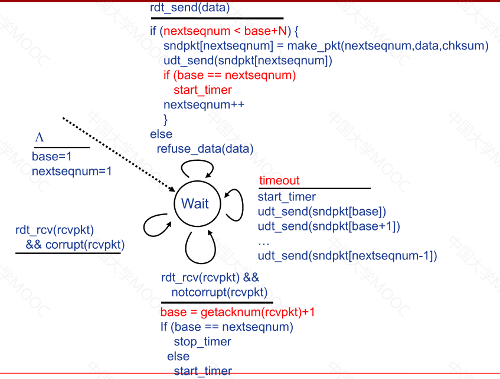

接收方：

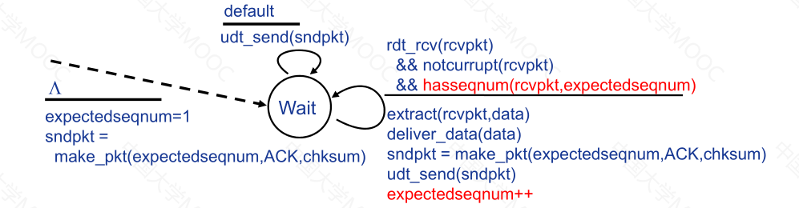

只需要记住唯一的`expectednum`。

对于乱序到达的分组，直接丢弃掉（接收方没有缓存），然后重新确认按序到达的序列号最大的分组。

demo：

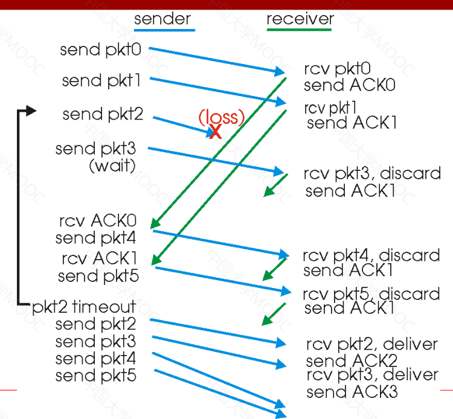

对于n位的序列号，要求发送窗口的大小<=2^n^-1。

例如，对于3bit的序列号，发送窗口大小为8时：

发送窗口：0 1 2 3 4 5 6 7

情况一：所有确认帧都到达了发送端，随后发送方继续发送0 1 2 3 4 5 6 7。

情况二：所有确认帧都丢失了，超时后发送方重发0 1 2 3 4 5 6 7，此时接收方无法判断这是旧的8个数据包还是新的数据包。

## SR

Selective Repeat

SR：接收方对每个分组进行单独确认；发送方只重传没有收到ACK的分组，为每个分组设置Timeout；

发送方/接收方窗口：

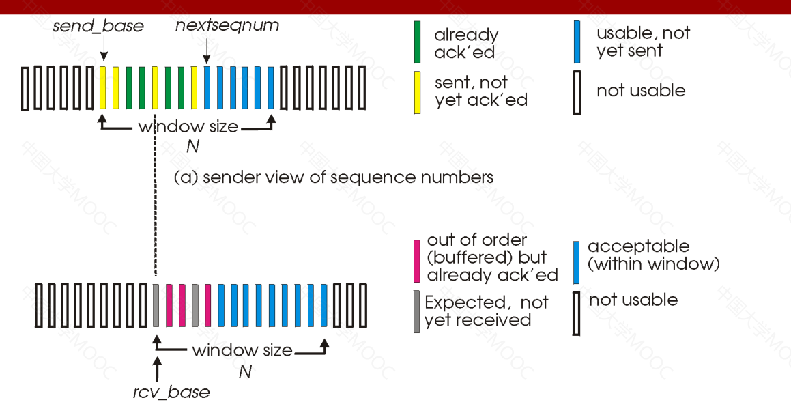

SR协议：

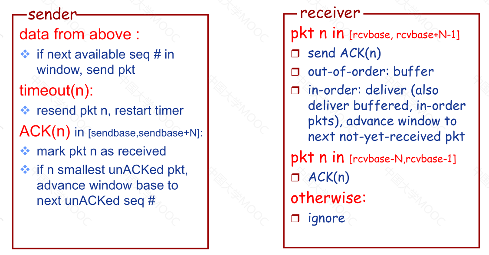

`sender`：`ACK(n)`，只有n是最小的`unACKed`序列号，才增大窗口。

demo：

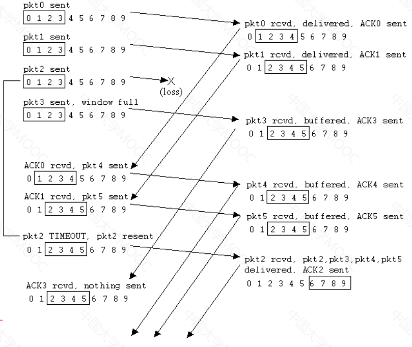

SR协议的问题：

窗口大小太小时，将无法区分第一轮序列号与第二轮序列号。

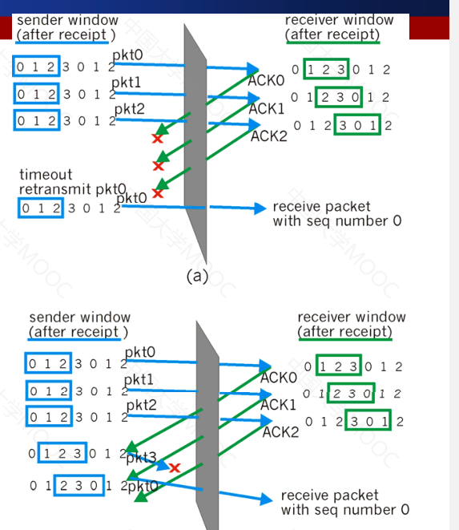

一般发送窗口的大小等于接收窗口的大小。

解决：

对于选择重传协议，序列号为m比特时，窗口大小<=2^(m-1)^，首先，发送窗口不能比接收窗口大，不然接收窗口可能会溢出。


其次，要最大化发送窗口的流水线分组，但是要保证不能产生二义性。假设序号最大为7即0,1,2,3,4,5,6,7，发送窗口大小为5，当发送窗口发送0,1,2,3,4后，假设接收窗口全部收到，则接收窗口向前移动到5次，接受窗口期望接收5,6,7,0,1.若发送窗口并没接收到任何ACK，所以发送窗口重发0，1，2，3，4此时接收窗口会以为重发的0,1是新的分组。

因为发送窗口<=接收窗口。要最大化发送窗口，则发送窗口=接收窗口。假设发送窗口为m，则接收窗口也为m。发送窗口发送m个分组时，接收窗口向前移动m，接收窗口为m+1，m+2，...2m。要避免二义性，必须满足2m<=序号总个数。


# TCP

TCP 是**面向连接的、可靠的、基于字节流**的传输层通信协议。


- **面向连接**：一定是「一对一」才能连接，不能像 UDP 协议可以一个主机同时向多个主机发送消息，也就是一对多是无法做到的；
- **可靠的**：无论的网络链路中出现了怎样的链路变化，TCP 都可以保证一个报文一定能够到达接收端；
- **字节流**：用户消息通过 TCP 协议传输时，消息可能会被操作系统「分组」成多个的 TCP 报文，如果接收方的程序如果不知道「消息的边界」，是无法读出一个有效的用户消息的。并且 TCP 报文是「有序的」，当「前一个」TCP 报文没有收到的时候，即使它先收到了后面的 TCP 报文，那么也不能扔给应用层去处理，同时对「重复」的 TCP 报文会自动丢弃。

TCP 连接的状态完全保留在两个端系统中，中间的网络元素看到的只有数据报。TCP 连接的组成包括：一台主机上的缓存、变量和与进程连接的套接字，以及另一台主机上的另一组缓存、变量和与进程连接的套接字。

基于TCP的应用层协议：

- HTTP
- FTP
- SMTP：简单邮件传输协议
- TELNET：远程登陆
- SSH：`Secure Shell`

## TCP段结构

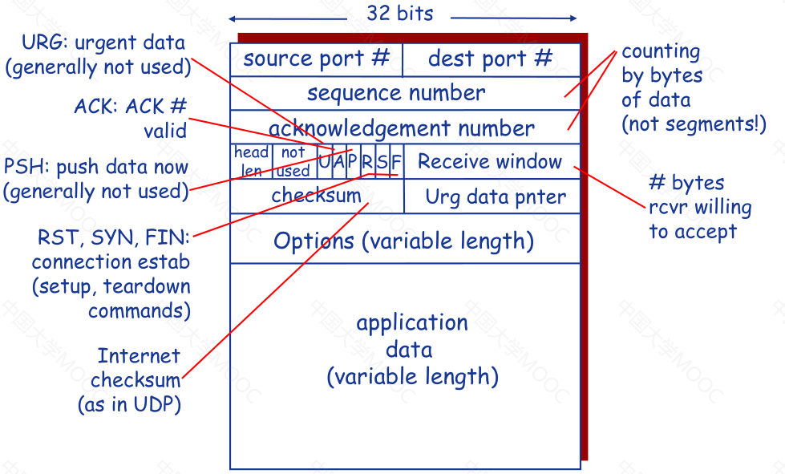

序列号和ACK的编号不是端的编码，而是利用数据的字节数来计数。

Receive window用于流量控制，指愿意接受的字节数。

`headlen`：指 TCP 头部的字节数，占 4 bit，因此 TCP 头部最大为 60 字节，由于 Options 字段的存在，TCP 头部长度是可变的，但是一般为 20 字节。

OPTIONS：用于发送方和接收方协商 MSS 时，或在高速网络下用作窗口调节因子时使用。

序列号：ISN即`Initial Sequence Number（初始序列号）`,在三次握手的过程当中，双方会用过`SYN`报文来交换彼此的 `ISN`。

> ISN 并不是一个固定的值，而是每 4 ms 加一，溢出则回到 0，这个算法使得猜测 ISN 变得很困难。那为什么要这么做？
>
> 如果 ISN 被攻击者预测到，要知道源 IP 和源端口号都是很容易伪造的，当攻击者猜测 ISN 之后，直接伪造一个 RST 后，就可以强制连接关闭的，这是非常危险的。
>
> 而动态增长的 ISN 大大提高了猜测 ISN 的难度。
>
> 序列号指的是segment中第一个字节的编号，而不是segment的编号；

ACK number：

- 希望接收到的下一个字节的序列号；
- 累积确认：该序列号之前的所有字节均已被正确收到。

RST：该位为 `1` 时，表示 TCP 连接中出现异常必须强制断开连接。

demo：

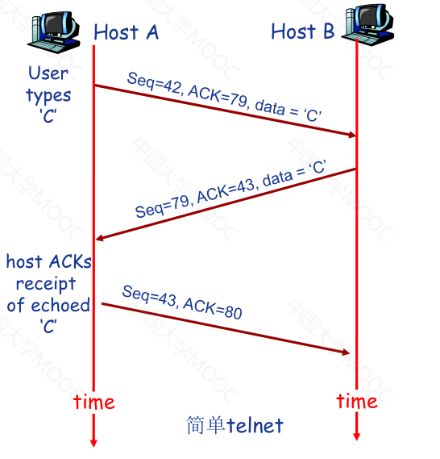

A -> B：发送含有一个字节的段，序列号为42，ACK=79，表示希望收到的下一个字节的编号为79。

B -> A：发送含有一个字节的段，序列号为79，ACK=43，表示序列号43之前的段都被收到了，且希望收到的下一个字节的编号为43。

A -> B：序列号为43，ACK为80（79及之前的字节已被正确收到）。+

## 校验和机制

同UDP。

## TCP分片

**MTU 最大传输单元（Maximum Transmission Unit，MTU）**用来通知对方所能接受数据单元的最大尺寸，说明发送方能够接受的有效载荷大小，以太网的帧大小范围为 64-1518 字节，数据部分限制为 46-1500 字节。

当 IP 数据包的大小大于网络路径的最小 MTU，则 IP 层需要对包进行分片。

**TCP MSS（Maximum Segment Size，最大报文长度）**，是TCP协议定义的一个选项，MSS选项用于在TCP连接建立时，收发双方协商通信时每一个报文段所能承载的最大数据长度。

数据会被以 `MSS` 的长度为单位进行拆分，拆分出来的每一块数据都会被放进单独的网络包中。也就是在每个被拆分的数据加上 TCP 头信息，然后交给 IP 模块来发送数据。

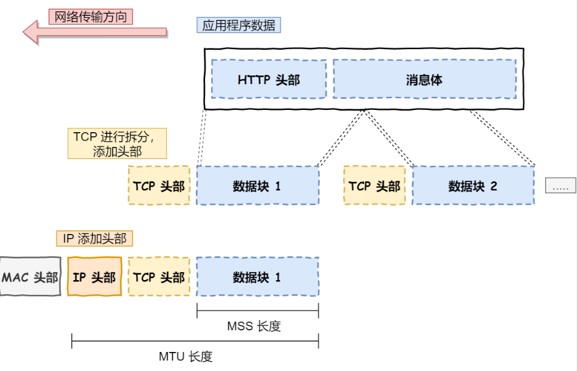

IP分片的缺点：一个分片丢失会导致**整个 IP 报文的所有分片都得重传**，由于IP层没有超时重传机制，TCP层将负责超时和重传。

TCP通过两种机制避免分片：

**1. 协商MSS，在交互之前避免分片的产生**

TCP在三次握手建立连接过程中，会在 SYN 报文中使用 MSS（Maximum Segment Size）选项功能，协商交互双方能够接收的最大段长 MSS 值。

MSS 是传输层 TCP 协议范畴内的概念，其标识 TCP 能够承载的最大的应用数据段长度，因此，`MSS = MTU-20字节TCP报头 - 20字节IP报头`，那么在以太网环境下，MSS值一般就是 1500 - 20 - 20=1460 字节。

客户端与服务器端分别根据自己发包接口的 MTU 值计算出相应MSS值，并通过SYN报文告知对方，我们还是通过一个实际环境中捕获的数据报文来看一下MSS协商的过程：

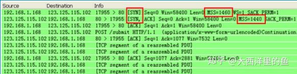

这是整个报文交互过程的截图，我们再来看一下客户端的报文详细解码

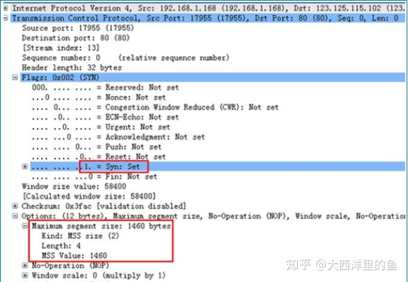

上图为客户端的SYN报文，在其TCP选项字段，我们可以看到其通告的MSS值为1460；我们在看看服务器端的SYN/ACK报文解码：

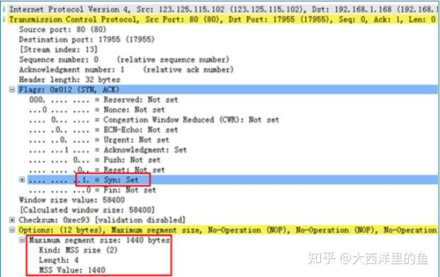

上图为服务器端给客户端回应的 SYN/ACK 报文，查看其 TCP 选项字段，我们可以发现其通告的 MSS 值为1440。

交互双方会以双方通告的 MSS 值中取最小值作为发送报文的最大段长。在此 TCP 连接后续的交互过程中，我们可以清楚的看到服务器端向客户端发送的报文中，TCP 的最大段长度都是 1440字 节，如下图解码所示：

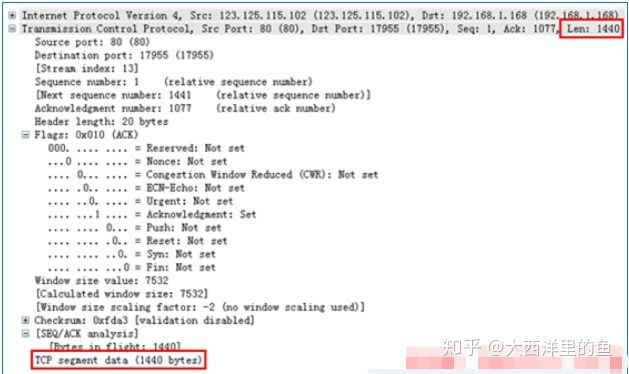

通过在 TCP 连接之初，协商 MSS 值巧妙的解决了避免端系统分片的问题，但是在复杂的实际网络环境下，影响到IP 报文分片的并不仅仅是发送方和接收方，还有路由器、防火墙等中间系统，假设在下图的网络环境下：

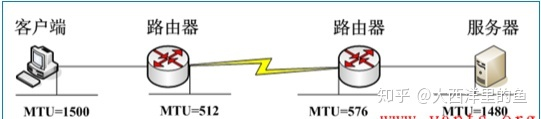

中间路径上的MTU问题，端系统并不知道，因此需要一个告知的机制，这个机制就是路径MTU发现。

**2. 路径MTU发现（PMTUD）**

路径MTU发现的原理：IP设置为禁止分片，不断调整包的大小，直到ICMP不返回差错信息。

将DF bit 置为一，(DF bit为1的话则不允许分片）将不允许中间设备对该报文进行分片，那么在遇到IP报文长度超过中间设备转发接口的MTU值时，该IP报文将会被中间设备丢弃。在丢弃之后，中间设备会向发送方发送ICMP差错报文：


实际环境下捕获的ICMP需要分片但DF位置一的差错报文，下图为其解码格式


我们可以看到其差错类型为 3，代码为 4，并且告知了下一跳的 MTU 值为 1478。在 ICMP 差错报文里封装导致此差错的原始 IP 报文的报头（包含 IP 报头和四层报头）。

逐渐增大包的大小，直到收到ICMP错误信息，以此确定路径MTU。


## TCP连接管理

一个TCP连接的组成：


### TCP连接数

服务端最大并发 TCP 连接数远不能达到理论上限，会受以下因素影响：

- 文件描述符限制

  ，每个 TCP 连接都是一个文件，如果文件描述符被占满了，会发生 too many open files。Linux 对可打开的文件描述符的数量分别作了三个方面的限制：

  - **系统级**：当前系统可打开的最大数量，通过 cat /proc/sys/fs/file-max 查看；
  - **用户级**：指定用户可打开的最大数量，通过 cat /etc/security/limits.conf 查看；
  - **进程级**：单个进程可打开的最大数量，通过 cat /proc/sys/fs/nr_open 查看；

- **内存限制**，每个 TCP 连接都要占用一定内存，操作系统的内存是有限的，如果内存资源被占满后，会发生 OOM。


### 建立连接

生成初始序列号有很多方法，初始序列号会随时间的改变而改变。

三次握手：

Step1：客户端发送一个 SYN 报文段，指定客户端的初始序列号#，不包含数据，进入 SYN_SENT 状态。

Step2：服务器接收 SYN 后，回复一个 SYN/ACK 报文段。同时，为客户端分配 TCP 缓存和变量，并指定服务器的初始序列号#，进入 SYN_REVD 状态。

Step3：客户端收到 SYN/ACK 报文后，为该 TCP 连接分配缓存和变量，回复 ACK 报文段（可以包含数据），进入 `ESTABLISHED`状态，服务器收到 ACK 后同样进入`ESTABLISHED`状态。

所谓的「连接」，只是双方计算机里维护一个状态机，在连接建立的过程中，双方的状态变化时序图就像这样。

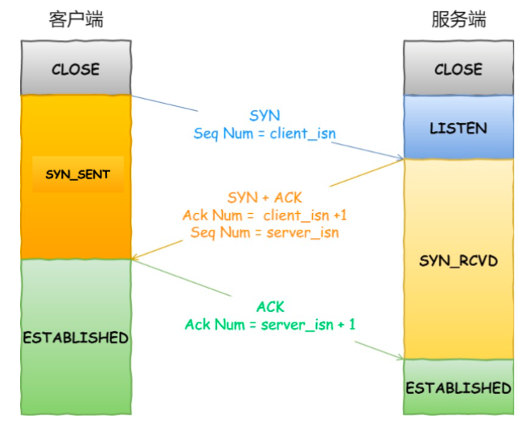

TCP 的连接状态查看，在 Linux 可以通过 `netstat -napt` 命令查看。

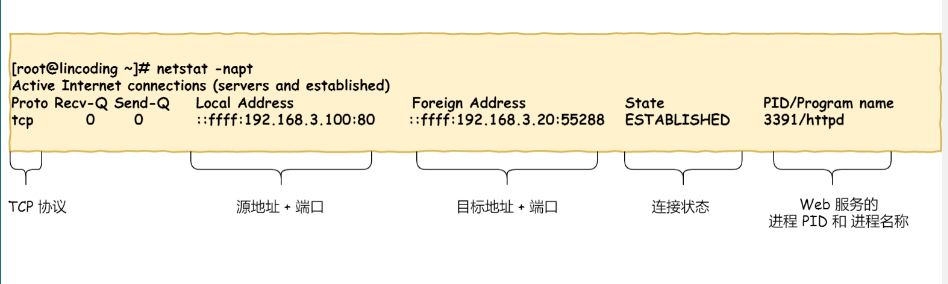


三次握手的原因：

- **避免历史连接（主要）**：为了防止两次握手情况下，已失效的连接请求报文段突然又传送到服务器端而导致错误。例如，客户端A向服务器B发出建立连接请求，但该请求在网络中某个节点长时间滞留，超时后A发出另一个请求，B收到后建立连接，数据传输结束后断开连接。而此时，第一个连接请求到达了服务端B，如果使用三次握手，B向A回复ACK，A收到后不做处理，建立连接失败；如果使用两次握手，B会认为连接已经建立，为A分配资源并等待数据，但A并不会发送数据，导致服务器资源的浪费。
- 同步双方初始序列号：两次握手只能保证一方的序列号被对方接收。

**如果是两次握手连接，就无法阻止历史连接**：**在两次握手的情况下，「被动发起方」没有中间状态给「主动发起方」来阻止历史连接，导致「被动发起方」可能建立一个历史连接，造成资源浪费**。

两次握手的情况下，「被动发起方」在收到 SYN 报文后，就进入 ESTABLISHED 状态，意味着这时可以给对方发送数据给，但是「主动发」起方此时还没有进入 ESTABLISHED 状态，假设这次是历史连接，主动发起方判断到此次连接为历史连接，那么就会回 RST 报文来断开连接，而「被动发起方」在第一次握手的时候就进入 ESTABLISHED 状态，所以它可以发送数据的，但是它并不知道这个是历史连接，它只有在收到 RST 报文后，才会断开连接。


可以看到，上面这种场景下，「被动发起方」在向「主动发起方」发送数据前，并没有阻止掉历史连接，导致「被动发起方」建立了一个历史连接，又白白发送了数据，妥妥地浪费了「被动发起方」的资源。

因此，**要解决这种现象，最好就是在「被动发起方」发送数据前，也就是建立连接之前，要阻止掉历史连接，这样就不会造成资源浪费，而要实现这个功能，就需要三次握手**。

#### 第一次握手丢失会发生什么

当客户端想和服务端建立 TCP 连接的时候，首先第一个发的就是 SYN 报文，然后进入到 `SYN_SENT` 状态。

在这之后，如果客户端迟迟收不到服务端的 SYN-ACK 报文（第二次握手），就会触发「超时重传」机制，重传 SYN 报文。

不同版本的操作系统可能超时时间不同，有的 1 秒的，也有 3 秒的，写死在内核里。

当客户端在 1 秒后没收到服务端的 SYN-ACK 报文后，客户端就会重发 SYN 报文，那到底重发几次呢？

在 Linux 里，客户端的 SYN 报文最大重传次数由 `tcp_syn_retries`内核参数控制，这个参数是可以自定义的，默认值一般是 5。

通常，第一次超时重传是在 1 秒后，第二次超时重传是在 2 秒，第三次超时重传是在 4 秒后，第四次超时重传是在 8 秒后，第五次是在超时重传 16 秒后。没错，**每次超时的时间是上一次的 2 倍**。

当第五次超时重传后，会继续等待 32 秒，如果服务端仍然没有回应 ACK，客户端就不再发送 SYN 包，然后断开 TCP 连接。

所以，总耗时是 1+2+4+8+16+32=63 秒，大约 1 分钟左右。

#### 第二次握手丢失会发生什么

当服务端收到客户端的第一次握手后，就会回 SYN-ACK 报文给客户端，这个就是第二次握手，此时服务端会进入 `SYN_RCVD` 状态。

第二次握手的 `SYN-ACK` 报文其实有两个目的 ：

- 第二次握手里的 ACK， 是对第一次握手的确认报文；
- 第二次握手里的 SYN，是服务端发起建立 TCP 连接的报文；

所以，如果第二次握手丢了，就会发送比较有意思的事情，具体会怎么样呢？

因为第二次握手报文里是包含对客户端的第一次握手的 ACK 确认报文，所以，如果客户端迟迟没有收到第二次握手，那么客户端就觉得可能自己的 SYN 报文（第一次握手）丢失了，于是**客户端就会触发超时重传机制，重传 SYN 报文**。

然后，因为第二次握手中包含服务端的 SYN 报文，所以当客户端收到后，需要给服务端发送 ACK 确认报文（第三次握手），服务端才会认为该 SYN 报文被客户端收到了。

那么，如果第二次握手丢失了，服务端就收不到第三次握手，于是**服务端这边会触发超时重传机制，重传 SYN-ACK 报文**。

在 Linux 下，SYN-ACK 报文的最大重传次数由 `tcp_synack_retries`内核参数决定，默认值是 5。

因此，当第二次握手丢失了，客户端和服务端都会重传：

- 客户端会重传 SYN 报文，也就是第一次握手，最大重传次数由 `tcp_syn_retries`内核参数决定；
- 服务端会重传 SYN-ACK 报文，也就是第二次握手，最大重传次数由 `tcp_synack_retries` 内核参数决定。

### SYN 泛洪攻击

在 TCP 建立连接的过程中，当服务器收到一个 SYN 后，会为客户端初始化连接变量和缓存，然后发送一个 SYNACK 作为响应，并等待客户端的 ACK 报文端，如果客户端不发送 ACK 完成三次握手的第三步，一般服务器会在一分半终止该半开连接并回收资源。

SYN Flood 属于典型的`DoS/DDoS`攻击。其攻击的原理很简单，就是用客户端在短时间内伪造大量不存在的 IP 地址，并向服务端疯狂发送`SYN`。对于服务端而言，会产生两个危险的后果:

1. 处理大量的`SYN`包并返回对应`ACK`, 势必有大量连接处于`SYN_RCVD`状态，从而占满整个**半连接队列**，无法处理正常的请求。
2. 由于是不存在的 IP，服务端长时间收不到客户端的`ACK`，会导致服务端不断重发数据，直到耗尽服务端的资源。

应对 SYN 泛洪攻击的方式：

1. 修改Linux内核参数，超出处理能力时，对新来的连接直接回复RST丢弃连接。
2. 增加 SYN 连接，也就是增加半连接队列的容量。
3. 减少 SYN + ACK 重试次数，避免大量的超时重发。
4. SYN cookie

**SYN cookie技术**：


- 当 「 SYN 队列」满之后，后续服务器收到 SYN 包，不进入「 SYN 队列」；
- 计算出一个 `cookie` 值，再以 SYN + ACK 中的「序列号」返回客户端，
- 服务端接收到客户端的应答报文时，服务器会检查这个 ACK 包的合法性。如果合法，直接放入到「 Accept 队列」。
- 最后应用通过调用 `accpet()` socket 接口，从「 Accept 队列」取出连接。

cookie：该序列号是一个报文段的源和目的IP、端口以及服务器中的一个secret number组成的复杂函数，服务器发送具有这种特殊序列号的 SYNACK 分组。**但服务器并不记忆该 cookie 或任何对应于 SYN 的状态信息。**

验证ACK合法性：从客户端的ACK中取出`服务器初始序列号 = ack序列号 - 1`，通过源和目的IP、端口以及secret number，求出散列值，判断`ACK序列号+1`是否等于散列值，如果相等，则说明这是一个合法用户（完成了三次握手），服务器生成一个具有套接字的全开连接。


### 断开连接

谁主动断开连接，谁先发第一个挥手包。假设客户端主动断开连接，则：

1. 第一次挥手，客户端发送FIN和ACK标志位的 TCP 报文给服务端，进入 FIN-WAIT-1 状态，无法再向服务器发送数据。
2. 第二次挥手，服务端接收后向客户端确认，变成了 CLOSED-WAIT 状态。客户端接收到了服务端的确认，变成了 FIN-WAIT2 状态。
1. 第三次握手，服务端向客户端发送 FIN，自己进入 LAST-ACK 状态，
2. 第四次握手，客户端收到服务端发来的FIN后，自己变成了 TIME-WAIT 状态，然后发送 ACK 给服务端。

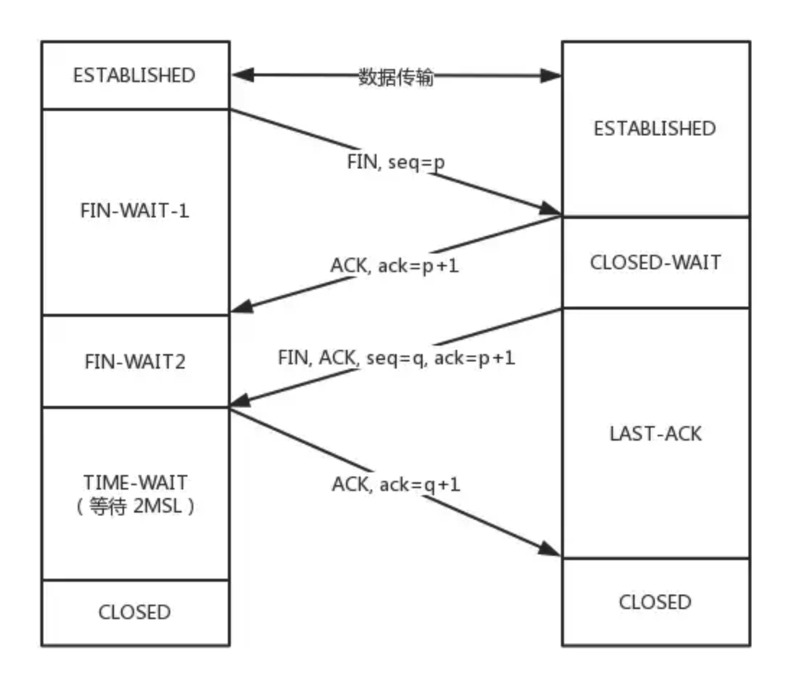

#### 为什么是四次挥手而不是三次

因为服务端在接收到`FIN`, 往往不会立即返回`FIN`, 必须等到服务端所有的报文都发送完毕了，才能发`FIN`。因此先发一个`ACK`表示已经收到客户端的`FIN`，延迟一段时间才发`FIN`。这就造成了四次挥手。

如果是三次挥手会有什么问题？

等于说服务端将`ACK`和`FIN`的发送合并为一次挥手，这个时候长时间的延迟可能会导致客户端误以为`FIN`没有到达客户端，从而让客户端不断的重发`FIN`。

#### 第二次挥手丢失会发生什么

ACK 报文是不会重传的，所以如果服务端的第二次挥手丢失了，客户端就会触发超时重传机制，重传 FIN 报文，直到收到服务端的ACK，或者达到最大的重传次数。

当客户端收到第二次挥手，也就是收到服务端发送的 ACK 报文后，客户端就会处于 `FIN_WAIT2` 状态，在这个状态需要等服务端发送第三次挥手，也就是服务端的 FIN 报文。

对于 close 函数关闭的连接，由于无法再发送和接收数据，所以`FIN_WAIT2` 状态不可以持续太久，而 `tcp_fin_timeout` 控制了这个状态下连接的持续时长，默认值是 60 秒。

这意味着对于调用 close 关闭的连接，如果在 60 秒后还没有收到 FIN 报文，客户端（主动关闭方）的连接就会直接关闭。

但是注意，如果主动关闭方使用 shutdown 函数关闭连接且指定只关闭发送方向，而接收方向并没有关闭，那么意味着主动关闭方还是可以接收数据的。如果主动关闭方一直没收到第三次挥手，那么主动关闭方的连接将会一直处于 `FIN_WAIT2` 状态（`tcp_fin_timeout` 无法控制 shutdown 关闭的连接）。

#### 第四次挥手丢失会发生什么

当主动关闭方向被动关闭方发送的ACK丢失后，由于有2MSL的Time_Wait状态，被动关闭方将重发FIN，然后主动关闭方再次回复ACK。


#### TIME_WAIT 状态

`MSL：Maximum Segment Lifetime`，**报文最大生存时间**，它是任何报文在网络上存在的最长时间，超过这个时间报文将被丢弃。因为 TCP 报文基于是 IP 协议的，而 IP 头中有一个 `TTL` 字段，是 IP 数据报可以经过的最大路由数，每经过一个处理他的路由器此值就减 1，当此值为 0 则数据报将被丢弃，同时发送 ICMP 报文通知源主机。

MSL 与 TTL 的区别： MSL 的单位是时间，而 TTL 是经过路由跳数。所以 **MSL 应该要大于等于 TTL 消耗为 0 的时间**，以确保报文已被自然消亡。

**TTL 的值一般是 64，Linux 将 MSL 设置为 30 秒，意味着 Linux 认为数据报文经过 64 个路由器的时间不会超过 30 秒，如果超过了，就认为报文已经消失在网络中了**。

TIME_WAIT 等待 2 倍的 MSL，比较合理的解释是： 网络中可能存在来自发送方的数据包，当这些发送方的数据包被接收方处理后又会向对方发送响应，所以**一来一回需要等待 2 倍的时间**。

比如，如果被动关闭方没有收到断开连接的最后的 ACK 报文，就会触发超时重发 `FIN` 报文，另一方接收到 FIN 后，会重发 ACK 给被动关闭方， 一来一去正好 2 个 MSL。

可以看到 **2MSL时长** 这其实是相当于**至少允许报文丢失一次**。比如，若 ACK 在一个 MSL 内丢失，这样被动方重发的 FIN 会在第 2 个 MSL 内到达，TIME_WAIT 状态的连接可以应对。


作用：

- 允许老的重复报文分组在网络中消逝
- 保证TCP全双工连接的正确关闭

> 第一个理由是假如我们在`192.168.1.1:5000`和`39.106.170.184:6000`建立一个TCP连接，一段时间后我们关闭这个连接，再基于相同插口建立一个新的TCP连接，这个新的连接称为前一个连接的化身。老的报文很有可能由于某些原因迟到了，那么新的TCP连接很有可能会将这个迟到的报文认为是新的连接的报文，而导致数据错乱。**为了防止这种情况的发生TCP连接必须让TIME_WAIT状态持续`2MSL`，在此期间将不能基于这个socket建立新的连接**，让它有足够的时间使迟到的报文段被丢弃。
>
> 第二个理由是因为如果主动关闭方最终的`ACK`丢失，那么服务器将会重新发送那个`FIN`,以允许主动关闭方重新发送那个`ACK`。要是主动关闭方不维护`2MSL`状态，那么主动关闭将会不得不响应一个`RST`报文段，而服务器将会把它解释为一个错误，导致TCP连接没有办法完成全双工的关闭，而进入半关闭状态。

**question：**

（1） time_wait 是「服务器端」的状态还是「客户端」的状态?

time_wait 是「主动关闭 TCP 连接」一方的状态，可能是「客户端」的，也可能是「服务器端」的

一般情况下，都是「客户端」所处的状态;「服务器端」一般设置「不主动关闭连接」

（2） 服务器在对外服务时，是「客户端」发起的断开连接还是「服务器」发起的断开连接?

- 正常情况下，都是「客户端」发起的断开连接
- 「服务器」一般设置为「不主动关闭连接」，服务器通常执行「被动关闭」
- 但 HTTP 请求中，http 头部 connection 参数，可能设置为 close，则，服务端处理完请求会主动关闭 TCP 连接


Time_Wait过多有哪些危害？

- 内存资源占用

- 对端口资源的占用，一个 TCP 连接至少消耗「发起连接方」的一个本地端口
  - 客户端：TIME_WAIT过多，就会导致端口资源被占用，因为端口就 65536 个，被占满就会导致无法创建新的连接。
  - 服务端：由于一个四元组表示 TCP 连接，理论上服务端可以建立很多连接，因为服务端只监听一个端口，不会因为 TCP 连接过多而导致端口资源受限。但是 TCP 连接过多，会占用系统资源，比如文件描述符、内存资源、CPU 资源、线程资源等。

**Time_Wait状态连接的回收**

**net.ipv4.tcp_tw_reuse**

如下的 Linux 内核参数开启后，则可以**复用处于 TIME_WAIT 的 socket 为新的连接所用**。

有一点需要注意的是，**tcp_tw_reuse 功能只能用于连接发起方，开启了该功能，在调用 connect() 函数时，内核会随机找一个 time_wait 状态超过 1 秒的连接给新的连接复用。**

```shell
net.ipv4.tcp_tw_reuse = 1
```

使用这个选项，还有一个前提，需要打开对 TCP 时间戳的支持，即

```text
net.ipv4.tcp_timestamps=1（默认即为 1）
```

这个时间戳的字段是在 TCP 头部的「选项」里，它由一共 8 个字节表示时间戳，其中第一个 4 字节字段用来保存发送该数据包的时间，第二个 4 字节字段用来保存最近一次接收对方发送到达数据的时间。

由于引入了时间戳，历史连接中的数据包就会因为时间戳过期被自然丢弃（RST报文无视时间戳）。

### 半连接队列和全连接队列


握手阶段：


断开连接：


### 端口扫描工具

> 在TCP协议中，RST 段标识复位，用来异常的关闭连接。在 TCP 的设计中它是不可或缺的，发送 RST 段关闭连接时，不必等缓冲区的数据都发送出去，直接丢弃缓冲区中的数据。而接收端收到 RST 段后，也不必发送 ACK 来确认。

`nmap`端口扫描工具扫描端口 x 时，发送 SYN 报文，可能收到的回复包括：

- SYNACK 报文：标识一个应用程序在目的主机的 x 端口运行；
- RST 报文：目的主机在该端口没有运行 TCP 应用程序；
- 什么都没有收到：SYN 报文端可能被防火墙拦截了。


## TCP 快速打开的原理(TFO)

#### 首轮三次握手

首先客户端发送`SYN`给服务端，服务端接收到。

注意哦！现在服务端不是立刻回复 SYN + ACK，而是通过计算得到一个`SYN Cookie`, 将这个`Cookie`放到 TCP 报文的 `Fast Open`选项中，然后才给客户端返回。

客户端拿到这个 Cookie 的值缓存下来。后面正常完成三次握手。

首轮三次握手就是这样的流程。而后面的三次握手就不一样啦！

#### 后面的三次握手

在后面的三次握手中，客户端会将之前缓存的 `Cookie`、`SYN` 和 HTTP 请求发送给服务端，服务端验证了 Cookie 的合法性，如果不合法直接丢弃；如果是合法的，那么就正常返回`SYN + ACK`。

重点来了，现在服务端能向客户端发 HTTP 响应了！这是最显著的改变，三次握手还没建立，仅仅验证了 Cookie 的合法性，就可以返回 HTTP 响应了。

流程如下:

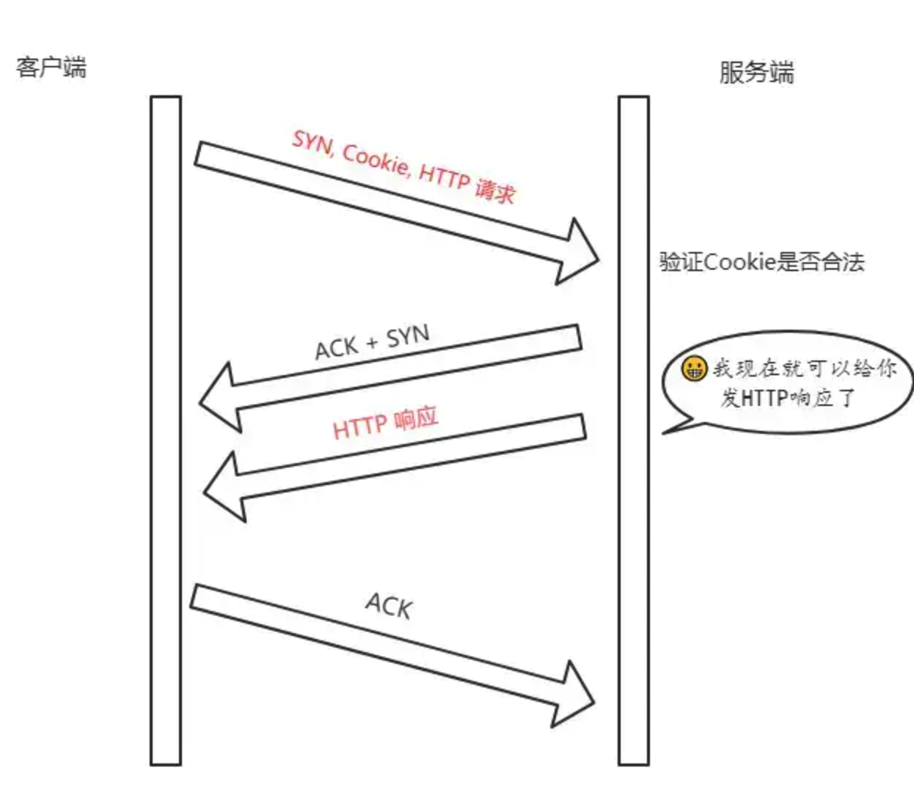

> 注意: 客户端最后握手的 ACK 不一定要等到服务端的 HTTP 响应到达才发送，两个过程没有任何关系。

#### TFO 的优势

TFO 的优势并不在与首轮三次握手，而在于后面的握手，在拿到客户端的 Cookie 并验证通过以后，可以直接返回 HTTP 响应，充分利用了**1 个RTT**(Round-Trip Time，往返时延)的时间**提前进行数据传输**，积累起来还是一个比较大的优势。

## 可靠数据传输

TCP使用了流水线机制以提高性能。

TCP使用累积确认机制，使用单一重传定时器。TCP 的数据传输机制是一种 SR 和 GBN 的结合。

触发重传的事件：

- 超时
- 收到重复ACK

RTT(Round Trip Time)的设置：

过短：不必要的重传。

过长：对段丢失反应慢。

`SampleRTT`：测试从段发出到收到ACK的时间，是一个随网络情况变化的值。

`EstimatedRTT`：测量多次`sampleRTT`形成的平均值。

`EstimatedRTT = (1 - α) * EstimatedRTT + α * SampleRTT`，α通常为0.125

定时器超时时间的设置：`EstimatedRTT + “安全边界”`

测量RTT的变化值：`SampleRTT`和`EstimatedRTT`的差值，作为定时器的安全边界。

TCP发送端伪代码：

```c
NextSeqNum = InitialSeqNum
SendBase = InitialSeqNum
loop(forever) {
    switch(event) {
    	event: data received from application above
            create TCP segment with sequence number NextSeqNum
            if(timer currently not running)
                start timer
            pass segment to IP
            NextSeqNum += length(data)
                
       event: timer timeout
           retransmit not-yet-acknowledged segment with smallest sequence number
           start timer
           
       event: ACK received, with ACK field value of y
           if(y > SendBase) {
               SendBase = y
               if(there are currently not-yet-acknowledged segments) {
                   start timer
               }
           }
    }
}
```

demo：

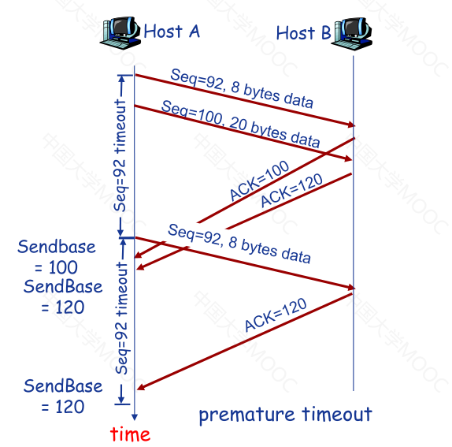

RFC56681 对接收端ACK生成的建议：

| 事件                                                         | 接收方行为                                    |
| ------------------------------------------------------------ | --------------------------------------------- |
| 一个序列号为x的段按序到达，且x之前的段均已被ACK              | 延迟ACK。等待500ms，若没有下一个段，则发送ACK |
| 一个序列号为y的段按序到达，且之前的一个段有正在延迟发送的ACK | 立即发送一个累积确认的ACK                     |
| 一个乱序的段到达，期待的序列号为x，到达的段序列号大于x，产生一个gap | 立即发送一个重复ACK，确认最后一个正确收到的段 |
| 一个可以完全或局部填充gap的段到达                            | 立即发送ACK进行确认                           |

**乱序报文段的处理**：TCP并没有规定如何处理乱序到达的报文段，一般有两种方式：

1. 丢弃报文段
2. 缓存乱序到达的字节（实践中采用的方式）

**超时间隔加倍**：在收到上层应用的数据和收到 ACK 这两种事件后，超时间隔会重置为`估计RTT + 安全边界 `，但同一个包每次超时重发，其超时间隔都会加倍。

### 快速重传机制

TCP的实现中，发生一次超时之后，超时时间间隔会增大。

通过重复ACK，可以检测出分组丢失。

当某个分组丢失后，接收方会多次回复相同的ACK，当sender收到对同一数据的3个ACK，则假定该数据之后的段已经丢失，在计时器没有超时的前提下直接重传。

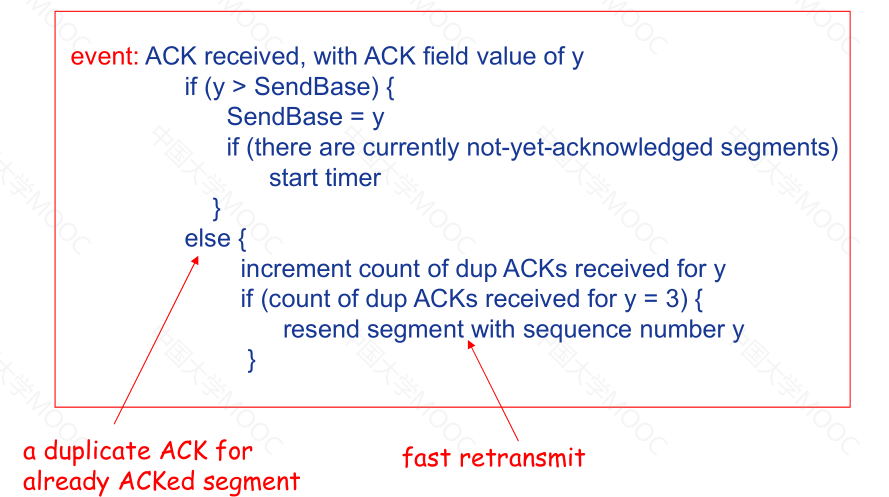

发生快重传后，有些TCP实现重传丢失报文后的所有报文，有些TCP实现只重传未正确接收的报文。

TCP可以通过SACK方法实现快重传时，只传递丢失的数据。（通过在ACK头部的选项字段里加SCAK，将缓存的地图发送给发送方，需要通信双方都支持快重传）


## TCP流量控制

TCP 连接每一侧的主机都为连接设置了接收缓存。当接收方处理数据速度较慢，而发送方发送数据太快时，很容易导致接收缓存溢出。

流量控制机制的目的：解决发送方发送数据过快或发送数据过多，以至于淹没接收方（buffer溢出）的问题。

发送方维护发送窗口（receive window）变量来提供流量控制：

- Buffer中的可用空间：`RcvWindow = RcvBuffer - [LastByteRcvd - LastByteRead]`

- Receiver通过在Segment的头部字段将`RcvWindow`的尺寸设置为Buffer中的可用空间大小

- Sender限制自己已经发送的但还未收到ACK的数据不超过接收方的`RcvWindow`大小。

当`RcvWindow`的大小为0时，发送方会启动一个特殊的计时器，每隔一段时间发送一个1字节的探测报文段，以便动态获取接收方新的`RcvWindow`的大小。


## 拥塞控制

太多发送主机发送了太多数据或发送速度太快，以至于网络无法处理。

拥塞的表现：

- 分组丢失（路由器缓存溢出）
- 分组延迟过大（路由器缓存中排队）

### 拥塞的成因与代价

一、路由器缓存无限大时

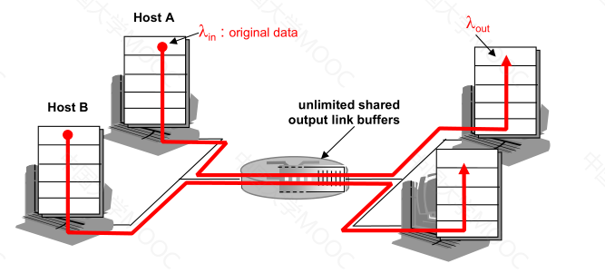

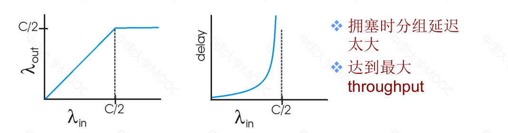

发送速率低时，分组在路由器的排队时延小，总时延小，发送速率高时，分组在路由器中的排队时延大，导致总时延增大。

二、路由器buffer有限时

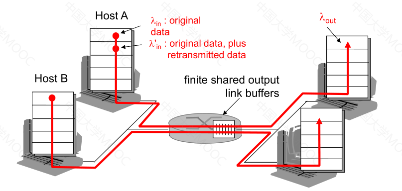

当路由器缓存达到上限后，发送方的超时重传机制导致发送方发送了过多重复的包，进一步加剧拥塞。

三、多跳网络

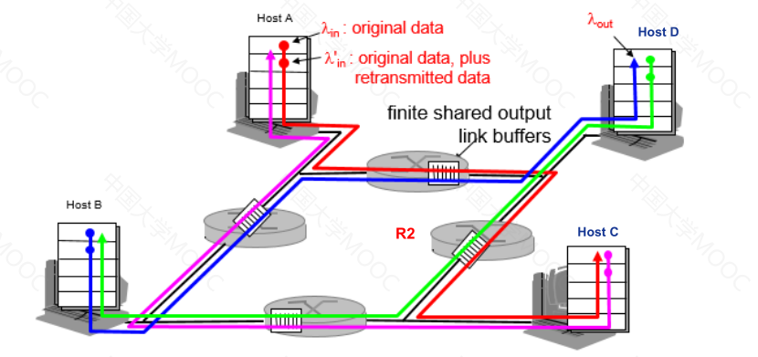

拥塞导致丢包后，中间路由器缓存的包全部失效，导致网络传输效率变低。

拥塞控制的方法：

- 端到端拥塞控制：端系统观察loss，delay等网络行为判断是否发生拥塞，TCP采用了这种方法。
- 网络辅助的拥塞控制：路由器向发送方显式地反馈网络拥塞信息。

### **TCP的拥塞控制**

设置拥塞窗口大小`CongestionWindow`，令：`LastByteSend - LastByteAcked <= CongWin`

通过感知网络情况（发生超时或3个重复ACK），动态调整拥塞窗口的大小来改变发送速率。

调整发送速率的方式：加性增-乘性减：AIMD；慢启动：SS。

拥塞控制算法（假设接收方缓存够大，不需要考虑流量控制）：

```
Th = ?
CongWin = 1MSS
//slow start
while(no packet loss and CongWin < Thr) {
	send CongWin TCP segments
	for each ACK
		CongWin++
}
//congestion avoidance or linear increase
while(no packet loss) {
	send CongWin TCP segments
	for CongWin ACKs
		CongWin++
}
Th = CongWin / 2
if(3 Duplicate ACKs)
	CongWin = Th
if(timeout)
	CongWin = 1
```


#### AIMD

Additive Increase：每个RTT将`CongWin`增大一个`MSS`（最大报文段长度，拥塞避免）

Multiplicative Decrease：发生loss后将`CongWin`大小减半

原理：逐渐增加发送速率，谨慎探测可用带宽，直到发生loss。

#### TCP慢启动

TCP连接刚建立时，`CongWin` = 1MSS，通常远小于可用带宽。

```
initialize: Congwin = 1
for(each segment ACKed)
	Congwin++;
until(loss OR CongWin >= threshold) //随后进入线性增长阶段
```


1-2-4-8-16-…

Loss事件的处理：

3个重复ACK：将`CongWin`切到一半，然后线性增长；

Timeout事件（意味着更严重的拥塞，ACK都收不到）：`CongWin`直接设为1个MSS，然后慢启动，达到Threshold再线性增长。

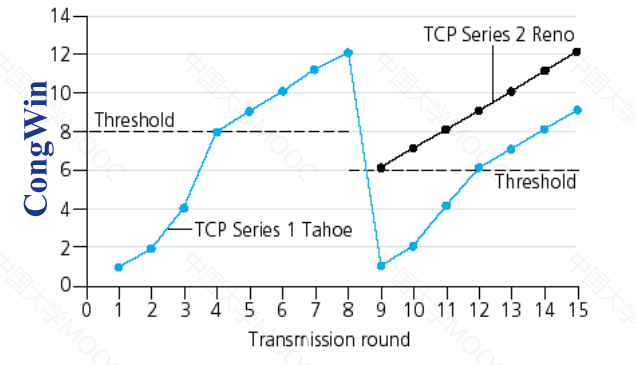

蓝色为Timeout事件，黑色为重复ACK事件。

Loss事件发生后，threshold要被设为Loss事件发生前`CongWin`尺寸的一半。

# TCP 和 UDP

*1. 连接*

- TCP 是面向连接的传输层协议，传输数据前先要建立连接。
- UDP 是不需要连接，即刻传输数据。

*2. 服务对象*

- TCP 是一对一的两点服务，即一条连接只有两个端点。
- UDP 支持一对一、一对多、多对多的交互通信

*3. 可靠性*

- TCP 是可靠交付数据的，数据可以无差错、不丢失、不重复、按需到达。
- UDP 是尽最大努力交付，不保证可靠交付数据。

*4. 拥塞控制、流量控制*

- TCP 有拥塞控制和流量控制机制，保证数据传输的安全性。
- UDP 则没有，即使网络非常拥堵了，也不会影响 UDP 的发送速率。

*5. 首部开销*

- TCP 首部长度较长，会有一定的开销，首部在没有使用「选项」字段时是 `20` 个字节，如果使用了「选项」字段则会变长的。
- UDP 首部只有 8 个字节，并且是固定不变的，开销较小。

*6. 传输方式*

- TCP 是流式传输，没有边界，但保证顺序和可靠。
- UDP 是一个包一个包的发送，是有边界的，但可能会丢包和乱序。

*7. 分片不同*

- TCP 的数据大小如果大于 MSS 大小，则会在传输层进行分片，目标主机收到后，也同样在传输层组装 TCP 数据包，如果中途丢失了一个分片，只需要传输丢失的这个分片。
- UDP 的数据大小如果大于 MTU 大小，则会在 IP 层进行分片，目标主机收到后，在 IP 层组装完数据，接着再传给传输层。


# keepalive

TCP的keepalive和HTTP的Keep-Alive

## TCP的keepalive

TCP的保活机制。

如果两端的 TCP 连接一直没有数据交互，达到了触发 TCP 保活机制的条件，那么内核里的 TCP 协议栈就会发送探测报文。

- 如果对端程序是正常工作的。当 TCP 保活的探测报文发送给对端, 对端会正常响应，这样 **TCP 保活时间会被重置**，等待下一个 TCP 保活时间的到来。
- 如果对端主机崩溃，或对端由于其他原因导致报文不可达。当 TCP 保活的探测报文发送给对端后，没有响应，连续几次，达到保活探测次数后，**TCP 会报告该 TCP 连接已经死亡**。

所以，TCP 保活机制可以在双方没有数据交互的情况，通过探测报文，来确定对方的 TCP 连接是否存活，这个工作是在内核完成的。

应用程序若想使用 TCP 保活机制需要通过 socket 接口设置 `SO_KEEPALIVE` 选项才能够生效，如果没有设置，那么就无法使用 TCP 保活机制。


## HTTP的Keep-Alive

短连接：


长连接：


使用`Connection:Keep-Alive`后，将使用长连接的连接模式

HTTP1.1后默认使用长连接。

# TCP协议的问题

- 建立连接延迟
- 队头阻塞问题
- wifi换流量需要重新建立TCP连接

