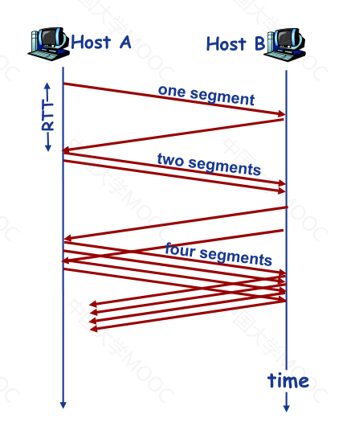

# 概述

传输层为运行在不同Host上的进程提供了一种逻辑通信机制。

发送方：将应用递交的消息分成一个或多个Segment，并向下传输给网络层。

接收方：将接收到的Segment重组为消息，上交给应用层。

# 多路复用和多路分用


多路分用：根据TCP/UDP的传输层报文段中的源端口和目的端口信息等，将Segment导向不同的Socket。

主机收到UDP段后，检查目的端口号，导向对应的Socket（主机不同，端口号相同的UDP数据报会被同一个Socket接收）。

TCP的Socket用源/目的IP、源/目的端口号这样的四元组来标识，服务器会为每一个客户端建立一个Socket。

# UDP

User Datagram Protocol，它基于 IP 协议进行了复用/分用，并添加了简单的错误校验。

UDP 提供尽力而为的服务，UDP的Segment可能会丢失或非按序到达，需要应用层保证可靠数据传输。

UDP 服务器端：


UDP 客户端：


优点：

- 实现简单，无需维护连接状态
- 头部开销少
- 无需建立连接，延迟低
- 没有拥塞控制：应用可以更好的控制发送时间和速率

应用：

- 流媒体应用（电话，视频会议等）
- 速率敏感
- DNS：域名服务
- SNMP：简单网络管理协议
- TFTP：简单文件传输协议
- NTP：`Network Time Protocol`

UDP段的格式：


length：首部和数据的全部字节数（由于数据字段长度不定，需要一个明确的大小指定数据段长度）

UDP校验和：首部和数据全部参与运算，用于检测UDP段在传输时是否发生错误（不一定能准确检测）。

由于 IP 包只对头部做校验和，无法对数据部分进行纠错，因此 UDP 为自己实现校验和。

发送方为 UDP 数据报计算校验和，并将其保存在校验和字段中；接收方收到报文后，重新计算校验和并与报文中的校验和字段进行对比；以此确定报文在传输的过程中是否发生差错。

与 IP 校验和不同，UDP 整个报文都会参与校验和计算。除此之外，UDP 还会在报文前面拼接一个 IP 伪头部，同时参与校验和计算。IP 伪头部只用于计算校验和，不会真的发送。IP 伪头部会包含 IP 层的核心信息，包括：

- 源地址
- 目的地址
- 协议类型
- 报文长度（和UDP头部的length数值相同）

IP 已经有了首部校验和了，UDP 校验和计算为什么还要考虑这些关键字段呢？

答案很简单：**再上一道保险**。

因为校验和长度是有限的，所以存在多个不同的 IP 包头，对应到同一个校验和的情况。换言之，校验和机制可能会漏判： IP 包头已经发生差错，但计算出来的校验和仍然匹配。

这样的话，系统可能会错收 UDP 包：假设 UDP 报文在传输过程中 IP 头部发生差错，目的地址变了，但 IP 头部校验和刚好揪不出。这时，“目的主机”就会错收这个 UDP 报文。

将 IP 包关键字段纳入 UDP 校验和计算后，就算 IP 层没能揪出 IP 包头部差错，UDP 层也很有可能会发现。当然了， UDP 校验和也可能会漏判，这时就只能由应用层来纠错了。

## 校验和算法

  首先，IP、ICMP、UDP和TCP报文头都有检验和字段，大小都是16bit，算法基本上也是一样的。

  在发送数据时，为了计算数据包的检验和。应该按如下步骤：

  1、把校验和字段设置为 0；

  2、把需要校验的数据看成以 16 位为单位的数字组成，依次进行二进制反码求和（最高位有进位时，将进位与临时结果再次相加）；

  3、把得到的结果存入校验和字段中

  在接收数据时，计算数据包的检验和相对简单，按如下步骤：

  1、把首部看成以 16 位为单位的数字组成，依次进行二进制反码求和，包括校验和字段；

  2、检查计算出的校验和的结果是否为 0；

  3、如果等于 0，说明被整除，校验和正确。否则，校验和就是错误的，协议栈要抛弃这个数据包。

 虽然说上面四种报文的校验和算法一样，但是在作用范围存在不同：IP 校验和只校验 20 字节的 IP 报头；而 ICMP 校验和覆盖整个报文( ICMP 报头+ ICMP 数据)；UDP 和 TCP 校验和不仅覆盖整个报文，而且还有 12 个字节的 IP 伪首部，包括源 IP 地址(4 字节)、目的 IP 地址( 4 字节)、协议( 2 字节)、TCP/UDP 包长( 2 字节)。另外UDP、TCP 数据报的长度可以为奇数字节，所以在计算校验和时需要在最后增加填充字节 0 (填充字节只是为了计算校验和，可以不被传送)。

在UDO传输协议中，校验和是可选的，当校验和字段为0时，表明该UDP报文未使用校验和，接收方就不需要校验和检查了！那如果 UDP 校验和的计算结果是 0 时怎么办？书上有一句话：“如果校验和的计算结果为 0，则存入的值为全1(65535)，这在二进制反码计算中是等效的。”

**什么是二进制反码求和**

对一个无符号的数，先求其反码，然后从低位到高位，按位相加，有进位则向高位进1(和一般的二进制法则一样),若最高位有进位，则向最低位进1。

下面是两种二进制反码求和的运算：

原码加法运算：3(0011)+5(0101)=8(1000)

​         8(1000)+9(1001)=1(0001)

反码加法运算：3(1100)+5(1010)=8(0111)

​         8(0111)+9(0110)=2(1101)

从上面的例子中，当加法未发生溢出时，原码与反码加法运算结果一样；当有溢出时，结果就不一样了，原码是满10000溢出，而反码是满1111溢出，所以相差正好是1.

另外，关于二进制反码求和运算需要说明的一点是，先取反后相加与先相加后取反，得到的结果是一样的。

**优势：**

- 不依赖系统是大端存储还是小端存储
- 计算简单，快捷

# 可靠数据传输

reliable data transfer(RDT)


RDT基于停等协议。

## RDT1.0

底层信道完全可靠。


## RDT2.0

RDT2.x假设信道只会发生位错误。

引入差错检测机制：利用校验和检测位翻转错误。

确认机制：

- ACK：接收方显式地告知发送方分组已正确接收。
- NAK：接收方显式地告知发送方分组有错误。

重传机制：发生错误时，重传分组。

停等协议：发送数据后，等收到ACK或者NAK后再进行下一次发送。


## RDT2.1

RDT2.0的问题：ACK/NAK消息可能会发生错误。解决方式：当收到被破坏的ACK/NAK时，重传分组（为了避免产生重复分组，需要为分组添加序列号）。

RDT2.1同样基于停等机制：

发送方


接收方


## RDT2.2

取消了NAK，收到重复ACK后重传当前分组。

- 接收方通过ACK告知最后一个被正确接收的分组
- 在ACK消息中显式地加入被确认分组的序列号

## RDT3.0

RDT3.0假设信道既会发生位错误又会发生分组丢失。

加入了定时器。


效率很低。


# 滑动窗口协议

Go Back N

为了允许发送方在接收到ACK之前发送多个分组：

- 设置更大的存储空间来缓存分组
- 设置更大的序列号范围

滑动窗口协议：Sliding Window Protocol

窗口：允许使用的序列号范围。窗口尺寸为N，最多有N个未确认的消息。

滑动窗口协议：GBN（回退N帧），SR（选择性重传）。

## GBN

分组首部包含k-bit序列号。

ACK(n)：使用累积确认机制，表示直到序号n的分组均已被正确接收。

Timeout(n)事件：重传序列号大于等于n的所有分组。

发送方：


接收方：


只需要记住唯一的`expectednum`。

对于乱序到达的分组，直接丢弃掉（接收方没有缓存），然后重新确认按序到达的序列号最大的分组。

demo：


对于n位的序列号，要求发送窗口的大小<=2^n^-1。

例如，对于3bit的序列号，发送窗口大小为8时：

发送窗口：0 1 2 3 4 5 6 7

情况一：所有确认帧都到达了发送端，随后发送方继续发送0 1 2 3 4 5 6 7

情况二：所有确认帧都丢失了，超时后发送方重发0 1 2 3 4 5 6 7，此时接收方无法判断这是旧的8个数据包还是新的数据包。

## SR

Selective Repeat

SR：接收方对每个分组进行单独确认；发送方只重传没有收到ACK的分组，为每个分组设置Timeout；

发送方/接收方窗口：


SR协议：


`sender`：`ACK(n)`，只有n是最小的`unACKed`序列号，才增大窗口。

demo：


SR协议的问题：

窗口大小太小时，将无法区分第一轮序列号与第二轮序列号。


一般发送窗口的大小等于接收窗口的大小。

解决：

对于选择重传协议，序列号为m比特时，窗口大小<=2^(m-1)^，首先，发送窗口不能比接收窗口大，不然接收窗口可能会溢出。


其次，要最大化发送窗口的流水线分组，但是要保证不能产生二义性。假设序号最大为7即0,1,2,3,4,5,6,7，发送窗口大小为5，当发送窗口发送0,1,2,3,4后，假设接收窗口全部收到，则接收窗口向前移动到5次，接受窗口期望接收5,6,7,0,1.若发送窗口并没接收到任何ACK，所以发送窗口重发0，1，2，3，4此时接收窗口会以为重发的0,1是新的分组。

因为发送窗口<=接收窗口。要最大化发送窗口，则发送窗口=接收窗口。假设发送窗口为m，则接收窗口也为m。发送窗口发送m个分组时，接收窗口向前移动m，接收窗口为m+1，m+2，...2m。要避免二义性，必须满足2m<=序号总个数。
# TCP

TCP是面向连接的、全双工的点对点通信协议，保证可靠的、按序的字节流。

TCP 连接的状态完全保留在两个端系统中，中间的网络元素看到的只有数据报。TCP 连接的组成包括：一台主机上的缓存、变量和与进程连接的套接字，以及另一台主机上的另一组缓存、变量和与进程连接的套接字。

基于TCP的应用层协议：

- HTTP
- FTP
- SMTP：简单邮件传输协议
- TELNET：远程登陆
- SSH：`Secure Shell`

## MSS

**MTU 最大传输单元（Maximum Transmission Unit，MTU）**用来通知对方所能接受数据单元的最大尺寸，说明发送方能够接受的有效载荷大小，以太网的帧大小范围为 64-1518 字节，数据部分限制为 46-1500 字节。

当 IP 数据包的大小大于网络路径的最小 MTU，则 IP 层需要对包进行分片。

TCP MSS（Maximum Segment Size，最大报文长度），是TCP协议定义的一个选项，MSS选项用于在TCP连接建立时，收发双方协商通信时每一个报文段所能承载的最大数据长度。

一旦DF bit 置为一，(DF bit为1的话则不允许分片）将不允许中间设备对该报文进行分片，那么在遇到IP报文长度超过中间设备转发接口的MTU值时，该IP报文将会被中间设备丢弃。在丢弃之后，中间设备会向发送方发送ICMP差错报文：


实际环境下捕获的ICMP需要分片但DF位置一的差错报文，下图为其解码格式


我们可以看到其差错类型为 3，代码为 4，并且告知了下一跳的 MTU 值为 1478。在 ICMP 差错报文里封装导致此差错的原始 IP 报文的报头（包含 IP 报头和四层报头）。

一旦出现这种因 DF bit 置一而引起丢包，如果客户端无法正常处理的话，将会导致业务应用出现异常，外在表现为页面无法打开、页面打开不全、某些大文件无法传输等等，这将严重影响业务的正常运行。
TCP主要通过两种方式来应对：

**1. 协商MSS，在交互之前避免分片的产生**

**2. 路径MTU发现（PMTUD）**

TCP在三次握手建立连接过程中，会在 SYN 报文中使用 MSS（Maximum Segment Size）选项功能，协商交互双方能够接收的最大段长 MSS 值。

MSS 是传输层 TCP 协议范畴内的概念，其标识 TCP 能够承载的最大的应用数据段长度，因此，`MSS = MTU-20字节TCP报头 - 20字节IP报头`，那么在以太网环境下，MSS值一般就是 1500 - 20 - 20=1460 字节。

客户端与服务器端分别根据自己发包接口的 MTU 值计算出相应MSS值，并通过SYN报文告知对方，我们还是通过一个实际环境中捕获的数据报文来看一下MSS协商的过程：


这是整个报文交互过程的截图，我们再来看一下客户端的报文详细解码


上图为客户端的SYN报文，在其TCP选项字段，我们可以看到其通告的MSS值为1460；我们在看看服务器端的SYN/ACK报文解码：


上图为服务器端给客户端回应的 SYN/ACK 报文，查看其 TCP 选项字段，我们可以发现其通告的 MSS 值为1440。

交互双方会以双方通告的 MSS 值中取最小值作为发送报文的最大段长。在此 TCP 连接后续的交互过程中，我们可以清楚的看到服务器端向客户端发送的报文中，TCP 的最大段长度都是 1440字 节，如下图解码所示：


通过在 TCP 连接之初，协商 MSS 值巧妙的解决了避免端系统分片的问题，但是在复杂的实际网络环境下，影响到IP 报文分片的并不仅仅是发送方和接收方，还有路由器、防火墙等中间系统，假设在下图的网络环境下：


中间路径上的MTU问题，端系统并不知道，因此需要一个告知的机制，这个机制就是路径MTU发现。


## TCP段结构


序列号和ACK的编号不是端的编码，而是利用数据的字节数来计数。

Receive window用于流量控制，指愿意接受的字节数。

`headlen`：指 TCP 头部的字节数，占 4 bit，因此 TCP 头部最大为 60 字节，由于 Options 字段的存在，TCP 头部长度是可变的，但是一般为 20 字节。

OPTIONS：用于发送方和接收方协商 MSS 时，或在高速网络下用作窗口调节因子时使用。

序列号：

- 序列号指的是segment中第一个字节的编号，而不是segment的编号；
- 建立TCP连接时，双方随机选择序列号。

ACK number：

- 希望接收到的下一个字节的序列号；
- 累积确认：该序列号之前的所有字节均已被正确收到。

demo：


A -> B：发送含有一个字节的段，序列号为42，ACK=79，表示希望收到的下一个字节的编号为79。

B -> A：发送含有一个字节的段，序列号为79，ACK=43，表示序列号43之前的段都被收到了，且希望收到的下一个字节的编号为43。

A -> B：序列号为43，ACK为80（79及之前的字节已被正确收到）。

## 可靠数据传输

TCP使用了流水线机制以提高性能。

TCP使用累积确认机制，使用单一重传定时器。TCP 的数据传输机制是一种 SR 和 GBN 的结合。

触发重传的事件：

- 超时
- 收到重复ACK

RTT(Round Trip Time)的设置：

过短：不必要的重传。

过长：对段丢失反应慢。

`SampleRTT`：测试从段发出到收到ACK的时间，是一个随网络情况变化的值。

`EstimatedRTT`：测量多次`sampleRTT`形成的平均值。

`EstimatedRTT = (1 - α) * EstimatedRTT + α * SampleRTT`，α通常为0.125

定时器超时时间的设置：`EstimatedRTT + “安全边界”`

测量RTT的变化值：`SampleRTT`和`EstimatedRTT`的差值，作为定时器的安全边界。

TCP发送端伪代码：

```c
NextSeqNum = InitialSeqNum
SendBase = InitialSeqNum
loop(forever) {
    switch(event) {
    	event: data received from application above
            create TCP segment with sequence number NextSeqNum
            if(timer currently not running)
                start timer
            pass segment to IP
            NextSeqNum += length(data)
                
       event: timer timeout
           retransmit not-yet-acknowledged segment with smallest sequence number
           start timer
           
       event: ACK received, with ACK field value of y
           if(y > SendBase) {
               SendBase = y
               if(there are currently not-yet-acknowledged segments) {
                   start timer
               }
           }
    }
}
```

demo：


RFC56681 对接收端ACK生成的建议：

| 事件                                                         | 接收方行为                                    |
| ------------------------------------------------------------ | --------------------------------------------- |
| 一个序列号为x的段按序到达，且x之前的段均已被ACK              | 延迟ACK。等待500ms，若没有下一个段，则发送ACK |
| 一个序列号为y的段按序到达，且之前的一个段有正在延迟发送的ACK | 立即发送一个累积确认的ACK                     |
| 一个乱序的段到达，期待的序列号为x，到达的段序列号大于x，产生一个gap | 立即发送一个重复ACK，确认最后一个正确收到的段 |
| 一个可以完全或局部填充gap的段到达                            | 立即发送ACK进行确认                           |

**乱序报文段的处理**：TCP并没有规定如何处理乱序到达的报文段，一般有两种方式：

1. 丢弃报文段
2. 缓存乱序到达的字节（实践中采用的方式）

**超时间隔加倍**：在收到上层应用的数据和收到 ACK 这两种事件后，超时间隔会重置为`估计RTT + 安全边界 `，但同一个包每次超时重发，其超时间隔都会加倍。

## 快速重传机制

TCP的实现中，发生一次超时之后，超时时间间隔会增大。

通过重复ACK，可以检测出分组丢失。

当某个分组丢失后，接收方会多次回复相同的ACK，当sender收到对同一数据的3个ACK，则假定该数据之后的段已经丢失，在计时器没有超时的前提下直接重传。


## TCP流量控制

TCP 连接每一侧的主机都为连接设置了接收缓存。当接收方处理数据速度较慢，而发送方发送数据太快时，很容易导致接收缓存溢出。

流量控制机制的目的：解决发送方发送数据过快或发送数据过多，以至于淹没接收方（buffer溢出）的问题。

发送方维护发送窗口（receive window）变量来提供流量控制：

- Buffer中的可用空间：`RcvWindow = RcvBuffer - [LastByteRcvd - LastByteRead]`

- Receiver通过在Segment的头部字段将`RcvWindow`的尺寸设置为Buffer中的可用空间大小

- Sender限制自己已经发送的但还未收到ACK的数据不超过接收方的`RcvWindow`大小。

当`RcvWindow`的大小为0时，发送方会启动一个特殊的计时器，每隔一段时间发送一个1字节的探测报文段，以便动态获取接收方新的`RcvWindow`的大小。

## TCP连接管理

### 建立连接

生成初始序列号有很多方法，初始序列号会随时间的改变而改变。

三次握手：

Step1：客户端发送一个SYN报文段，指定客户端的初始序列号#，不包含数据。

Step2：服务器接收SYN后，回复一个SYN/ACK报文段。同时，为客户端分配TCP缓存和变量，并指定服务器的初始序列号#。

Step3：客户端收到SYN/ACK报文后，为该TCP连接分配缓存和变量，回复ACK报文段（可以包含数据）。

三次握手的原因：

- 同步双方初始序列号：两次握手只能保证一方的序列号被对方接收。

- 为了防止两次握手情况下，已失效的连接请求报文段突然又传送到服务器端而导致错误。例如，客户端A向服务器B发出建立连接请求，但该请求在网络中某个节点长时间滞留，超时后A发出另一个请求，B收到后建立连接，数据传输结束后断开连接。而此时，第一个连接请求到达了服务端B，如果使用三次握手，B向A回复ACK，A收到后不做处理，建立连接失败；如果使用两次握手，B会认为连接已经建立，为A分配资源并等待数据，但A并不会发送数据，导致服务器资源的浪费。

TCP对旧的SYN报文段的处理：

接收方无法辨别SYN是不是旧的，返回一个SYN/ACK，发送方发现ACK中的序列号不是期望的序列号时，发送RST报文段重置连接。

### 拆除连接


### SYN 泛洪攻击

在 TCP 建立连接的过程中，当服务器收到一个 SYN 后，会为客户端初始化连接变量和缓存，然后发送一个 SYNACK 作为响应，并等待客户端的 ACK 报文端，如果客户端不发送 ACK 完成三次握手的第三步，一般服务器会在一分半终止该半开连接并回收资源。

SYN 泛洪攻击：攻击者发送大量的 TCP SYN 报文段，而不完成第三次握手的步骤，耗尽服务器的资源。

一种防御方式：SYN cookie

- 当服务器收到一个 SYN 报文段时，不知道这是一个合法的用户还是泛洪攻击的一部分，先不为该请求生成半开的连接，而是生成一个初始 TCP 序列号，该序列号是一个报文段的源和目的IP、端口以及服务器中的一个secret number组成的复杂函数，称为 cookie，服务器发送具有这种特殊序列号的 SYNACK 分组。**但服务器并不记忆该 cookie 或任何对应于 SYN 的状态信息。**
- 服务器收到客户端返回的 ACK 后，从中取出`服务器初始序列号 = ack序列号 - 1`，通过源和目的IP、端口以及secret number，求出散列值，判断`ACK序列号+1`是否等于散列值，如果相等，则说明这是一个合法用户（完成了三次握手），服务器生成一个具有套接字的全开连接。

### 端口扫描工具

> 在TCP协议中，RST 段标识复位，用来异常的关闭连接。在 TCP 的设计中它是不可或缺的，发送 RST 段关闭连接时，不必等缓冲区的数据都发送出去，直接丢弃缓冲区中的数据。而接收端收到 RST 段后，也不必发送 ACK 来确认。

`nmap`端口扫描工具扫描端口 x 时，发送 SYN 报文，可能收到的回复包括：

- SYNACK 报文：标识一个应用程序在目的主机的 x 端口运行；
- RST 报文：目的主机在该端口没有运行 TCP 应用程序；
- 什么都没有收到：SYN 报文端可能被防火墙拦截了。


## 拥塞控制

太多发送主机发送了太多数据或发送速度太快，以至于网络无法处理。

拥塞的表现：

- 分组丢失（路由器缓存溢出）
- 分组延迟过大（路由器缓存中排队）

### 拥塞的成因与代价

一、路由器缓存无限大时


发送速率低时，分组在路由器的排队时延小，总时延小，发送速率高时，分组在路由器中的排队时延大，导致总时延增大。

二、路由器buffer有限时


当路由器缓存达到上限后，发送方的超时重传机制导致发送方发送了过多重复的包，进一步加剧拥塞。

三、多跳网络


拥塞导致丢包后，中间路由器缓存的包全部失效，导致网络传输效率变低。

拥塞控制的方法：

- 端到端拥塞控制：端系统观察loss，delay等网络行为判断是否发生拥塞，TCP采用了这种方法。
- 网络辅助的拥塞控制：路由器向发送方显式地反馈网络拥塞信息。

### **TCP的拥塞控制**

设置拥塞窗口大小`CongestionWindow`，令：`LastByteSend - LastByteAcked <= CongWin`

通过感知网络情况（发生超时或3个重复ACK），动态调整拥塞窗口的大小来改变发送速率。

调整发送速率的方式：加性增-乘性减：AIMD；慢启动：SS。

拥塞控制算法（假设接收方缓存够大，不需要考虑流量控制）：

```
Th = ?
CongWin = 1MSS
//slow start
while(no packet loss and CongWin < Thr) {
	send CongWin TCP segments
	for each ACK
		CongWin++
}
//congestion avoidance or linear increase
while(no packet loss) {
	send CongWin TCP segments
	for CongWin ACKs
		CongWin++
}
Th = CongWin / 2
if(3 Duplicate ACKs)
	CongWin = Th
if(timeout)
	CongWin = 1
```


#### AIMD

Additive Increase：每个RTT将`CongWin`增大一个`MSS`（最大报文段长度，拥塞避免）

Multiplicative Decrease：发生loss后将`CongWin`大小减半

原理：逐渐增加发送速率，谨慎探测可用带宽，直到发生loss。

#### TCP慢启动

TCP连接刚建立时，`CongWin` = 1MSS，通常远小于可用带宽。

```
initialize: Congwin = 1
for(each segment ACKed)
	Congwin++;
until(loss OR CongWin >= threshold) //随后进入线性增长阶段
```



1-2-4-8-16-…

Loss事件的处理：

3个重复ACK：将`CongWin`切到一半，然后线性增长；

Timeout事件（意味着更严重的拥塞，ACK都收不到）：`CongWin`直接设为1个MSS，然后慢启动，达到Threshold再线性增长。


蓝色为Timeout事件，黑色为重复ACK事件。

Loss事件发生后，threshold要被设为Loss事件发生前`CongWin`尺寸的一半。

# TCP 和 UDP

## TCP 无界，UDP 有界

TCP通过字节流传输，即TCP将应用程序看成是一连串的无结构的字节流。每个TCP套接口有一个发送缓冲区，如果字节流太长时，TCP会将其拆分进行发送。当字节流太短时，TCP会等待缓冲区中的字节流达到一定程度时再构成报文发送出去，TCP发给对方的数据，对方在收到数据时必须给矛确认，只有在收到对方的确认时，本方TCP才会把TCP发送缓冲区中的数据删除。

而UDP传输报文的方式是由应用程序控制的，应用层交给UDP多长的报文，UDP照样发送，既不拆分，也不合并，而是保留这些报文的边界，即一次发送一个报文。

有界与无界之分是根据接收报文来划分的，对于TCP协议，客户端连续发送数据，只要服务端的这个函数的缓冲区足够大，会一次性接收过来，即客户端是分好几次发过来，是有边界的，而服务端却一次性接收过来，所以证明是无边界的；而对于UDP协议，客户端连续发送数据，即使服务端的这个函数的缓冲区足够大，也只会一次一次的接收，发送多少次接收多少次，即客户端分几次发送过来，服务端就必须按几次接收，从而证明，这种UDP的通讯模式是有边界的。

## TCP有序，UDP无序

消息在传输过程中可能会乱序，后发送的消息可能会先到达，TCP会对其进行重排序，UDP不会。

# 问题

1. TCP 发生超时事件后超时时间间隔会加倍，为什么还需要引入拥塞控制机制？

答：超时时间间隔虽然加倍了，但是滑动窗口的存在，导致 TCP 还是会发送多个报文段（停等协议时，超时时间间隔加倍将对避免拥塞发挥作用）。

2. 序列号的作用？

答：确定到达的packet是发送方新的packet还是重传的packet。

