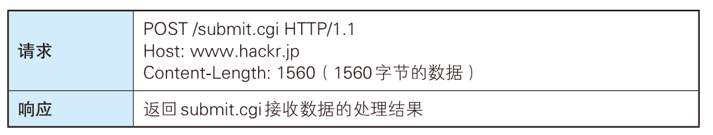

# HTTP报文中的HTTP信息

HTTP报文本身是由多行（用 CR+LF 作换行符）数据构成的字符串文本。

HTTP 报文大致可分为报文首部和报文主体两块。两者由最初出现的空行（CR+LF）来划分。通常，并不一定要有报文主体。


请求报文：


响应报文：


# 简单的HTTP协议

客户端发送一个请求报文给服务器，服务器根据请求报文中的信息进行处理，并将处理结果放入响应报文中返回给客户端。

请求报文结构：

- 第一行是包含了请求方法、URL、协议版本
- 接下来的多行都是请求首部 Header，每个首部都有一个首部名称，以及对应的值
- 一个空行用来分隔首部和内容主体 Body
- 最后是请求的内容主体

```http
GET http://www.example.com/ HTTP/1.1
Accept: text/html,application/xhtml+xml,application/xml;q=0.9,image/webp,image/apng,*/*;q=0.8,application/signed-exchange;v=b3;q=0.9
Accept-Encoding: gzip, deflate
Accept-Language: zh-CN,zh;q=0.9,en;q=0.8
Cache-Control: max-age=0
Host: www.example.com
If-Modified-Since: Thu, 17 Oct 2019 07:18:26 GMT
If-None-Match: "3147526947+gzip"
Proxy-Connection: keep-alive
Upgrade-Insecure-Requests: 1
User-Agent: Mozilla/5.0 xxx

param1=1&param2=2
```

响应报文结构：

- 第一行包含协议版本、状态码以及描述，最常见的是 200 OK 表示请求成功了
- 接下来多行也是首部内容
- 一个空行分隔首部和内容主体
- 最后是响应的内容主体

```http
HTTP/1.1 200 OK
Age: 529651
Cache-Control: max-age=604800
Connection: keep-alive
Content-Encoding: gzip
Content-Length: 648
Content-Type: text/html; charset=UTF-8
Date: Mon, 02 Nov 2020 17:53:39 GMT
Etag: "3147526947+ident+gzip"
Expires: Mon, 09 Nov 2020 17:53:39 GMT
Keep-Alive: timeout=4
Last-Modified: Thu, 17 Oct 2019 07:18:26 GMT
Proxy-Connection: keep-alive
Server: ECS (sjc/16DF)
Vary: Accept-Encoding
X-Cache: HIT

<!doctype html>
<html>
<head>
    <title>Example Domain</title>
	// 省略... 
</body>
</html>

```


# HTTP方法


## GET

GET 方法用来请求访问已被 URL 识别的资源。指定的资源经服务器端解析后返回响应内容。


## POST

POST 方法用来传输实体的主体。



## PUT

PUT 方法用来传输文件。就像 FTP 协议的文件上传一样，要求在请求报文的主体中包含文件内容，然后保存到请求 URI 指定的位置。

PUT 方法没有验证机制，一般只有配合 Web 应用程序的验证机制，或遵守 REST 标准时才会开放使用。


响应的意思是请求执行成功，无数据返回。

## HEAD

HEAD 方法和 GET 方法一样，只是不返回报文主体部分。用于确认URL 的有效性及资源更新的日期时间等。


## DELETE

DELETE 方法用来删除文件，是与 PUT 相反的方法。DELETE 方法按请求 URL 删除指定的资源。

DELETE 方法同样没有验证机制，一般只有配合 Web 应用程序的验证机制，或遵守 REST 标准时才会开放使用。


## OPTIONS

OPTIONS 方法用来查询针对请求 URL 指定的资源支持的方法。


# Cookie

HTTP 协议是无状态的，主要是为了让 HTTP 协议尽可能简单，使得它能够处理大量事务。HTTP/1.1 引入 Cookie 来保存状态信息。

Cookie 技术通过在请求和响应报文中写入 Cookie 信息来控制客户端的状态。

Cookie 会根据从服务器端发送的响应报文内的一个叫做 Set-Cookie的首部字段信息，通知客户端保存 Cookie。当下次客户端再往该服务器发送请求时，客户端会自动在请求报文中加入 Cookie 值后发送出去。

服务器端发现客户端发送过来的 Cookie 后，会去检查究竟是从哪一个客户端发来的连接请求，然后对比服务器上的记录，最后得到之前的状态信息。

场景示例：


## 分类

- 会话期 Cookie：浏览器关闭之后它会被自动删除，也就是说它仅在会话期内有效。
- 持久性 Cookie：指定过期时间（Expires）或有效期（max-age）之后就成为了持久性的 Cookie。

```html
Set-Cookie: id=a3fWa; Expires=Wed, 21 Oct 2015 07:28:00 GMT;
```

#### 

# HTTP状态码

状态码的职责是当客户端向服务器端发送请求时，描述返回的请求结果。借助状态码，用户可以知道服务器端是正常处理了请求，还是出
现了错误。

| 状态码 |               类别               |            含义            |
| :----: | :------------------------------: | :------------------------: |
|  1XX   |  Informational（信息性状态码）   |     接收的请求正在处理     |
|  2XX   |      Success（成功状态码）       |      请求正常处理完毕      |
|  3XX   |   Redirection（重定向状态码）    | 需要进行附加操作以完成请求 |
|  4XX   | Client Error（客户端错误状态码） |     服务器无法处理请求     |
|  5XX   | Server Error（服务器错误状态码） |     服务器处理请求出错     |

## 1XX

-   **100 Continue**  ：表明到目前为止都很正常，客户端可以继续发送请求或者忽略这个响应。

## 2XX

2XX的状态码代表响应被正常处理。

| 状态码 | 原因           | 描述                                                         |
| ------ | -------------- | ------------------------------------------------------------ |
| 200    | OK             | 请求被成功处理。                                             |
| 204    | No Content     | 服务器接收的请求已成功处理，但在返回的响应报文中不含实体的主体部分。 |
| 206    | Patial Content | 客户端指定了资源的范围，服务器只执行了这部分范围的GET请求。  |

## 3XX

3XX 响应结果表明浏览器需要执行某些特殊的处理以正确处理请求。

| 状态码 | 原因              | 描述                                                         |
| ------ | ----------------- | ------------------------------------------------------------ |
| 301    | Moved Permanently | 请求的资源已被分配了新的URL，当URL被保存为书签时，应更新书签。 |
| 302    | Found             | 请求的资源被临时分配了新的URL，希望用户本次使用新的URL来访问资源。 |
| 304    | Not Modified      | 客户端发送带有条件的请求时，服务器允许请求访问资源，但由于不满足条件，不返回任何主体部分。 |

在实际使用中，当接收到301、302、303状态码时，几乎所有浏览器都会将POST请求改为GET，删除请求报文中的主体并自动再次发送请求（尽管301、302禁止浏览器将POST改为GET）。

## 4XX

4XX 的响应结果表明客户端出现错误。

| 状态码 | 原因         | 描述                                                         |
| ------ | ------------ | ------------------------------------------------------------ |
| 400    | Bad Request  | 请求报文中存在语法错误                                       |
| 401    | Unauthorized | 该状态码表示发送的请求需要有通过 HTTP 认证（BASIC 认证、DIGEST 认证）的认证信息。如果之前已认证过一次，则标识认证失败（如密码错误等）。返回401时需要返回一个输入认证信息的WWW-Authenticate，且浏览器会弹出一个认证窗口。 |
| 403    | Forbidden    | 该状态码表明对请求资源的访问被服务器拒绝了。                 |
| 404    | Not Found    | 该状态码表明服务器上无法找到请求的资源，也可以在服务器端拒绝请求且不想说明理由时使用。 |

## 5XX

5XX的响应结果表明服务器本身发生错误。

| 状态码 | 原因                  | 描述                                                         |
| ------ | --------------------- | ------------------------------------------------------------ |
| 500    | Internal Server Error | 表明服务器端在执行请求时发生了错误。也有可能是 Web应用存在的 bug 或某些临时的故障。 |
| 502    | Bad Gateway           | 服务器作为网关或代理时返回的错误码，表示服务器自身工作正常，访问后端服务器发生了错误。 |
| 503    | Service Unavailable   | 该状态码表明服务器暂时处于超负载或正在进行停机维护，现在无法处理请求。如果事先得知解除以上状况需要的时间，最好写入 Retry-After 首部字段再返回给客户端。 |

# Web服务器

## 代理

代理：代理是一种有转发功能的应用程序，它扮演了位于服务器和客户端“中间人”的角色，接收由客户端发送的请求并转发给服务器，同时也接收服务器返回的响应并转发给客户端。


代理服务器的基本行为就是接收客户端发送的请求后转发给其他服务器。代理不改变请求URL，会直接发送给前方持有资源的目标服务器。
持有资源实体的服务器被称为源服务器。从源服务器返回的响应经过代理服务器后再传给客户端。


代理可以分为两类：

- 缓存代理

代理转发响应时，缓存代理（Caching Proxy）会预先将资源的副本（缓存）保存在代理服务器上。

当代理再次接收到对相同资源的请求时，就可以不从源服务器那里获取资源，而是将之前缓存的资源作为响应返回。

- 透明代理

转发请求或响应时，不对报文做任何加工的代理类型被称为透明代理（Transparent Proxy）。反之，对报文内容进行加工的代理被称为非透明代理。

## 网关

网关：网关是转发其他服务器通信数据的服务器，接收从客户端发送来的请求时，它就像自己拥有资源的源服务器一样对请求进行处理。有时客户端可能都不会察觉，自己的通信目标是一个网关。


## 隧道

隧道：隧道是在相隔甚远的客户端和服务器两者之间进行中转，并保持双方通信连接的应用程序。

隧道可按要求建立起一条与其他服务器的通信线路，届时使用 SSL等加密手段进行通信。隧道的目的是确保客户端能与服务器进行安全的通信。


### Connection	

作用：

1. 控制不再转发给代理的首部字段
2. 管理持久连接

当浏览器访问一个包含多张图片的 HTML 页面时，除了请求访问的 HTML 页面资源，还会请求图片资源。如果每进行一次 HTTP 通信就要新建一个 TCP 连接，那么开销会很大。

长连接只需要建立一次 TCP 连接就能进行多次 HTTP 通信。

- 从 HTTP/1.1 开始默认是长连接的，如果要断开连接，需要由客户端或者服务器端提出断开，使用 `Connection : close`；
- 在 HTTP/1.1 之前默认是短连接的，如果需要使用长连接，则使用 `Connection : Keep-Alive`。

服务器端想明确断开连接时，将Connection字段设置为close。

### Content-Length

服务器在返回数据时，会有 `Content-Length` 字段，表明本次回应的数据长度。


```text
Content-Length: 1000
```

如上面则是告诉浏览器，本次服务器回应的数据长度是 1000 个字节，后面的字节就属于下一个回应了。

### Content-Encoding

`Content-Encoding` 字段说明数据的压缩方法。表示服务器返回的数据使用了什么压缩格式


```text
Content-Encoding: gzip
```

上面表示服务器返回的数据采用了 gzip 方式压缩，告知客户端需要用此方式解压。

客户端在请求时，用 `Accept-Encoding` 字段说明自己可以接受哪些压缩方法。

```text
Accept-Encoding: gzip, deflate
```


# HTTPS

HTTP的缺点：

- 窃听：通信使用明文，内容可能被窃听；（**私密性**）
- 冒充：不验证通信方的身份，因此可能遭遇伪装；（**认证**）
- 篡改：无法验证报文的完整性，报文可能遭遇篡改。（**完整性**）

HTTP 可以通过和 SSL（Secure Socket layer，安全套接层），或 TLS（Transport Layer Security，安全层传输协议）组合使用，加密HTTP的通信内容。首先通过TLS建立安全通信线路，再通过HTTP协议通信。

HTTP 与 TLS 的组合被称为HTTPS，即 HTTP Secure 或 HTTP over SSL。

SSL是早期的安全协议，现已废弃，**被TLS取代。**

**HTTPS = HTTP + 加密 + 认证 + 完整性保护** 


## 共享密钥加密

共享密钥加密指的是发送方和接收方用同一个密钥进行加密和解密，也叫**对称密钥加密**。

存在的问题：

- **在传输密钥的过程中，密钥可能被攻击者获取。**
- 如果密钥能安全到达，那数据也能安全到达。
- 存在被暴力破解的可能性。如今，存在诸如AES（高级加密标准）和3DES（三重数据加密算法）的复杂算法。它们都被公认为很难破解，原因是因为现代计算机的算力不够。


## 公开密钥加密

非对称加密：

- **公钥加密，私钥解密**。这个目的是为了**保证内容传输的安全**，因为被公钥加密的内容，其他人是无法解密的，只有持有私钥的人，才能解密出实际的内容；
- **私钥加密，公钥解密**。这个目的是为了**保证消息不会被冒充**，因为私钥是不可泄露的，如果公钥能正常解密出私钥加密的内容，就能证明这个消息是来源于持有私钥身份的人发送的。


公开密钥加密指的是发送方使用公开密钥加密信息，而接收者使用私有密钥解密的加密方式，也叫非对称密钥加密。

服务器需要先在自己的机器上生成公钥和私钥，然后把自己的公钥发送给客户端。然后，客户端会用服务器的公钥把信息加密得到密文，发送给服务器，密文传输过程中如果被截获是不用担心的，因为只有服务器才能解密密文。


## HTTPS加密

HTTPS采用混合加密机制。


原因：使用公钥加密进行通信时，加密解密的时间成本较高。

## HTTPS的安全通信机制

[](http://chuquan-public-r-001.oss-cn-shanghai.aliyuncs.com/blog-images/SSL-TLS-handshake.png)

如上图所示，”握手阶段”包含**4次通信**。

**三个随机数的作用：增加随机度。**

### 客户端发出请求(`ClientHello`)

**`ClientHello`请求**: 客户端（通常是浏览器）先向服务器发出加密通信的请求。在这一步，客户端主要向服务器提供以下信息：

> (1) 支持的协议版本，如TLS 1.0版本。
> (2) 一个客户端生成的随机数，稍后用于生成”会话密钥”。
> (3) 支持的加密方法，如RSA公钥加密。
> (4) 支持的压缩方法。


### 服务器回应(`ServerHello`)

**`ServerHello`**: 服务器收到客户端请求后，向客户端发出回应。在这一步，服务器端的回应包含以下内容：

> (1) 确认使用的加密通信协议版本，比如TLS 1.0版本。如果浏览器与服务器支持的版本不一致，服务器关闭加密通信。
> (2) 一个服务器生成的随机数，稍后用于生成”会话密钥”。
> (3) 确认使用的加密方法，如RSA公钥加密。
> (4) 服务器证书。

除了以上信息，如果服务器需要确认客户端的身份，就会再包含一项请求，要求客户端提供”客户端证书”。比如，金融机构往往只允许客户连入自己的网络，就会向正式客户提供USB密钥，里面就包含了一张客户端证书。

### 客户端回应

客户端收到服务器回应以后，首先验证服务器证书。如果证书不是可信机构颁布、或者证书中的域名与实际域名不一致、或者证书已经过期，就会向访问者显示一个警告，由其选择是否还要继续通信。

如果证书没有问题，客户端就会从证书中取出服务器的公钥。然后，向服务器发送下面三项信息。

> (1) 一个随机数。该随机数用服务器公钥加密，防止被窃听。
> (2) 编码改变通知，表示随后的信息都将用双方商定的加密方法和密钥发送。
> (3) 客户端握手结束通知，表示客户端的握手阶段已经结束。本项的值为前面发送的所有内容的hash值，用于服务器校验，以防被篡改。

此过程中出现的随机数是整个握手阶段出现的第三个随机数，又称”**premaster secret**“。经过这个过程之后，服务器端和客户端就同时拥有了三个随机数，接着双方就用事先商定的加密方法，各自生成本次会话所用的同一把”**会话密钥**“。

此外，如果前一步，服务器要求客户端提供证书，客户端会在这一步发送证书及其相关信息。

### 服务器回应

服务器收到客户端的第三个随机数premaster secret之后，计算本次会话所需的”会话密钥”。
然后，向客户端发送以下信息：

> (1) 编码改变通知，表示随后的信息都将用双方商定的加密方法和密钥发送。
> (2) 服务器握手结束通知，表示服务器的握手阶段已经结束。本项的值为前面发送的所有内容的hash值，用于服务器校验，以防被篡改。

至此，整个握手阶段全部结束。
接下来，客户端与服务器进入加密通信，就完全是使用普通的HTTP协议，只不过用”会话密钥”加密内容。

## 证明公开密钥正确性的证书


公开密钥加密同样存在问题，那就是无法验证公开密钥的真实性。**攻击者可能会将服务器的公开密钥篡改为自己的密钥，然后客户端用攻击者的公钥加密数据，发送给服务端，攻击者用自己的私钥解密客户端的数据，再发送给服务端，然后就能劫持双方的通信。**

为了解决这个问题，可以使用由数字证书认证机构和其相关机构颁发的公开密钥证书。

首先，浏览器会预存一些常见的证书颁发机构的公开密钥。收到服务器的数字证书后，用第三方的公钥对证书进行解密，确认服务端的身份。

数字证书认证机构的业务流程（**数字签名**）：

1. 服务器运营人员向数字证书认证机构提出申请，并提供自己的公开密钥；
2. 数字证书认证机构用自己的私钥对该公开密钥做数字签名并颁发公钥证书（公开密钥+认证机构的数字签名）
3. 服务器将签名后的公钥证书发送给客户端
4. 客户端使用认证机构的公开密钥验证服务器的公钥证书上的数字签名


数字证书的格式普遍采用的是X.509V3国际标准，一个标准的X.509数字证书包含以下一些内容：

1、证书的版本信息；

2、证书的序列号，每个证书都有一个唯一的证书序列号；

3、证书所使用的签名算法；

4、证书的发行机构名称，命名规则一般采用X.500格式；

5、证书的有效期，通用的证书一般采用UTC时间格式；

6、证书所有人的名称，命名规则一般采用X.500格式；

7、证书所有人的公开密钥；

8、证书发行者对证书的签名。


## 数字证书验证

申请者拿到CA的证书并部署在网站服务器端，那浏览器发起握手并接收到证书后，如何确认这个证书就是CA签发的呢？怎样避免第三方伪造这个证书？答案就是数字签名（digital signature）。数字签名是证书的防伪标签，目前使用最广泛的SHA-RSA（SHA用于哈希算法，RSA用于非对称加密算法）。数字签名的制作和验证过程如下：

1、数字签名的签发。首先是使用哈希函数对待签名内容进行安全哈希，生成消息摘要，然后使用CA自己的私钥对消息摘要进行加密。

2、数字签名的校验。使用CA的公钥解密签名，然后使用相同的签名函数对签名证书内容进行签名，并和服务端数字签名里的签名内容进行比较，如果相同就认为校验成功。


**如果黑客拦截了服务器把证书发送给客户端，并对证书进行恶意修改，会出现什么情况？**

第一种情况，假如黑客只是单纯的修改数字证书中的内容，那么由于数字签名的存在，客户端会很容易的判断出报文是否被篡改。

第二种情况，黑客不仅修改了数字证书的内容，并且把数字签名替换掉了，由于黑客不可能知道CA的私钥，于是在客户端用CA的公钥进行解密的时候，解密之后得不到正确的信息，也很容易判断出报文是否被修改。

第三种情况，黑客恶意的从相同的第三方CA申请了一个数字证书。由于这个CA是真实存在的，所以客户端是可以用CA的公钥进行解密，得到了黑客提供的数字证书中的公钥。但是，由于数字证书在申请的时候，会绑定一个域名，当客户端比如说浏览器，检测到这个数字证书中的域名和我们现在网页访问的域名不一致，便会发出警告，此时我们也能得知数字证书被替换了。发出的警告如下：


# HTTP2


# GET 和 POST 比较

## 作用

GET 用于获取资源，而 POST 用于传输实体主体。

## 参数

GET 和 POST 的请求都能使用额外的参数，但是 GET 的参数是以查询字符串出现在 URL 中，而 POST 的参数存储在实体主体中（url里也能放）。不能因为 POST 参数存储在实体主体中就认为它的安全性更高，因为照样可以通过一些抓包工具（Fiddler）查看。

因为 URL 只支持 ASCII 码，因此 GET 的参数中如果存在中文等字符就需要先进行编码。例如 `中文` 会转换为 `%E4%B8%AD%E6%96%87`，而空格会转换为 `%20`。POST 参数支持标准字符集。

```
GET /test/demo_form.asp?name1=value1&name2=value2 HTTP/1.1
```

```
POST /test/demo_form.asp HTTP/1.1
Host: w3schools.com
name1=value1&name2=value2
```

## 安全

安全的 HTTP 方法不会改变服务器状态。GET 方法是安全的，而 POST 却不是，因为 POST 的目的是传送实体主体内容，这个内容可能是用户上传的表单数据，上传成功之后，服务器可能把这个数据存储到数据库中，因此状态也就发生了改变。

安全的方法除了 GET 之外还有：HEAD、OPTIONS。

不安全的方法除了 POST 之外还有 PUT、DELETE。

## 幂等性

幂等的 HTTP 方法，同样的请求被执行一次与连续执行多次的效果是一样的，服务器的状态也是一样的。换句话说就是，幂等方法不应该具有副作用（统计用途除外）。

所有的安全方法也都是幂等的。

在正确实现的条件下，GET，HEAD，PUT 和 DELETE 等方法都是幂等的，而 POST 方法不是。

GET /pageX HTTP/1.1 是幂等的，连续调用多次，客户端接收到的结果都是一样的：

```
GET /pageX HTTP/1.1
GET /pageX HTTP/1.1
GET /pageX HTTP/1.1
GET /pageX HTTP/1.1
```

POST /add_row HTTP/1.1 不是幂等的，如果调用多次，就会增加多行记录：

```
POST /add_row HTTP/1.1   -> Adds a 1nd row
POST /add_row HTTP/1.1   -> Adds a 2nd row
POST /add_row HTTP/1.1   -> Adds a 3rd row
```

DELETE /idX/delete HTTP/1.1 是幂等的，即使不同的请求接收到的状态码不一样：

```
DELETE /idX/delete HTTP/1.1   -> Returns 200 if idX exists
DELETE /idX/delete HTTP/1.1   -> Returns 404 as it just got deleted
DELETE /idX/delete HTTP/1.1   -> Returns 404
```

## 可缓存

如果要对响应进行缓存，需要满足以下条件：

- 请求报文的 HTTP 方法本身是可缓存的，包括 GET 和 HEAD，但是 PUT 和 DELETE 不可缓存，POST 在多数情况下是不可缓存的。
- 响应报文的状态码是可缓存的，包括：200, 203, 204, 206, 300, 301, 404, 405, 410, 414, and 501。
- 响应报文的 Cache-Control 首部字段没有指定不进行缓存。

## XMLHttpRequest

为了阐述 POST 和 GET 的另一个区别，需要先了解 XMLHttpRequest：

> XMLHttpRequest 是一个 API，它为客户端提供了在客户端和服务器之间传输数据的功能。它提供了一个通过 URL 来获取数据的简单方式，并且不会使整个页面刷新。这使得网页只更新一部分页面而不会打扰到用户。XMLHttpRequest 在 AJAX 中被大量使用。

- 在使用 XMLHttpRequest 的 POST 方法时，浏览器会先发送 Header 再发送 Data。但并不是所有浏览器会这么做，例如火狐就不会。
- 而 GET 方法 Header 和 Data 会一起发送。

