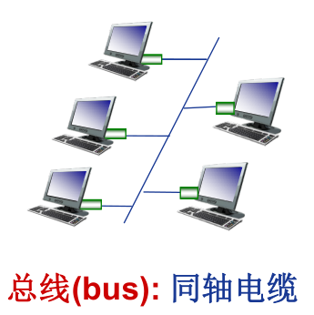
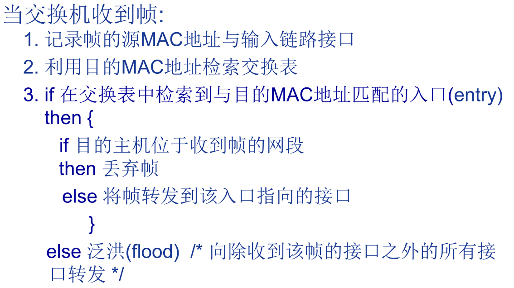
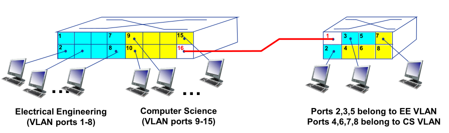
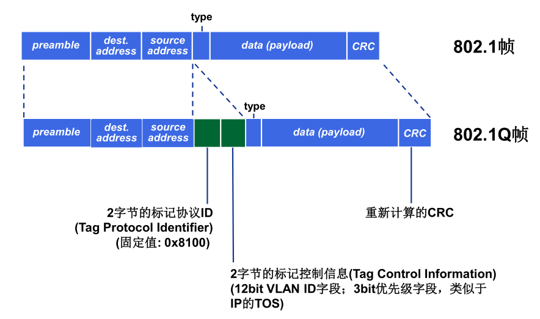
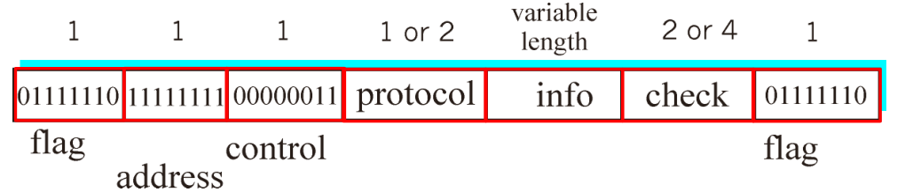

# 以太网

以太网是目前在局域网中使用最广泛的局域网技术，它的优势包括：

- 造价低廉
- 应用广泛
- 比令牌环网和ATM等简单、便宜
- 能够满足网络带宽需求：10Mbps-10Gbps

以太网对数据帧的长度都有一个限制，1500。称作

## 以太网的网络拓扑结构

一、总线型

上世纪90年代中期前流行，所有节点在同一冲突域。

二、星型

目前主流的以太网网络拓扑结构，所有主机与交换机相连。

星型拓扑最大的优点是每个节点一个单独的冲突域，节点间不会彼此冲突。

## 安全性

以太网是不可靠的，无连接的服务。

- 无连接（connectionless）：发送帧的网卡和接收帧的网卡间没有握手过程。

- 不可靠（unreliable）：接收网卡不向发送网卡进行确认。
  - 差错帧直接丢弃，由高层协议确保可靠性。

## MAC协议

传统以太网的MAC（介质访问控制）协议为：采用二进制指数退避算法的CSMA/CD（Carrier Sense, Multiple Access with Collision Detection）协议。

CSMA/CD算法：

1. NIC（网络接口控制器，即网卡，network interface controller）从网络层接收数据报，创建数据帧；
2. 监听信道：如果NIC监听到信道空闲，则开始发送帧；否则，一直等待到信道空闲，然后发送帧。
3. NIC发送整个帧的过程中没有检测到其他结点的数据发送，则NIC确认帧发送成功！
4. 如果在发送过程中检测到其他节点传输数据，则中止发送，并发送阻塞信号（jam signal）。
5. 中止发送后，NIC进入二进制指数规避。

二进制指数规避算法：

- 第m次冲突后，取n = min(m, 10)
- NIC从{0,1,2,3,…,2^n^-1}中随机取一个数K
- NIC等待K*512bit的传输时间后，再执行CSMA/CD的第二步。

冲突次数越大，等待的时间越长。

## 帧结构

以太网的帧结构为：

以太网帧长度为64-1518字节（不包含preamble）。

前导码：以太网包含8个字节的前导码，用于发送数据时进行同步，一般不计入以太网帧的长度。其中，前七个字节为10101010，第八个字节为10101011。

目的地址和源地址：长为6个字节的物理地址，共 12 字节。

type：指示帧中封装的是哪种高层协议的分组（如，IP数据报、Novell IPX数据报、AppleTalk数据报等），2 字节。

CRC：循环冗余校验码，校验失败后丢弃帧，4字节。

Data：要求长度为46-1500字节，长度不够时需要进行填充。

## 补充

**1、以太网为什么限制数据部分的长度：**

由于传统以太网采用的是CSMA/CD协议，为了在发送帧的过程中检测冲突，必须保证可能的冲突信号返回前帧仍未发送结束，如果在2t内没有收到冲突信号，则发送成功。如果发送端在2t内已经发送结束，则即使发生了冲突也无法检测到。

一个以太网的最大长度被限制为2500米，然后根据电子在铜轴中的传输速度，计算出为了保证冲突检测正常工作，数据部分的最小长度应控制在64字节。以太网数据部分的最大长度被限制为1500是一个折衷，这样做的话，如果帧传输过程出错，只需要重传1.5kb的数据，但这也导致了大数据被拆分为多个帧后，每个帧都有额外的头部开销。

2、以太网的数据部分的最大值为1500字节，称为MTU，最大传输单元。如果IP数据报的大小大于MTU，则数据报就需要分片。

路径MTU：在整条通信线路上，最小的链路的MTU。

3、不同类型的以太网标准速率和物理介质不同，但都共享相同的MAC协议和帧格式（可能将帧中数据部分的某些位用作特殊用途）。

# 环回接口

`localhost:127.0.0.1`就是一个环回接口。

广播时会将数据报复制一份给环回接口，再发送到以太网。

# 交换机

交换机是一个链路层设备，其功能包括：

- 存储-转发以太网帧。
- 检验到达帧的目的MAC地址，选择性(selectively) 向一个或多个输出链路转发帧。
- 利用CSMA/CD访问链路，发送帧。

交换机对主机来说时透明的，是一种即插即用的设备，无需配置（利用自学习机制）。

特点：

- 主机利用独享链路直接连接交换机。
- 交换机能够缓存帧。
- 交换机在每段链路上使用CDMA/CD收发帧，全双工且不会产生冲突。
- 可以多端口同时与多个主机通信（通过交换表）。

交换机会维护一个交换表，记录主机与端口的绑定信息：当交换机接收到一个帧时，将帧的源MAC地址与收到该帧的端口进行绑定。

帧过滤和转发过程：

网络设备对比：

# 虚拟局域网

VLAN(Virtual Local Area Network)：支持VLAN划分的交换机可以在一个LAN架构上配置、定义多个VLAN。

基于端口的VLAN：分组交换机端口（通过交换机管理软件），每一组端口对应一个VLAN。

同一个VLAN内部的主机可以互相通信，不同VLAN的主机无法通过数据链路层进行通信，需要通过路由器完成第三层的转发。

实践中，厂家会将交换机和路由器集成在一起。

实现跨交换机的VLAN通信：

1 多线缆连接

将两个交换机同一VLAN的端口通过一根线缆连接。

缺陷：交换机和VLAN数据过多时会导致很多端口的浪费。

2 中继端口（trunk port）

在跨越多个物理交换机定义的VLAN承载帧。

- 帧必须携带VLAN ID信息，供其他交换机识别VLAN
- 802.1q协议为经过中继端口转发的帧增加/去除额外的首部域

# PPP协议

PPP表示点到点协议，这是一种在串行链路上传输IP数据报的流行方法。

优势：

- 无需MAC协议（介质访问控制）
- 无需MAC寻址
- eg.拨号链路，ISDN链路

PPP实际上是一组协议结合，它支持建立链接的基本方法（LCP，Link Control Protocol，链路控制协议），以及一系列NCP协议，在LCP建立了基本链路之后，用于为各种协议（各种网络层协议）建立网络层链路。

设计需求：

- 组帧

- 比特透明传输
- 差错检测
- 连接活性检测：检测，并向网络层通知链路失效
- 网络层地址协商：端节点可以学习、配置彼此网络地址。

PPP数据帧格式：

标志（Flag）：0x7e，定界符。

address：无效

control：无效

protocol：通过协商确定1个或2个字节，上层协议的标志（`eg.PPP_LCP, IP, IPCP, etc`）

info：上层协议分组数据

check：2/4字节，协商确定，校验码。

当数据域中出现flag定界符时，对同步和异步传输链路，PPP协议进行不同的处理。

异步：用0x7D作为转义字符，对flag进行转义，用0x7D5D对转义符自身转义。

同步：如果出现五个连续的1，在1的后面添加一个0（可能导致一个字节超过8位），接收方会去掉多余的0。

## PPP数据控制协议

在交换网络层数据之前，PPP数据链路两端必须：

- 配置PPP链路
  - 最大帧长
  - 身份认证
  - etcetera
- 学习/配置网络层信息
  - 对于IP协议：对于IP协议: 通过交换IPCP协议 (IP Control Protocol )报文 (IP分组首部的“上层
    协议”字段取值: 8021)，完成IP地址等相关信息配置

# 无线局域网

无线局域网802.11存在很多版本。

早期的一个版本是802.11b，其频率带宽为2.4-2.5Ghz免费频段，最高速率为22Mbps，物理层采用直接序列扩频技术（所有主机使用相同的码片序列）。

802.11a使用5-6Ghz频段，最高速率为54Mbps。

802.11g使用2.4-2.5Ghz频段，最高速率为54Mbps。

近几年的802.11n利用MIMO（多天线）技术，其频率为2.4Ghz或5Ghz，最高速率可达600Mbps。

802.11协议均使用CSMA/CA协议作为MAC协议，均有基础设施网络模式和自组网网络模式。

典型WLAN结构：

主机通过基站（Base Station）进行通信，基站也被称为访问点（AP，Access Point），一个基站的覆盖范围称为BSS（Basic Service Set），也叫单元（cell）。

自组网模式（Ad hoc）只有主机。

信道与AP关联的方式：

802.11b: 2.4GHz-2.485GHz频谱划分为11个不同频率的信道，每个AP随机选择一个频率(信道)

- 存在干扰可能: 相邻的AP可能选择相同的信道

- 主机必须与某个AP关联

主动与被动扫描：

信标帧包含基本服务集BSS的id，即SSID。

## MAC协议

CSMA/CA（Collision Avoidance）基于CSMA，发送数据前监听信道，避免与正在进行传输的其他节点冲突。

由于无线信道中存在隐藏站，并且信号会随距离衰减，因此很难边发送边检测冲突。

隐藏站：障碍物遮挡导致双方无法通信。

802.11发送过程：

1. 如果监听到信道空闲了DIFS时间，发送整个帧(无同时检测冲突，即CD)
2. 如果监听到信道忙，计算随机退避计时间。当信道空闲时，计时器根据随即退避时间开始倒计时，直到计时器结束，然后再监听到信道空闲了DIFS时间，开始发送帧。如果规定时间内没有收到ACK，增加随机退避间隔时间并重复第二步。

802.11接收过程：

SIFS：短帧间间隔时间， DIFS：长帧间间隔时间。

当正确接收到帧时，延迟SIFS时间后向发送端发送ACK（SIFS比DIFS时间短）。

基本思想：允许发送端预约信道，而不是随机发送数据帧，从而避免长数据帧的冲突。

- 发送端首先利用CSMA向BS发送一个RTS(request to send)帧（可能冲突，但RTS帧很短，信道浪费很少）。
- BS广播一个CTS（clear to send）帧作为对RTS的响应。
- CTS帧可以被隐藏站收到：
  - 消除隐藏站影响
  - 发送端可以发送数据帧
  - 其他节点延迟发送

利用很小的预约帧避免了数据帧的冲突。

demo:

## MAC帧

帧序号用于可靠数据传输。

地址字段：

