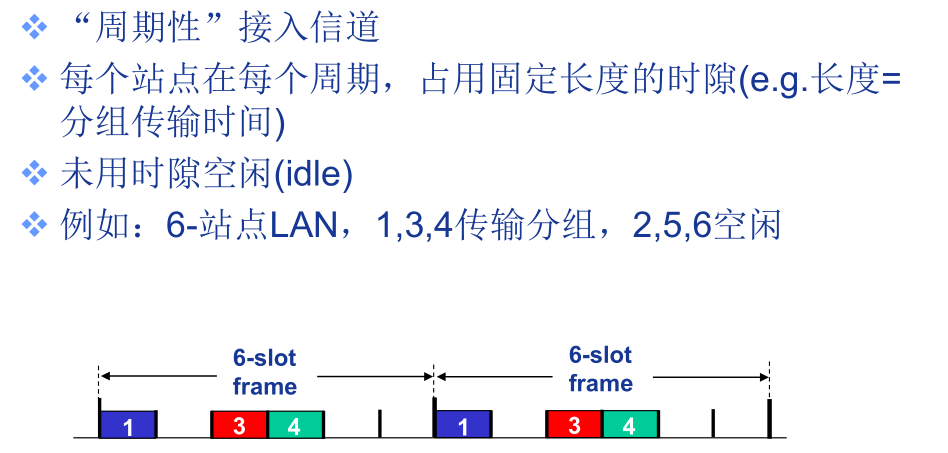
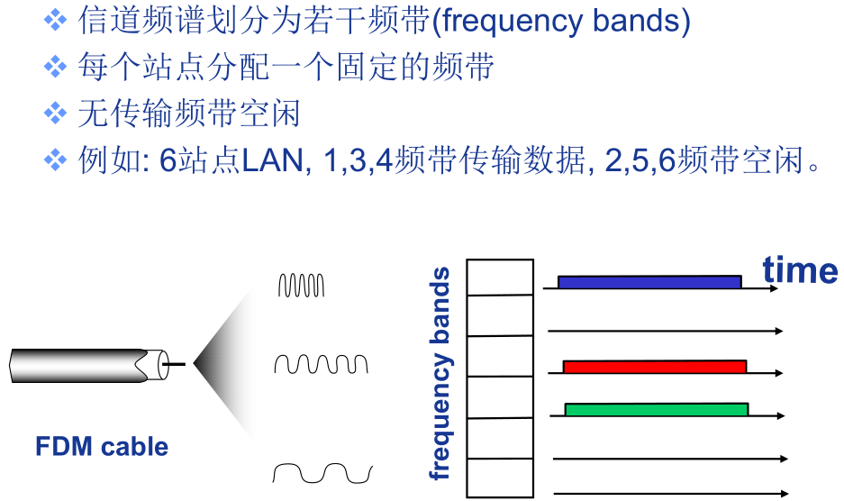
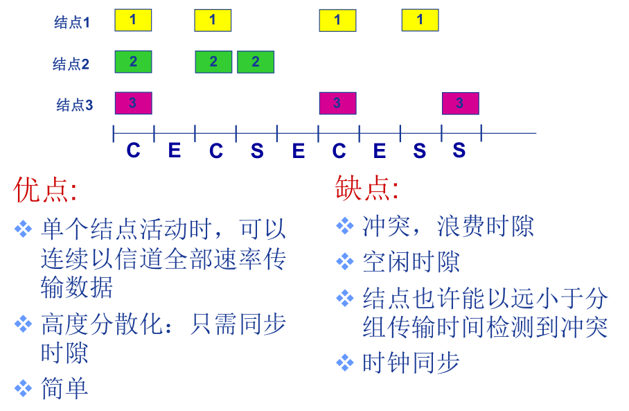
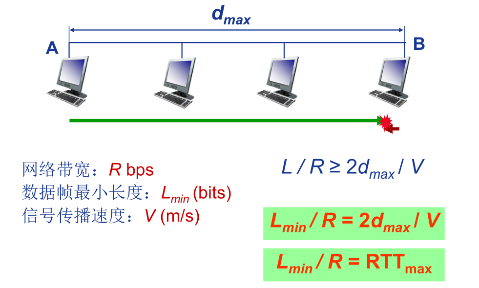

数据链路层的作用：

1. 为IP模块发送和接收IP数据报；
2. 为ARP模块发送ARP请求和接收ARP应答；
3. 为RARP发送RARP请求和接收RARP应答。

TCP/IP支持多种不同的以太网链路层协议，如以太网、令牌环网、FDDI（光纤分布式数据接口等）。

术语：

- 主机和路由器：节点
- 连接相邻节点的通信信道：链路
  - 有线链路
  - 无线链路
  - 局域网
- 链路层数据分组：帧

链路层服务：

- 组帧
  - 封装数据报成数据帧
  - 加首部和尾部，帧定界符
- 链路接入
  - 如果是共享介质，需要解决信道接入问题
  - 使用MAC地址标识帧的源和目的
- 相邻节点间可靠交付
  - 有线链路上很少采用
  - 无线链路：误码率高，需要可靠接入
- 流量控制
  - 协调节点的发送速率，滑动窗口
- 差错控制
- 全双工与半双工通信控制

# MAC协议

两类链路：

- 点对点链路
  - 拨号接入的PPP
  - 以太网交换机与主机间的点对点链路
- 广播链路（共享介质）
  - 无线局域网
  - 早期的总线以太网

MAC协议分类：

- 信道划分MAC协议，不会发生冲突。
  - 多路复用技术
  - TDMA，FDMA，CDMA，WDMA
- 随机访问MAC协议
  - 信道不划分，允许冲突
  - 采用冲突“恢复”机制
- 轮转MAC协议
  - 节点轮流使用信道

## 信道划分MAC协议

网络负载很重，某一时刻所有节点都在发送数据，此时信道划分MAC协议信道利用率最高，但网络负载很轻，一般只有少数几个节点发送数据时，其信道利用率很低。

### TDMA

Time Division Multiple Access

### FDMA

Frequency Division Multiple Access

## 随机访问MAC协议

当节点需要发送分组时，利用信道全部数据速率R发送数据，当两个或多个节点同时传输时，即产生冲突。

随机访问MAC协议需要定义冲突的检测方式和如何从冲突中恢复。

典型的随机访问MAC协议：

- 时隙（sloted）ALOHA
- 纯ALOHA
- CSMA、CSMA/CD、CSMA/CA

### 时隙ALOHA协议

前提：

1. 所有帧大小相同
2. 时间被划分为等长的间隙（每个时隙可以传输一个帧）
3. 节点只能在时隙开始时刻发送帧
4. 节点间时钟同步
5. 如果多个节点在同一时隙发送帧，即发生冲突

规则：

当结点有新的帧时，在下一个时隙(slot)发送。如果无冲突，发送结束。如果检测到冲突（广播信道，发送的同时接收，并与缓冲区的数据对比，如果数据不同，就说明发生了冲突），在下一个时隙以概率p重传该帧，直到成功。

demo：

任意结点成功发送帧的概率为，$Np(1-p)^{(N-1)}$，N趋近于无穷大时，概率为0.37。

### 纯ALOHA协议

当新的帧生成时，立即发送。

其最好情况下的效率为0.18。

### CSMA协议

Carrier Sense Multiple Access Protocol

发送帧之前，监听信道，如果信道空闲，发送数据，否则，推迟发送。

冲突仍然有可能发生：信号传播延迟，冲突后继续发送完整个帧会浪费信道资源。

CSMA/CD：带有冲突检测的CSMA协议，可以在短时间内检测到冲突，冲突后终止传输。

冲突检测：

- 有线局域网：检测信号强度，比较发送信号与接收信号。
- 无线局域网：由于信号衰减问题，难以实现冲突检测。

要求在检测到冲突信号之前，帧还没有传输完毕，因此对帧的大小有要求。