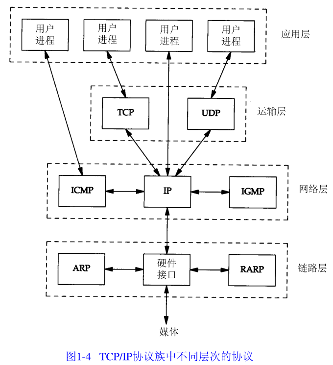
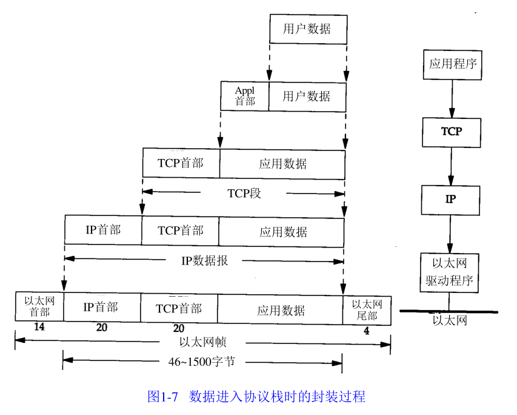

# 分层

TCP/IP是一个四层协议系统。

应用层：Telnet、FTP、email、HTTP、DNS、DHCP等。

传输层：TCP和UDP。

网络层：IP、ICMP（互联网控制报文协议）、IGMP（Internet组管理协议）。

链路层：用于网络层到基于多接入链路层网络的链路层的地址映射的非正式的层，如ARP。

封装过程：

OSI

# 端口号

端口号是0-65535的整数。

- 熟知端口号：0-1023

- 注册端口号：1024-49151
- 私有端口号：49152-65535

熟知端口用于识别众所周知的服务，例如DNS(53)、SSH(22)、FTP(20, 21)、Telnet(23)、SMTP(25)、HTTP和HTTPS(80和443)。